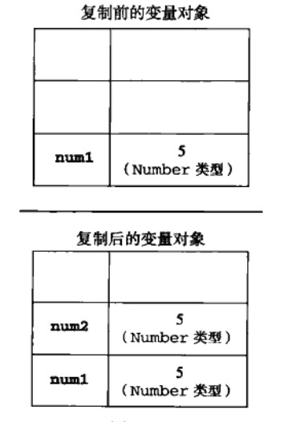
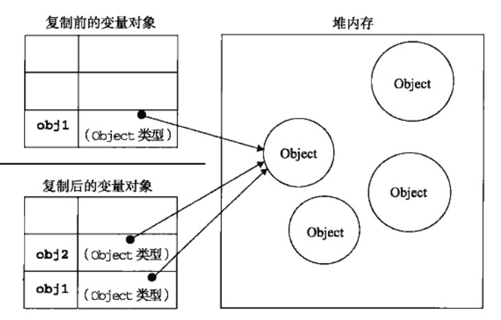
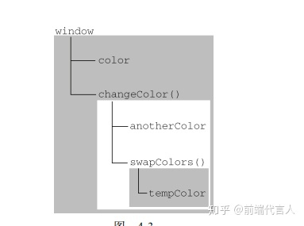

# 第4章 变量、作用域和内存

JS 变量是松散的。所以，变量的值和数据类型可以随意改变、


## 1 基本类型和引用类型的值

跟其他语言一样，JS 变量分基本类型值和引用类型值。

+ 基本类型值：5种基本数据类型（Undefined、Null、Boolean、Number、String）（es6新增Symbol类型）
+ 引用类型值：指保存在内存中的对象（Object、Array、Function）

> JS 不允许直接访问内存中的位置，也就是说不能直接操作对象的内存空间。在操作对象时，实际上在操作对象的引用而不是实际的对象。为此，引用类型的值是按引用访问的。


### 1.1 复制变量值

基本类型值和引用类型值在复制时，表现时不一样的。

复制基本类型的值时，会在内存中创建新的内存地址，然后copy要复制的值，存到新创建的内存地址。




也就是说，`num1`和`num2`两者不存在关联性。

而，引用类型值得复制并非如此。引用类型值复制的时候，同样会在内存中创建新的内存地址，不过新的内存地址存的是被复制的引用类型值的指针。因此，复制操作结束后，两个变量实际上引用的是同一个对象。因此，改变其中一个变量，就会影响另一个变量。



### 1.2 传递参数

基本类型值的参数传递如同基本类型变量的复制一样，而引用类型值的参数传递，则如同引用类型变量的复制一样。

```js
function setName(obj){
  obj.name = "Nicholas";
  obj = new Object();
  obj.name = "Greg";
}

let person = new Object();
setName(person);
console.log(person.name);			// "Nicholas"
```

上面例子的如果按照引用类型变量复制的规则，`person`的指针传递到了函数内，但是最终输出的却是“Nicholas”。这是因为，`person` 的指针确实传递到函数内部，而且成功这是了`name`属性。但是`obj = new Object()`这句代码，将`obj`存储的指针覆盖了。所以最后一条代码实际上操作的是一个新的对象。


### 1.3 检查类型

第三章介绍过`typeof`，可用于检查数据类型。但是，`typeof`操作符只适用于检测基础类型。如：`String`、`Number`、`boolean`和`undefined`。如果变量的值是一个对象或者`null`，`typeof`就只会返回`Object`。换句话说，`typeof`并不适用检测引用类型。

```js
let s = 'Nicholas';
let b - true;
let i = 22;
let u;
let n = null;
let o = new Object();

alert(typeof s);	// string
alert(typeof b);	// boolean
alert(typeof i);	// number
alert(typeof u);	// undefined
alert(typeof n);	// object
alert(typeof o);	// object
```

因此，JS 提供了 `instanceof` 操作符，根据原型链来检测引用类型变量的类型。

```js
const obj = {};
const arr = [];
const reg = /[a-b0-9]/;

alert(obj instanceof Object);  // 变量 obj 是 Object 吗？ true
alert(obj instanceof Array);   // 变量 obj 是 Array 吗？false
alert(arr instanceof Array);   // 变量 arr 是 Object 吗？true
alert(reg instanceof RegExp);  // 变量 reg 是 RegExp 吗？true
```


## 2 执行环境及作用域

### 2.1 概念

#### 执行环境

> 执行环境（execution context，为简单起见，有时也称为“环境”）是 JavaScript 中最为重要的一个概念。执行环境定义了变量或函数有权访问的其他数据，决定了它们各自的行为。每个执行环境都有一个与之关联的变量对象（variable object），环境中定义的所有变量和函数都保存在这个对象中。虽然我们编写的代码无法访问这个对象，但解析器在处理数据时会在后台使用它。

“执行环境”，即运行的环境。“环境”另一种意思就是范围。所以，"执行环境"指的是代码运行的范围。也可以理解为给变量和函数划分的归属。就好比要定义一个变量，我们必须要先知道这个变量定义哪里，而“执行环境”就是这个“哪里”。

上面有一句话，“每个执行环境都有一个与之关联的变量对象（variable object），环境中定义的所有变量和函数都保存在这个对象中”。这句话也很好的说明了“执行环境就是代码运行的范围”。

> 全局执行环境是最外围的一个执行环境。根据 ECMAScript 实现所在的宿主环境不同，表示执行环境的对象也不一样。在 Web 浏览器中，全局执行环境被认为是 window 对象（第 7 章将详细讨论），因此所有全局变量和函数都是作为 window 对象的属性和方法创建的。某个执行环境中的所有代码执行完毕后，该环境被销毁，保存在其中的所有变量和函数定义也随之销毁（全局执行环境直到应用程序退出——例如关闭网页或浏览器——时才会被销毁）。
>
> 每个函数都有自己的执行环境。当执行流进入一个函数时，函数的环境就会被推入一个环境栈中。而在函数执行之后，栈将其环境弹出，把控制权返回给之前的执行环境。ECMAScript 程序中的执行流正是由这个方便的机制控制着。

上面这段话提到以下4点：

1. JS有一个最外层的环境，即全局执行环境。
2. 执行环境的所有代码执行后，会被立即销毁。
3. 除开全局执行环境，函数也会为自己内部的代码创建一个执行环境。但是这个执行环境是被包含在函数所处的环境中的。也就是，函数创建的执行环境是一个局部执行环境。存在上下层关系。
4. JS存在一个环境栈。当执行流进入一个函数时，函数的环境就会被推入一个环境栈中。而在函数执行之后，栈将其环境弹出，把控制权返回给之前的执行环境。

#### 作用域链

> 当代码在一个环境中执行时，会创建变量对象的一个作用域链（scope chain）。作用域链的用途，是保证对执行环境有权访问的所有变量和函数的有序访问。作用域链的前端，始终都是当前执行的代码所在环境的变量对象。如果这个环境是函数，则将其活动对象（activation object）作为变量对象。活动对象在最开始时只包含一个变量，即 arguments 对象（这个对象在全局环境中是不存在的）。作用域链中的下一个变量对象来自包含（外部）环境，而再下一个变量对象则来自下一个包含环境。这样，一直延续到全局执行环境；全局执行环境的变量对象始终都是作用域链中的最后一个对象。
>
> 标识符解析是沿着作用域链一级一级地搜索标识符的过程。搜索过程始终从作用域链的前端开始，然后逐级地向后回溯，直至找到标识符为止（如果找不到标识符，通常会导致错误发生）。

作用域：**在 JavaScript 中, 作用域为当前执行环境可访问变量，对象，函数的集合。**

”作用域链“的机制类似于”环境栈“。执行流访问一个环境时，会为当前访问的”执行环境“创建“作用域”，然后将作用域存储到“作用域链”中。当离开执行流离开当前”执行环境“，就会立即将当前”执行环境“的作用域从”作用域链“中删除。因为”作用域链“是一个栈，所以，我们永远可以借助“作用域链”访问父级作用域。这也就代表着借助”作用域链“，子作用域可以访问父作用域的变量、函数和对象。

请看书中的例子：

```js
var color = "blue";
function changeColor(){
  var anotherColor = "red";
  function swapColors(){
    var tempColor = anotherColor;
    anotherColor = color;
    color = tempColor;
    
    // 这里可以访问 color、anotherColor 和 tempColor
  }
  
  // 这里可以访问 color 和 anotherColor，但不能访问 tempColor
  swapColors();
}
```

以上代码共涉及 3 个执行环境：全局环境、`changeColor()`的局部环境和 `swapColors()`的局部环境。全局环境中有一个变量 color 和一个函数 `changeColor()`。`changeColor()`的局部环境中有一个名为 `anotherColor`的变量和一个名为 `swapColors()`的函数，但它也可以访问全局环境中的变量 `color`。`swapColors()`的局部环境中有一个变量 `tempColor`，该变量只能在这个环境中访问到。无论全局环境还是 `changeColor()`的局部环境都无权访问 `tempColor`。然而，在 `swapColors()`内部则可以访问其他两个环境中的所有变量，因为那两个环境是它的父执行环境。

下图是本例子作用域链：



矩形表示特定的执行环境。其中，内部环境可以通过作用域链访问所有的外部环境，但外部环境不能访问内部环境中的任何变量和函数。这些环境之间的联系是线性、有次序的。每个环境都可以向上搜索作用域链，以查询变量和函数名；但任何环境都不能通过向下搜索作用域链而进入另一个执行环境。对于这个例子中的 `swapColors()`而言，其作用域链中包含 3 个对象：`swapColors()`的变量对象、`changeColor()`的变量对象和全局变量对象。`swapColors()`的局部环境开始时会先在自己的变量对象中搜索变量和函数名，如果搜索不到则再搜索上一级作用域链。`changeColor()`的作用域链中只包含两个对象：它自己的变量对象和全局变量对象。这也就是说，它不能访问 `swapColors()`的环境。

### 2.2 延长作用域链

在下面两种语句中，作用域链可以被延长：

+ `try-catch`语句的`catch`块；
+ with 语句

这两个语句都会在作用域链的前端添加一个变量对象。对 with 语句来说，会将指定的对象添加到作用域链中。对 catch 语句来说，会创建一个新的变量对象，其中包含的是被抛出的错误对象的声明。

请看下面例子：

```js
function buildUrl () {
   var qs = '?debug=true';
   var url = qs;
  
   return url;
}
```

上面例子的作用域链为：

1. 全局环境：window 执行环境的作用域
2. 局部环境：`buildUrl`函数内部的作用域

然后我们做如下更改：

```js
function buildUrl () {
   var qs = '?debug=true';
   with(location){
   		var url = href + qs;
   }
   return url;
}
```

因为`with`语句的特性，会将`location`对象的作用域关联到`buildUrl`的作用域来。这样，作用域链就被延长了：

1. 全局环境：window 执行环境的作用域
2. 局部环境：`buildUrl`函数内部的作用域
3. `location` 作用域

### 2.3 没有块级作用域

#### 什么是块级作用域

在其他类C语言中，由花括号封闭的代码都会有自己的作用域。例如：

```c
/* 使用 if 语句检查布尔条件 */
if( true )
{
  /* 局部变量定义 */
  int a = 10;
}
printf("a 的值是 %d\n", a);
```

上面是一段 C 语言的 IF 语句。在 IF 语句里面定义一个变量`a`，然后在 IF 语句外面打印`a`变量。因为 C 语言有块级作用域，根据前面所学的作用域链的知识，IF 语句外面是无法访问到IF语句里面的变量的。所以，`printf`将会报错。

但是，如果上面的代码是JS，那结果就可以正常输出了。

```js
/* 使用 if 语句检查布尔条件 */
if( true )
{
  /* 局部变量定义 */
  let a = 10;
}
alert(a);
```

因为 JS 没有块级作用域。所以，`a` 变量的作用域和`alert(a)`所处的作用域实际是同一个。故而，`alert`语句能正常访问变量`a`。

#### 声明变量

在变量声明的时候，变量会被自动添加到最接近的环境中。

+ 在函数内部，最接近的环境是函数内部的局部环境；
+ 在`with`语句中，最接近的环境是`with`接收的环境。

#### 查询标识符

结合作用域链的知识点，当JS要查询一个标识符的时候，会先在当前作用域查找；如果当前作用域查找不到，则会沿着作用域链一层一层查找，直至找到符合的标识符。根据这个特性，我们可以得出JS的另一个特点：即，子作用域的同名标识符会覆盖父作用的同名标识符；

## 3 垃圾回收机制

JS 具有自动垃圾收集机制。也就是说，执行环境会负责管理代码执行过程中使用的内存。所以，在编写 JS 时，开发人员不用关心内存使用的问题，所需内存的分配以及无用内存的回收完全实现了自动管理。

原理就是：找出那些不在使用的变量，然后释放其占用的内存。

以函数中的局部变量为例。局部变量自会在函数执行过程中存在。在这个过程中，会为局部变量在栈（或堆）内存上分配相应的空间，用于存储他们的值。然后在函数中使用这些变量，直到函数执行结束。此时，局部变量就没有存在的必要了，因此可以释放他们的占用的内存。

#### 常用的垃圾回收策略

1. 引用计数
2. 标记清除