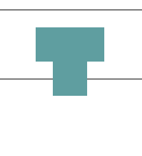
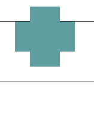
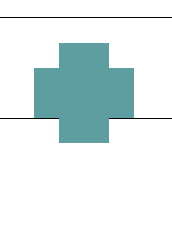
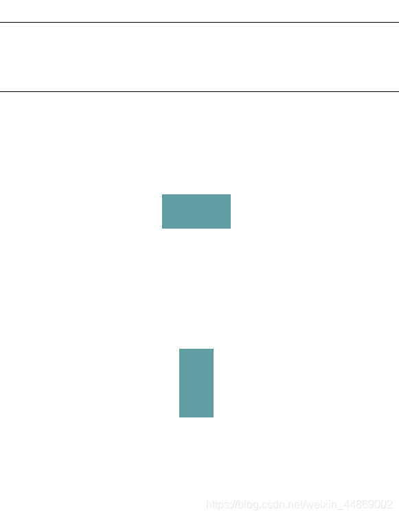
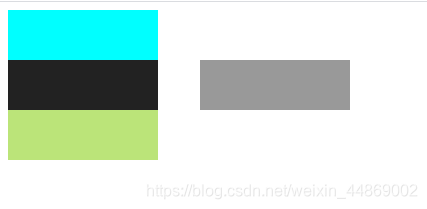
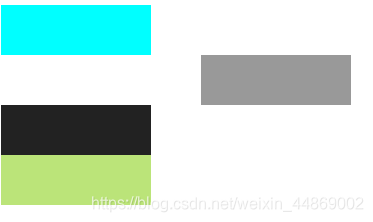
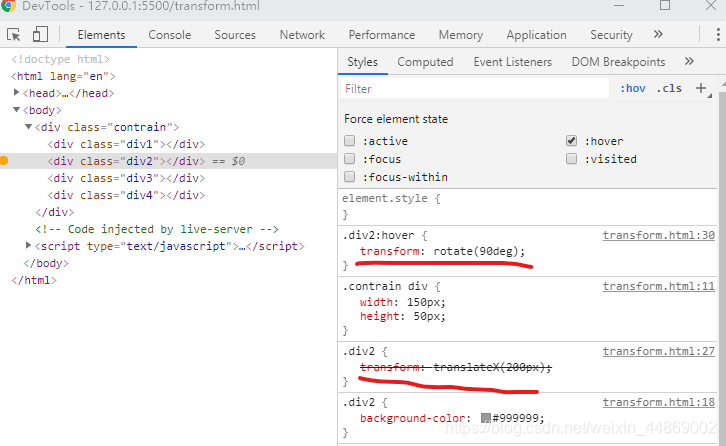

# 通过 translate 实现垂直居中与 rotate 的冲突——分析与解决方案

最近，自己尝试使用`input`+`ul`去模拟实现`select`。因为，使用原生的`select`有着诸多不便。而且，模拟实现`select`看上去也并不是很困难的事情。

但是呢！当你信心满满的时候，往往就会打脸之时。确实，功能、效果、样式都很会实现了。可是，下三角的旋转却出现了问题。因为我比较喜欢通过`position: absolute`去实现**垂直居中**。这次我也是这么做了。然后我就悲催的发现，**下三角的旋转并不是根据中心去旋转的**。

为了更好的观察，我做了放大处理。

```css
<style>
    .rotate{
        position: relative;
        border: 1px solid;
        height: 100px;
        text-align: center;
    }
    .rotate div{
        position: absolute;
        top: 50%;
        transform: translateY(-50%);
        display: inline-block;
        width: 100px;
        height: 50px;
        background-color: cadetblue;
        transition: transform 0.5s;
        cursor: pointer;
    }
    .rotate .div2{
        transform: rotate(90deg);
    }
</style>
```

```
<div class="rotate">
    <div></div>
    <div class="div2">
    </div>
</div>
```

效果如下：



很明显，没有根据中心来旋转。

然后去掉垂直居中后，效果如下：



css 代码如下：

```css
<style>
    .rotate{
        position: relative;
        border: 1px solid;
        height: 100px;
        text-align: center;
    }
    .rotate div{
        position: absolute;
        /* top: 50%;
        transform: translateY(-50%); */
        display: inline-block;
        width: 100px;
        height: 50px;
        background-color: cadetblue;
        transition: transform 0.5s;
        cursor: pointer;
    }
    .rotate .div2{
        transform: rotate(90deg);
    }
</style>
```

注意：上面我只去掉了垂直居中效果，`position: absolute;`这段代码并没有注释掉。因为需要借助`absolute`实现两个的`div`标签堆叠模拟旋转的始末两种状态。

从上面可以看到，**取消了垂直居中效果后，旋转就根据中心去进行旋转了**。

由此可以知道，出现问题的原因大概率就出现`top: 50%;`以及`transform: translateY(-50%);`这两个属性了。

#### 排除`top: 50%;`

接下来，开始逐个排除。先来验证`top: 50%;`。

对`top: 50%;`的验证很简单。就是取消`top: 50%;`的注释。

效果如下：



可见，仅仅是位置变了而已。这样就基本确定`transform: translateY(-50%);`.

#### 验证`transform: translateY(-50%);`

通过查找资料，我看到了这样一个结论：

> 当同时使用 translate 和 rotate 属性的时候，rotate 始终按 div 第一次出现的位置的纵向中心轴旋转。

来自：[css3——translate 组合 rotate 实验心得](https://blog.csdn.net/xishaoguo/article/details/81562112)

上面的结论需要解释一下：因为上面的博文测试是以 Z 轴为主。所以，才说”rotate 始终按 div 第一次出现的位置的纵向中心轴旋转“。实际上，**rotate 始终按 div 第一次出现的位置的中心（或中心的 Z、Y 轴）旋转。**

看到上面的结论，大受启发。我立即做了测试。

修改 CSS 如下：

```css
.rotate {
  position: relative;
  border: 1px solid;
  height: 100px;
  text-align: center;
}
.rotate div {
  position: absolute;
  top: 500%;
  transform: translateY(-500%);
  display: inline-block;
  width: 100px;
  height: 50px;
  background-color: cadetblue;
  transition: transform 0.5s;
  cursor: pointer;
}
.rotate .div2 {
  transform: rotate(90deg);
}
```

主要修改`top: 500%;`与`transform: translateY(-500%);`，夸大了范围。因为，如果如上面结论所说，那么旋转后的`.div2`一定是在第一个`div`下面的，而且位置大概在父标签`.rotate`高度的 5 倍的地方。

结果如下：



可证得，结论：**当同时使用 translate 和 rotate 属性的时候，rotate 始终按 div 第一次出现的中心（或中心的 Z、Y 轴）旋转。**

#### 问题出现的原因分析

导致这个问题的出现有两个原因：

##### 其一，`translate`实际上并没有改变标签元素在网页的位置，只是让原生进行了偏移。

我们都知道，网页的标签元素是由上往下堆叠的。就好像网页的上方有块磁体不断的吸引着便签元素。只要有中间有某一块标签元素消失了，下面的便签就会自动去“抢占”空缺出来的位置。

验证：

创建了 4 个大小一致的 div

```html
<!DOCTYPE html>
<html lang="en">
  <head>
    <meta charset="UTF-8" />
    <meta name="viewport" content="width=device-width, initial-scale=1.0" />
    <title>trransform</title>
    <style>
      .contrain {
        width: 150px;
      }
      .contrain div {
        width: 150px;
        height: 50px;
      }
      .div1 {
        background-color: aqua;
      }
      .div2 {
        background-color: #999999;
      }
      .div3 {
        background-color: #222222;
      }
      .div4 {
        background-color: rgb(187, 228, 121);
      }
    </style>
  </head>
  <body>
    <div class="contrain">
      <div class="div1"></div>
      <div class="div2"></div>
      <div class="div3"></div>
      <div class="div4"></div>
    </div>
  </body>
</html>
```


然后，使用`position: absolute;`将`div2`脱离正常的文档流。给`div2`添加如下 CSS：

```css
.div2 {
  position: absolute;
  left: 200px;
}
```

> ### 绝对定位
>
> 相对定位的元素并未脱离文档流，而绝对定位的元素则脱离了文档流。在布置文档流中其它元素时，绝对定位元素不占据空间。绝对定位元素相对于*最近的非 `static` 祖先元素*定位。当这样的祖先元素不存在时，则相对于 ICB（inital container block, 初始包含块）。

来自：[MDN: position](https://developer.mozilla.org/zh-CN/docs/Web/CSS/position)

页面效果变化如下：



可见，`div3`和`div4`自动填补了`div2`的位置。

接下来，去掉`div2`的`position: absolute;`。添加`translateX`样式:

```css
.div2 {
  transform: translateX(200px);
}
```

页面效果如下：



可见，`div2`原本的位置并没有被侵占。说明，`translate`只是让标签元素发生了便宜，实际的位置并没有改变。

##### 其二，给元素 anchor 伪类添加的样式实际上作用于元素本身

> miaoanchor 伪类: `:link`、`:visited`、`:hover`、`active`

anchor 伪类代表元素的四种状态。所以实际还是元素本身。

例如：

给`div2`添加`:hover`样式：

```
.div2:hover{
    transform: rotate(90deg);
}
```

通过 Chrome DevTools 查看。



可以看到，` transform: rotate(90deg);`在`div2`生效了。

但是，这也就导致`div2`的 CSS 中存在两个`transform`CSS 属性。

```
.div2{
     transform: translateX(200px);
     transform: rotate(90deg);
 }
```

故而导致样式覆盖的问题。

综上，因为`translate`被覆盖，元素就从偏移的位置回到原本的位置。继而，再进行`rotate`的旋转操作。这也就是为什么说，**当同时使用 translate 和 rotate 属性的时候，rotate 始终按 div 第一次出现的中心（或中心的 Z、Y 轴）旋转。**

#### 如何避免 translate

**上面的问题归结来看无非就是垂直居中的问题**。所以，只要不去使用`translate`就行了。

实现垂直居中有多种方法。

例如，**弹性盒模型**（如果不了解弹性盒模型可参考：[CSS 弹性盒子布局使用方法介绍](https://blog.csdn.net/weixin_44869002/article/details/102702965)）。

又如，对于行内标签更简单。只需设置`vertical-align: middle;`，然后通过`margin-left`来调整位置即可。使用`input`+`ul`去模拟实现`select`，正是这种情况。

附件：

- [Demo：`input`+`ul`去模拟实现`select`以及输入选项框](https://download.csdn.net/download/weixin_44869002/12389513)
