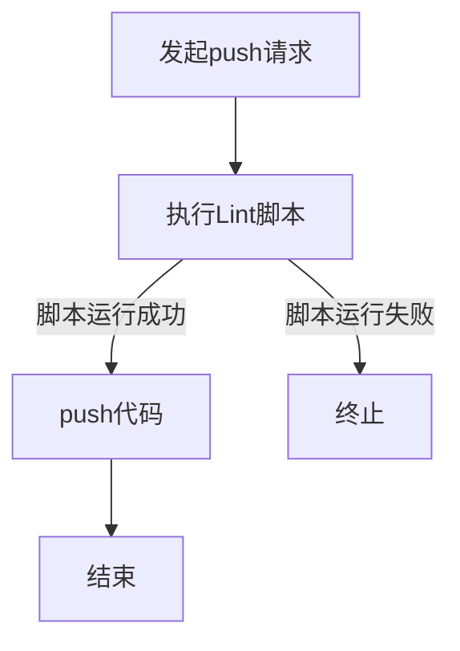

# CI/CD 概述

## 为什么需要 CI/CD？

在阐述 CI/CD 前先来回顾一下网站项目的开发过程。概括来讲，网站开发分为**开发**、**测试**、**部署**三个阶段。这三个阶段又可以衍生出很多工作。如：开发阶段可以细分为**编码**、**代码审核**、**代码合并**等；测试阶段可以细分为**冒烟测试**、**黑盒测试**、**自动化测试**等；代码部署根据开发阶段的不同需要将代码部署到不同的服务器中。

这些工作中有一些是比较范式化的。例如，代码审核。代码审核的作用之一是筛查代码中一些**常见的风险代码**以及保证多人开发项目的编码风格一致性。常见的风险代码与编码风格这些都是事先确定且基本不会变动。人为的检查这些繁琐、枯燥且重复。因此，成熟的团队都会把这些工作集成到 Esint 一类的工具中，让工具来检查，我们只需执行对应的脚本即可完成代码检验。

不过任然存在一个问题，那就是这些脚本需要人为的去执行，这就存在一个遗忘的风险。因此，人们就在想着如果这些脚本能自己根据情况来运行就好了。而这些就是 CI/CD 的所要做的。当然，这仅仅是 CI/CD 最基础的工作之一。

## 什么是 CI/CD？

以下是来自文心一言的关于 CI/CD 的解释，讲的特别好：

> CI/CD 是持续集成（Continuous Integration）和持续部署/持续交付（Continuous Deployment/Continuous Delivery）的缩写，它们是现代软件开发实践中广泛采用的方法论，旨在提高软件开发的效率、质量和速度。
>
> ### 持续集成（Continuous Integration, CI）
>
> 持续集成是一种软件开发实践，它要求开发团队在每次代码提交后，自动地构建和测试项目。这个过程通常包括以下几个步骤：
>
> 1. **自动化构建**：每次代码提交后，系统自动拉取最新的代码，并执行构建过程（如编译、打包等）。
> 2. **自动化测试**：构建完成后，自动运行单元测试、集成测试等，确保新代码没有破坏现有功能。
> 3. **反馈**：测试结果会迅速反馈给开发团队，以便及时发现问题并修复。
>
> 持续集成的目标是尽早发现并修复问题，减少集成过程中的冲突和错误，提高代码质量。
>
> ### 持续部署/持续交付（Continuous Deployment/Continuous Delivery, CD）
>
> 持续部署和持续交付是持续集成之后的步骤，它们之间的主要区别在于自动化程度和目标的不同。
>
> - **持续部署（Continuous Deployment, CD）**：在持续集成的基础上，进一步自动化地将通过所有测试的构建版本部署到生产环境。这意味着每次代码提交并成功通过测试后，都会自动更新到生产环境。这种方式要求团队有高度的自动化水平和严格的测试流程，以确保每次部署都是安全可靠的。
>
> - **持续交付（Continuous Delivery, CD）**：与持续部署类似，但持续交付并不要求自动部署到生产环境。它强调的是保持软件随时可部署到生产环境的状态，但具体部署的时机可以由团队根据业务需求、风险评估等因素来决定。持续交付通常包括一个自动化的发布流程，但部署的触发是手动的。

分析上面的描述，可以明显看出 CI/CD 的两个关键点——“脚本”以及“自动化”。概括来讲，CI/CD 就是指在项目开发阶段引入一系列的自动化工具来辅助项目的开发工作。通过自动化构建、测试和部署流程，减少了人为错误，加快了软件交付的速度。持续集成确保了代码的质量，而持续部署/持续交付则提高了软件交付的灵活性和可靠性。核心(本质)是自动化脚本，目的是提高效率。

## 如何使用 CI/CD？

CI/CD 等本质是自动化脚本，所以 CI/CD 的使用就是自动化脚本的使用。

### 编写自动化脚本

自动化脚有两个要点：一、编写所需的脚本；二、自动执行编写好的脚本。

编写脚本时，首先需要根据脚本的运行环境确定脚本的编写语言，然后再依照需求编写实现需求的脚本即可。

自动执行编写好的脚本，其实就是根据不同的条件来执行响应的代码。例如，想要在代码 push 前执行脚本命令`npm run lint`来对代码进行校验。流程如下：



要将这个过程实现自动化，可以通过编写本地 git 仓库的 gitHook 来实现。

```bash
#!/bin/sh
# pre-push Hook 脚本

npm run lint
```

这就是一个基础的 CI。

尽管借助本地 git 仓库的 gitHook 可以实现简单的 CI/CD，但这种实现方式存在着诸多不便。如，多人项目的 gitHook 同步问题；对于失败的 CI/CD 无法手动重新执行；没有 CI/CD 历史日志；脚本运行的环境不一致等等问题。好在市面上有着许多专业的 CI/CD 软件或者平台供我们使用。下面列举几个免费的 CI/CD 平台：

- Jenkins：一款开源 CI&CD 软件，用于自动化各种任务，包括构建、测试和部署软件。借助 Jenkins，我们可以搭建自己的 CI/CD 平台
- GitHub：GItHub 不单单是国际知名的代码托管平台，同时也是 DevOps 平台，自然也支持 CI/CD 功能。在 GitHub 中，CI/CD 叫 Actions。
- GitLab：与 GItHub 类似，都是 DevOps 平台。不过 Gitlab 的 CI/CD 早于 GitHub 的，应用更为广泛。

### 构建成体系的 CI/CD

编写单个自动化脚本并不难，但是要构建一套成体系的自动化脚本是很复杂的。首先需要项目开发流程规范化，只有流程规范化了并成为项目的工作标准，我们才能对流程进行分析，将其中可自动化的工作提取出来。其次，我们需要熟悉各个流程的自动化脚本所需的工具，这是很多的学习成本。然后，在摸索阶段必然存在不断的试错过程，需要人工流程和自动化流程并行执行直至自动化流程能够完全替代人工，这个过程反而会增加工作成本。

## 写在最后

CI/CD 可简单可复杂，主要是看项目组的工作流程复杂度和细致度。下面罗列一些前端项目常用的 CI/CD 自动化脚本：

- Git Commit 的规范性校验
- 代码 push 后自动进行代码风格校验
- 代码 merge 前自动执行单元测试
- git release 后自动构建打包
- 一键部署项目代码到服务器
