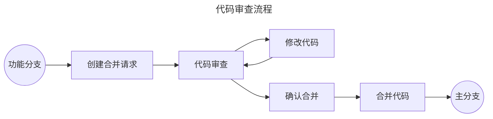

# Code Review 流程说明以及制定

## 概述

Code Review（**代码审查**，也可译为**代码审核**）是一种软件开发实践，通过团队成员之间相互审查代码，发现代码中的问题，提高代码质量。本文将介绍代码审查的必要性、流程和内容，以及审查的形式。

## 必要性

- 代码审查是保证代码质量的重要手段，通过代码审查，可以**及时发现代码中的问题**，**提高代码质量**。
- 代码审查可以**减少代码冲突和合并冲突**，**提高代码合并的效率**。
- 代码审查是分支管理策略的重要帮手，通过代码审查，可以**保证主分支代码的稳定性**。
- 代码审查可以**保证代码风格的一致性**，**提高代码的可读性和可维护性**。
- 代码审查可以**促进团队成员之间的交流和学习**，**提高团队的整体技术水平**。

## 审查形式

代码审查可分为两种形式：集中式代码审查和分布式代码审查。

- **集中式代码审查**：在项目开发过程中，团队成员定期集中在一起进行代码审查，审查过程中，团队成员会相互查看代码，提出意见和建议，共同改进代码质量。
- **分布式代码审查**：在项目开发过程中，团队成员通过工具（如 GitHub、GitLab 等）进行代码审查，团队成员可以随时查看代码，提出意见和建议，共同改进代码质量。

两种审查形式各有优劣，集中式代码审查可以更全面地了解代码，但需要团队成员的集中时间，而分布式代码审查可以更灵活地进行代码审查，但可能无法全面了解代码。

由于集中式代码审查需要团队成员统一时间和地点，较为臃肿且成本较高，再加上通常只能项目开发的中后期才能进行，存在滞后性，无法保证主分支代码的稳定性。因此，集中式代码审查不再是代码审核的首选，更多是分布式代码审查的补充，或者是团队成员的学习平台。

如今，大多数团队都依托于 Github、GitLab 等 DevOps 平台进行代码管理，这些平台都提供了便捷的分布式代码审查功能。此外，分布式代码审查更符合敏捷开发原则和分支管理策略，在分支合并时进行代码审查，可以保证主分支代码的稳定性。因此，分布式代码审核是代码审查的首选。本文也将主要介绍分布式代码审查的流程和内容。

> [!TIP] 分支管理策略
>
> 请参考：《[分支管理](./第4章：git篇-分支管理.md)》

## 分布式代码审查流程

分布式代码审查流程如下：

1. 开发人员提交代码到自己的功能分支。
2. 开发人员创建将功能分支代码合并到主分支请求，并指派相关人员进行审核。
3. 代码审查者查看代码，提出意见和建议。
4. 开发人员根据意见和建议修改代码。
5. 代码审查者再次查看代码，确认代码质量。
6. 代码审查者同意合并代码，将代码合并到主分支。

## 审查内容

代码审查的内容主要包括以下几个方面：

1. **代码风格**：代码风格是否统一，是否符合团队的代码规范。
2. **代码逻辑**：代码逻辑是否清晰，是否存在逻辑错误。
3. **代码性能**：代码性能是否满足需求，是否存在性能瓶颈。
4. **代码安全性**：代码是否存在安全漏洞，是否满足安全要求。
5. **代码可维护性**：代码是否易于维护，是否遵循良好的编程习惯。
6. **代码文档**：代码是否包含必要的注释和文档，是否易于理解。
7. **代码测试**：代码是否包含必要的测试用例，测试用例是否覆盖了主要功能。

## 审查手段

得益于开发工具的完善，代码审查手段也日益丰富。如今，我们可以把一些**标准化的审查内容**交于自动化工具来完成，从而减轻审查的工作量。故而，如今的代码审查都是由**人工审查**和**自动化审查**协同进行。

两种审查手段侧重点不同：

- **人工审查**：主要关注代码逻辑、代码风格、代码可读性等方面。
- **自动化审查**：主要关注代码质量、代码风格等方面。

> [!TIP] 标准化的审查内容
> 标准化的审查内容指那些**已经成为标准规范的内容**，如代码风格、代码安全性分析、代码测试等。

> [!TIP] 自动化代码审查工具
> 自动化审查可借助 eslint、stylelint、vitest 等工具进行自动化审查。可以将这些审查工具部署 DevOps 平台提供的 CI/CD 中，在代码提交时进行自动化审查，从而减少人工审查的工作量。
>
> 关于 CI/CD 请参考：《[CI/CD]()》

## 总结

代码审查是软件开发过程中的重要环节，是保证代码质量的重要手段。其有助于及时发现代码中的问题，提高代码质量、可维护性和可读性。此外，代码审查也是团队成员相互学习的进步的平台，有利于成员的进步与发展。

依托于 DevOps 平台的完善和普及，**分布式代码审查已成为代码审查的首选形式**。但集中式代码审查仍可做为分布式代码审查的补充，其在团队交流学习方面发挥着更为重要的作用。

**尽管代码审查会增加开发成本，但长远来看利大于弊。仍旧强烈建议将代码审查纳入 SOP 中**。
