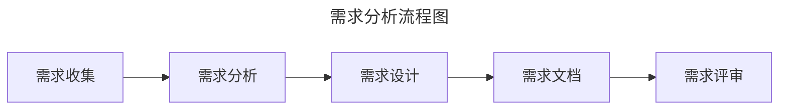
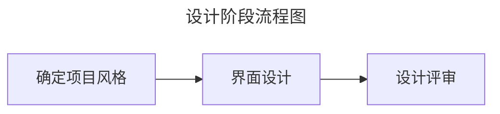
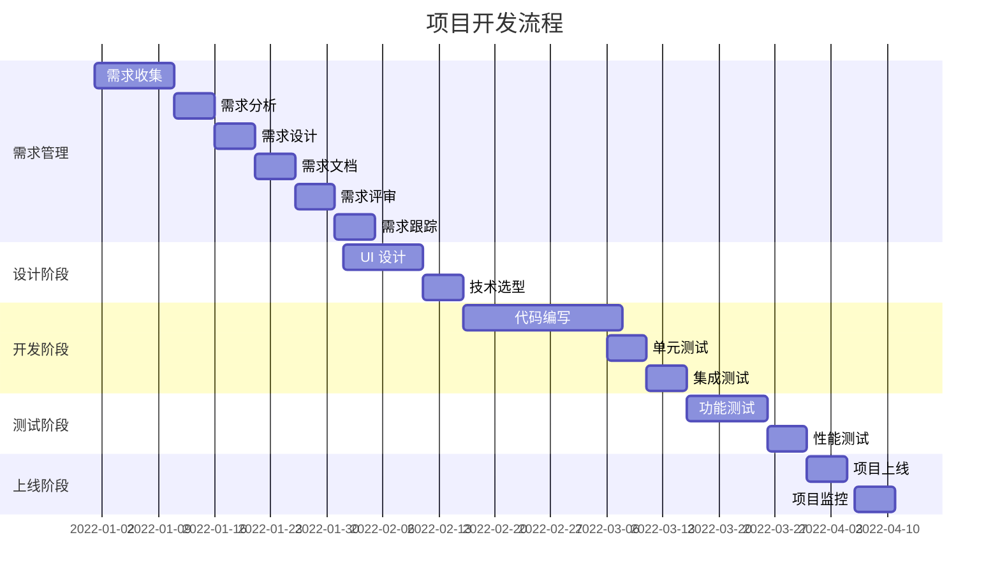

# 制定开发流程

开发流程是项目从需求分析到上线发布的整个过程中的一系列操作步骤。其中详细规定了各个岗位的职责以及团队成员如何进行协作，以确保项目按时、保质完成。

在制定开发流程时，可以从以下五个阶段进行考虑：

- 需求分析：明确项目需求，制定项目计划。
- 设计阶段：完成项目设计，包括 UI 设计、技术选型等。
- 开发阶段：按照项目计划进行开发，确保代码质量。
- 测试阶段：进行功能测试、性能测试等，确保项目质量。
- 上线阶段：完成项目上线，进行项目监控和维护。

## 需求管理

需求管理是项目开发过程中的重要环节之一，主要包括需求分析、需求设计、需求开发、需求测试、需求上线等。

需求管理主要包括以下几个方面：

- 需求管理：对需求进行管理，包括需求跟踪、需求变更等。
- 需求分析：明确项目需求，制定项目计划。
- 需求设计：根据需求分析，设计项目功能，包括功能模块、功能描述等。
- 需求开发：根据需求设计，进行项目开发，确保代码质量。
- 需求测试：进行功能测试、性能测试等，确保项目质量。
- 需求上线：完成项目上线，进行项目监控和维护。
- 需求文档：编写需求文档，包括需求描述、需求原型等。
- 需求变更：明确需求变更的流程和机制。
- 需求文档管理：对需求文档进行管理，包括需求文档的编写、修改、发布等。
- 需求评审管理：对需求评审进行管理，包括需求评审的安排、组织、记录等。
- 需求变更管理：对需求变更进行管理，包括需求变更的申请、审批、实施等。
- 需求跟踪管理：对需求跟踪进行管理，包括需求跟踪的记录、分析、报告等。
- 需求管理工具：使用需求管理工具，如 JIRA、Confluence 等，对需求进行管理。
- 需求管理流程：制定需求管理流程，包括需求分析、需求设计、需求开发、需求测试、需求上线等。
- 需求管理规范：制定需求管理规范，包括需求文档规范、需求评审规范、需求变更规范等。
- 需求管理培训：对团队成员进行需求管理培训，提高需求管理能力。

## 需求分析

需求分析是项目开发的第一步，也是最重要的步骤之一。需求分析的主要目的是明确项目需求，制定项目计划。

主要包括以下几个方面：

- 项目背景：了解项目背景，包括项目背景、项目目标等。
- 用户需求：了解用户需求，包括用户需求、用户痛点等。
- 功能需求：明确项目功能需求，包括功能模块、功能描述等。
- 技术需求：明确项目技术需求，包括技术选型、技术架构等。
- 项目计划：制定项目计划，包括项目进度、项目资源等。
- 风险评估：评估项目风险，包括技术风险、市场风险等。
- 需求文档：编写需求文档，包括需求描述、需求原型等。
- 需求评审：组织需求评审，确保需求准确、完整、可实施。

### 主要活动

主要包括以下几个活动：

- **需求收集**：产品经理与用户、项目经理等沟通，收集需求。
- **需求分析**：产品经理分析需求，明确项目需求，制定项目计划。如有必要，可以邀请架构师或开发人员等参与需求分析。
- **需求设计**：产品经理根据需求分析，设计项目功能，包括功能模块、功能描述等。
- **需求文档**：产品经理将需求设计转换成编写需求文档，包括需求描述、需求原型等。
- **需求评审**：产品经理**知会项目经理组织需求评审**，确保需求准确、完整、可实施。参与人员包括项目经理、产品经理、开发人员、测试人员、设计人员等。如有必要，可以邀请用户（即，需求方）参与评审。

### 参与人员

主要参与人员包括产品经理、项目经理、开发人员、测试人员、设计人员。

## 设计阶段

设计阶段是将需求转化为 UI 设计稿的过程，主要包括 UI 设计、设计评审等。

### 主要活动

主要包括以下几个活动：

- 确定项目风格：设计人员根据项目需求，确定项目风格，包括颜色、字体、图标等。
- 界面设计：待风格确定好后，设计人员则可根据需求文档进行界面设计。
- 设计评审：设计人员知会项目经理组织设计评审，确保设计符合需求。参与人员包括项目经理、产品经理、开发人员、测试人员、设计人员等。如有必要，可以邀请用户（即，需求方）参与评审。

### 参与人员

主要参与人员包括产品经理、项目经理、开发人员、测试人员、设计人员。

## 开发阶段

当需求文档和 UI 都准备好后，即可进入开发阶段。开发阶段主要包括开发评审、任务拆分、代码编写、单元测试、集成测试等。

### 主要活动

主要包括以下几个活动：

- 开发评审：当一切准备妥当，项目经理即可组织开发评审。在开发评审中，开发人员需要评估需求的实现成本；对于实现难度较高的需求及时点出，进行评估。参与人员包括项目经理、产品经理、开发人员、测试人员、设计人员等。
- 任务拆分：项目经理根据开发计划，将任务拆分成若干子任务，分配给开发人员。
- 代码编写：开发人员根据任务拆分，进行代码编写。
- 测试环境部署：开发人员完成代码编写后，需部署测试环境，以便测试人员进行测试。

#### 开发评审说明

开发评审是开发阶段的首要环节。只有进行开发评审后，开发人员才允许参与开发。开发评审主要内容如下：

- 评估需求的实现成本：开发人员需要评估需求的实现成本，包括时间成本、人力成本等。
- 评估需求的开发风险：开发人员需要及时点出实现难度较高的需求，以便项目经理进行评估和调整。
- 评估需求的实现风险：开发人员需要评估需求的实现风险，包括技术风险、市场风险等。
- 评估需求的实现可行性：开发人员需要评估需求的实现可行性，包括技术可行性、市场可行性等。
- 确定开发截至时间：项目经理根据开发计划，确定开发截至时间，以便开发人员按时完成任务。
- 确定开发资源：项目经理根据开发计划，确定开发资源，包括人力、设备等。
- 确定测试用例评审时间点：项目经理根据开发计划，确定测试用例评审时间点，以便测试人员提前准备测试用例。

> [!IMPORTANT] 关于开发评审中明确需要调整的需求
> 严格来说，开发评审中不应该出现需要调整的需求。技术可行性的评估应该在需求评审阶段，架构师或者高级开发人员应该评估需求的实现成本和开发风险，并给出建议。然而，在实际工作中，由于疏忽或缺乏高级开发人员等原因，可能会出现需要调整的需求。因此，**在开发评审中，开发人员需要及时点出需要调整的需求，以便项目经理进行评估和调整。避免将问题留到开发阶段，影响开发进度**。
>
> 项目经理对于需要变动的需求，可做如下处理：
>
> - 如果调整幅度较小，产品经理调整需求文档后，知会全员即可。
> - 如果调整幅度较大可有两种处理方式：1. 将需要调整的需求移出本次迭代，放到下一个迭代中开发；2. 产品经理调整需求文档后，重新组织需求评审和开发评审，若涉及设计稿变动，则需重新组织设计评审。

#### 代码编写说明

开发人员在进行开发过程中，应优先输出相关文档，如数据库设计文档、接口文档等。在编写代码时，应**遵严格循编码规范、代码审查规范、分支管理规范等**。如有单元测试、集成测试要求，则应编写相关测试用例代码。

### 参与人员

主要参与人员包括产品经理、项目经理、开发人员、测试人员、设计人员。

## 测试阶段

待开发人员完成功能开发并把代码部署到测试环境后，即可进入测试阶段。测试阶段的主要工作是在开发阶段结束后进行，主要包括功能测试、性能测试、回归测试、BUG 修复等。不过测试用例编写、测试用例评审工作需在开发阶段同步进行。

### 主要活动

主要包括以下几个活动：

- 编写测试用例：根据需求文档，编写测试用例，包括功能测试用例、性能测试用例等。
- 测试用例评审：组织测试用例评审，确保测试用例准确、完整、可实施。参与人员包括项目经理、产品经理、开发人员、测试人员、设计人员等。如有必要，可以邀请用户（即，需求方）参与评审。
- 执行测试用例：执行测试用例，包括功能测试、性能测试等。
- 记录测试结果：记录测试结果，包括测试用例执行结果、测试用例缺陷等。
- BUG 修复：开发人员修复 BUG，并提交修复结果。
- 回归测试：修复 BUG 后，进行回归测试，确保修复的 BUG 没有引入新的问题。
- 编写测试报告：编写测试报告，包括测试用例执行情况、测试用例缺陷情况等。

> [!TIP] 测试阶段和开发阶段的关联
> 在部分开发模式中，测试阶段是穿插在开发阶段的。例如，在敏捷开发模式中，开发人员完成部分功能开发后即可进行测试，测试人员发现 BUG 后，开发人员立即修复 BUG，并重新进行测试。这种模式可以加快开发进度，提高开发效率。

#### 测试用例管理说明

功能测试主要包括以下几个方面：

- 编写测试用例：根据需求文档，编写测试用例，包括功能测试用例、性能测试用例等。
- 执行测试用例：执行测试用例，包括功能测试、性能测试等。
- 记录测试结果：记录测试结果，包括测试用例执行结果、测试用例缺陷等。
- 分析测试结果：分析测试结果，包括测试用例缺陷分析、测试用例改进等。
- 修复测试用例缺陷：修复测试用例缺陷，包括缺陷修复、缺陷跟踪等。
- 测试用例管理：对测试用例进行管理，包括测试用例的编写、修改、发布等。
- 测试用例评审：对测试用例进行评审，包括测试用例评审流程、测试用例评审规范等。
- 测试用例跟踪：对测试用例进行跟踪，包括测试用例执行情况、测试用例缺陷情况等。
- 测试用例报告：编写测试用例报告，包括测试用例执行情况、测试用例缺陷情况等。
- 测试用例管理工具：使用测试用例管理工具，如 JIRA、Confluence 等，对测试用例进行管理。
- 测试用例评审管理：对测试用例评审进行管理，包括测试用例评审的安排、组织、记录等。
- 测试用例跟踪管理：对测试用例跟踪进行管理，包括测试用例跟踪的记录、分析、报告等。
- 测试用例报告管理：对测试用例报告进行管理，包括测试用例报告的编写、修改、发布等。

## 上线阶段

上线阶段是项目开发的最后一个环节，主要包括项目上线、项目监控、项目维护等。

项目上线主要包括以下几个方面：

- 部署项目：将项目部署到生产环境，包括服务器配置、数据库配置等。
- 配置项目：配置项目，包括项目配置、项目参数等。
- 测试项目：测试项目，包括功能测试、性能测试等。
- 上线项目：上线项目，包括项目发布、项目上线等。
- 监控项目：监控项目，包括项目监控、项目报警等。
- 维护项目：维护项目，包括项目修复、项目升级等。
- 项目上线管理：对项目上线进行管理，包括项目上线的安排、组织、记录等。
- 项目监控管理：对项目监控进行管理，包括项目监控的安排、组织、记录等。
- 项目维护管理：对项目维护进行管理，包括项目维护的安排、组织、记录等。
- 项目上线工具：使用项目上线工具，如 Ansible、Jenkins 等，对项目上线进行管理。
- 项目监控工具：使用项目监控工具，如 Prometheus、Grafana 等，对项目监控进行管理。
- 项目维护工具：使用项目维护工具，如 Git、SVN 等，对项目维护进行管理。
- 项目上线文档：编写项目上线文档，包括项目上线流程、项目上线规范等。
- 项目监控文档：编写项目监控文档，包括项目监控流程、项目监控规范等。
- 项目维护文档：编写项目维护文档，包括项目维护流程、项目维护规范等。
- 项目上线培训：对团队成员进行项目上线培训，提高项目上线能力。
- 项目监控培训：对团队成员进行项目监控培训，提高项目监控能力。
- 项目维护培训：对团队成员进行项目维护培训，提高项目维护能力。
- 项目上线文档管理：对项目上线文档进行管理，包括项目上线文档的编写、修改、发布等。
- 项目监控文档管理：对项目监控文档进行管理，包括项目监控文档的编写、修改、发布等。
- 项目维护文档管理：对项目维护文档进行管理，包括项目维护文档的编写、修改、发布等。
- 项目上线文档管理工具：使用项目上线文档管理工具，如 JIRA、Confluence 等，对项目上线文档进行管理。
- 项目监控文档管理工具：使用项目监控文档管理工具，如 JIRA、Confluence 等，对项目监控文档进行管理。
- 项目维护文档管理工具：使用项目维护文档管理工具，如 JIRA、Confluence 等，对项目维护文档进行管理。

