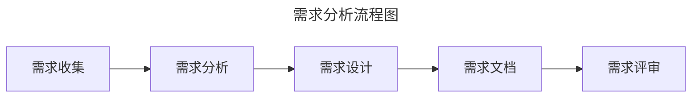
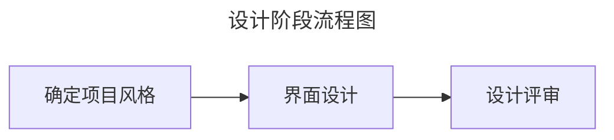
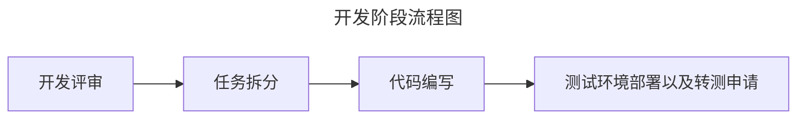
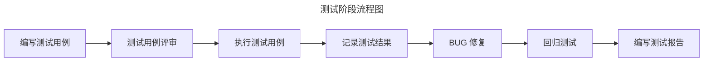
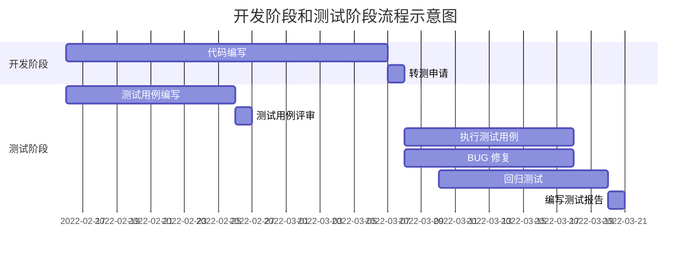
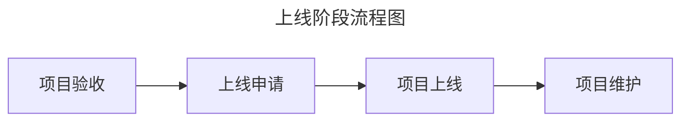
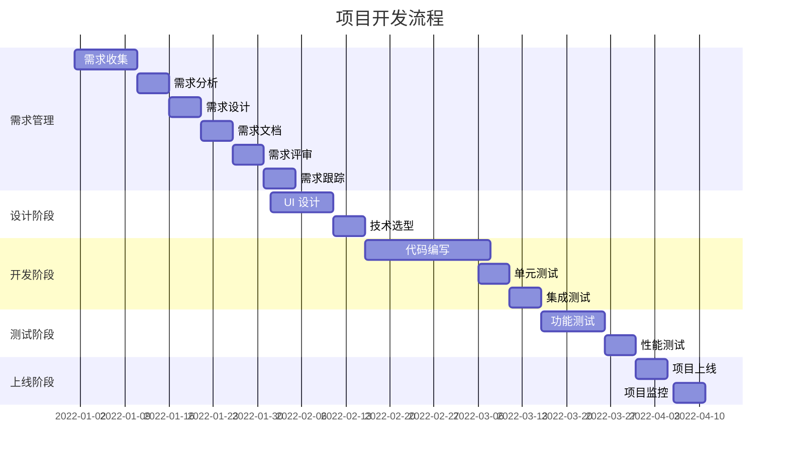

# 开发流程规范

开发流程是项目从需求分析到上线发布的整个过程中的一系列操作步骤。其中详细规定了各个岗位的职责以及团队成员如何进行协作，以确保项目按时、保质完成。

在制定开发流程时，可以从以下五个阶段进行考虑：

- 需求分析：明确项目需求，制定项目计划。
- 设计阶段：完成项目设计，包括 UI 设计、技术选型等。
- 开发阶段：按照项目计划进行开发，确保代码质量。
- 测试阶段：进行功能测试、性能测试等，确保项目质量。
- 上线阶段：完成项目上线，进行项目监控和维护。

## 需求分析

需求分析是项目开发的第一步，也是最重要的步骤之一。需求分析的主要目的是明确项目需求，制定项目计划。

### 主要活动

主要包括以下几个活动：

- **需求收集**：产品经理与用户、项目经理等沟通，收集需求。
- **需求分析**：产品经理分析需求，明确项目需求，制定项目计划。如有必要，可以邀请架构师或开发人员等参与需求分析。
- **需求设计**：产品经理根据需求分析，设计项目功能，包括功能模块、功能描述等。
- **需求文档**：产品经理将需求设计转换成编写需求文档，包括需求描述、需求原型等。
- **需求评审**：产品经理**知会项目经理组织需求评审**，确保需求准确、完整、可实施。参与人员包括项目经理、产品经理、开发人员、测试人员、设计人员等。如有必要，可以邀请用户（即，需求方）参与评审。

### 参与人员

主要参与人员包括产品经理、项目经理、开发人员、测试人员、设计人员。

## 设计阶段

设计阶段是将需求转化为 UI 设计稿的过程，主要包括 UI 设计、设计评审等。

### 主要活动

主要包括以下几个活动：

- 确定项目风格：设计人员根据项目需求，确定项目风格，包括颜色、字体、图标等。
- 界面设计：待风格确定好后，设计人员则可根据需求文档进行界面设计。
- 设计评审：设计人员知会项目经理组织设计评审，确保设计符合需求。参与人员包括项目经理、产品经理、开发人员、测试人员、设计人员等。如有必要，可以邀请用户（即，需求方）参与评审。

### 参与人员

主要参与人员包括产品经理、项目经理、开发人员、测试人员、设计人员。

## 开发阶段

当需求文档和 UI 都准备好后，即可进入开发阶段。开发阶段主要包括开发评审、任务拆分、代码编写、单元测试、集成测试等。

### 主要活动

主要包括以下几个活动：

- 开发评审：当一切准备妥当，项目经理即可组织开发评审。在开发评审中，开发人员需要评估需求的实现成本；对于实现难度较高的需求及时点出，进行评估。参与人员包括项目经理、产品经理、开发人员、测试人员、设计人员等。
- 任务拆分：项目经理根据开发计划，将任务拆分成若干子任务，分配给开发人员。
- 代码编写：开发人员根据任务拆分，进行代码编写。
- 转测申请：开发人员完成代码编写后，将代码部署到测试环境。项目管理发起转测申请，通知测试人员开始测试。

#### 开发评审说明

开发评审是开发阶段的首要环节。只有进行开发评审后，开发人员才允许参与开发。开发评审主要内容如下：

- 评估需求的实现成本：开发人员需要评估需求的实现成本，包括时间成本、人力成本等。
- 评估需求的开发风险：开发人员需要及时点出实现难度较高的需求，以便项目经理进行评估和调整。
- 评估需求的实现风险：开发人员需要评估需求的实现风险，包括技术风险、市场风险等。
- 评估需求的实现可行性：开发人员需要评估需求的实现可行性，包括技术可行性、市场可行性等。
- 确定开发截至时间：项目经理根据开发计划，确定开发截至时间，以便开发人员按时完成任务。
- 确定开发资源：项目经理根据开发计划，确定开发资源，包括人力、设备等。
- 确定测试用例评审时间点：项目经理根据开发计划，确定测试用例评审时间点，以便测试人员提前准备测试用例。

> [!IMPORTANT] 关于开发评审中明确需要调整的需求
> 严格来说，开发评审中不应该出现需要调整的需求。技术可行性的评估应该在需求评审阶段，架构师或者高级开发人员应该评估需求的实现成本和开发风险，并给出建议。然而，在实际工作中，由于疏忽或缺乏高级开发人员等原因，可能会出现需要调整的需求。因此，**在开发评审中，开发人员需要及时点出需要调整的需求，以便项目经理进行评估和调整。避免将问题留到开发阶段，影响开发进度**。
>
> 项目经理对于需要变动的需求，可做如下处理：
>
> - 如果调整幅度较小，产品经理调整需求文档后，知会全员即可。
> - 如果调整幅度较大可有两种处理方式：1. 将需要调整的需求移出本次迭代，放到下一个迭代中开发；2. 产品经理调整需求文档后，重新组织需求评审和开发评审，若涉及设计稿变动，则需重新组织设计评审。

#### 代码编写说明

开发人员在进行开发过程中，应优先输出相关文档，如数据库设计文档、接口文档等。在编写代码时，应**严格遵循编码规范、代码审查规范、分支管理规范等**。如有单元测试要求，则应编写相关测试用例代码。

> [!TIP] 关于单元测试、集成测试代码编写
> 编写单元测试、集成测试代码的目的是为了保证代码质量、提高代码的可读性和可维护性。但由于开发人员的时间有限，一味强求单元测试、集成测试可能会导致开发周期的延长。如此就本末倒置了。因此，对于单元测试、集成测试的编写有如下建议：**在不影响项目进度的情况下，测试代码的编写应与业务实现代码一同进行。如果时间不充裕，则优先保证项目进度，补充完善测试代码可在测试、上线阶段进行**。

### 参与人员

主要参与人员包括产品经理、项目经理、开发人员、测试人员、设计人员。

## 测试阶段

待开发人员完成功能开发并把代码部署到测试环境后，即可进入测试阶段。测试阶段的主要工作是在开发阶段结束后进行，主要包括功能测试、性能测试、回归测试、BUG 修复等。不过测试用例编写、测试用例评审工作需在开发阶段同步进行。

### 主要活动

主要包括以下几个活动：

- 编写测试用例：根据需求文档，编写测试用例，包括功能测试用例、性能测试用例等。
- 测试用例评审：组织测试用例评审，确保测试用例准确、完整、可实施。参与人员包括项目经理、产品经理、开发人员、测试人员、设计人员等。如有必要，可以邀请用户（即，需求方）参与评审。
- 执行测试用例：执行测试用例，包括功能测试、性能测试、UI 测试等。
- 记录测试结果：记录测试结果，包括测试用例执行结果、测试用例缺陷等。
- BUG 修复：开发人员修复 BUG，并提交修复结果。
- 回归测试：修复 BUG 后，进行回归测试，确保修复的 BUG 没有引入新的问题。
- 编写测试报告：编写测试报告，包括测试用例执行情况、测试用例缺陷情况等。

> [!TIP] 测试阶段和开发阶段的关联
> 在部分开发模式中，测试阶段是穿插在开发阶段的。例如，在敏捷开发模式中，开发人员完成部分功能开发后即可进行测试，测试人员发现 BUG 后，开发人员立即修复 BUG，并重新进行测试。这种模式可以加快开发进度，提高开发效率。

## 上线阶段

当项目通过测试阶段后，则进入上线阶段。主要包括项目验收、项目上线、项目监控、项目维护等。

### 主要活动

主要包括以下几个活动：

- 项目验收：开发人员将代码部署到预发布环境，然后通知产品经理、软件安全管理员等进行项目验收。项目验收主要包括功能验收、性能验收、安全验收等。
- 上线申请：项目验收通过后，项目经理需通知开发人员准本上线材料，待准备妥当后发起上线申请。
- 项目上线：运维人员收到上线通知，根据上线材料配置上线环境并执行上线操作。
- 项目维护：上线完成后，则转入维护状态。项目维护主要包括项目修复、项目升级等。

### 参与人员

主要参与人员包括产品经理、项目经理、软件安全管理员、开发人员、运维人员。

## 一些贯穿性的工作

除开前面提及的各个决断下的工作外，还有一些非常重要的贯穿性的工作，如需求管理、开发任务管理、测试用例管理、文档管理等。

### 需求管理

需求管理是一个系统性的过程，除了项目起始阶段的需求收集、分析、设计等工作外，还包括需求变更、需求跟踪、需求验收、优先级管理等。

- 需求变更：在项目开发过程中，需求可能会发生变更。需求变更需经过需求评审，确保变更的需求符合项目需求。变更后的需求及时通知给所有相关人员。此外，还需做好需求变更记录，包括变更的内容、变更的原因、变更的负责人、变更的完成时间等。
- 需求跟踪：在项目开发过程中，需求需跟踪其状态。需求跟踪需记录需求的状态，包括需求的状态、需求的负责人、需求的完成时间等。
- 需求验收：需求验收发生在项目验收阶段。需求验收需确保需求已满足项目需求，且需求的质量符合项目要求。需求验收需记录需求验收的结果，包括需求的验收结果、需求的验收人、需求的验收时间等。
- 需求优先级管理：根据项目目标和利益相关者的需求，确定需求的优先级顺序，并确保高优先级需求得到及时处理。

### 开发任务管理

开发任务管理主要包括任务分配、任务进度追踪、任务工时记录等。通过合理、科学、细致的开发任务管理，可以确保项目按时、按质、按量完成。

### 测试用例管理

除了测试阶段的所提及工作内容，对测试用例进行科学管理也是十分重要的。主要包括测试用例的变更、状态跟踪、历史追溯等。

### 文档管理

文档管理是指在项目执行的整个生命周期内，系统地收集、管理和存储所有项目相关文档的过程。涉及的文档主要包括需求文档、设计文档、开发文档、测试文档、上线文档等。良好的文档管理有助于项目团队和相关利益相关者可以轻松获取所需信息，从而支持项目的顺利进行、决策制定和有效沟通；可以大幅提升项目的透明度、效率和成功率。

## 写在最后

开发流程是一个复杂的系统性过程，需要团队成员之间的紧密合作和沟通。通过科学、合理地制定开发流程规范，可以确保项目按时、按质、按量完成，提高团队开发效率。上面提及的各项工作内容，都有更加科学、细致的工程实践案例可参考。本文只是做了一个简单的介绍。在实际制定开发流程规范时，应多做调研并结合实际情况。

此外，市面上也有很多成熟的开发流程管理工具，如 JIRA、Trello、Confluence 等。这些工具不仅可以辅助团队进行开发流程管理，同时自身也是一套成熟的开发流程规范。如果团队采用这些工具进行开发流程管理，则可以基于这些工具的所提供的开发流程制定开发流程规范。
