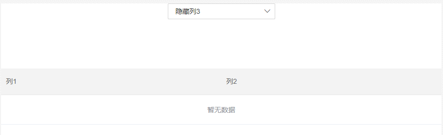

# element-ui el-table 动态新增 el-table-column，表格闪现问题的分析与解决

## 问题重现

在做动态增加删除 el-table 的列，遇到 column 显示隐藏会造成 el-table 闪烁情况：效果如下：



代码如下：

```html
<template>
  <div>
    <el-select v-model="select">
      <el-option label="显示列3" :value="true"></el-option>
      <el-option label="隐藏列3" :value="false"></el-option>
    </el-select>
    <div style="margin-top: 100px">
      <el-table style="width:100%">
        <el-table-column label="列1"></el-table-column>
        <el-table-column label="列2"></el-table-column>
        <el-table-column label="列3" v-if="select"></el-table-column>
      </el-table>
    </div>
  </div>
</template>

<script>
  export default {
    data() {
      return {
        select: false
      }
    }
  }
</script>
```

如上代码，通过 `v-if` 来控制 “列 3” 的显示隐藏。尽管成功实现了功能，这个闪烁效果并不是我们想要的。得想方法去除。

## 原因推断

仔细观察切换时候的表现效果可以发现：

- 当新增一列时，表头先是变高然后迅速复原；
- 当减少一列时，表头先是空出了提出那一列的位置，然后迅速将空出来的空间重新分配给剩余的两列；

通过这么一粗浅的分析，我们可以很容易的看出：**无论是新增列还是删除列，vue 都需要重新计算单元格的高度和宽度，然后再重新渲染到页面上。因为这个过程被直接反馈到了页面上，所以导致了 table 发生闪烁。**

很显然，只要我们把这个过程隐藏，就可以解决闪烁问题。

## 解决方法

#### 使用 element 提供的 doLayout 方法

官方描述如下:

| 方法名   | 说明                                                                               | 参数 |
| -------- | ---------------------------------------------------------------------------------- | ---- |
| doLayout | 对 Table 进行重新布局。当 Table 或其祖先元素由隐藏切换为显示时，可能需要调用此方法 | —    |

使用如下:

```js
beforeUpdate(){
  this.$nextTick(() => { //在数据加载完，重新渲染表格
    this.$refs['table'].doLayout();
  })
}
```

参考自：《[使用 element 中 el-table 动态增减表头列的时候出现抖动闪动的问题](https://blog.csdn.net/my466879168/article/details/107150931?utm_medium=distribute.pc_relevant.none-task-blog-baidujs_title-0&spm=1001.2101.3001.4242)》

#### 给 el-table 设置 key

除了`doLayout` 方法，还可以通过给 `<el-table>` 添加 key 来解决这个问题。设置 key 后，只要 key 值发生时变化，vue 就会对整个`<el-table>`重新加载渲染。如下：

```html
<template>
  <div>
    <el-select v-model="select">
      <el-option label="显示列3" :value="true"></el-option>
      <el-option label="隐藏列3" :value="false"></el-option>
    </el-select>
    <div style="margin-top: 100px">
      <el-table style="width:100%" :key="select">
        <el-table-column label="列1"></el-table-column>
        <el-table-column label="列2"></el-table-column>
        <el-table-column label="列3" v-if="select"></el-table-column>
      </el-table>
    </div>
  </div>
</template>
```

## 参考文章

- 《[使用 element 中 el-table 动态增减表头列的时候出现抖动闪动的问题](https://blog.csdn.net/my466879168/article/details/107150931?utm_medium=distribute.pc_relevant.none-task-blog-baidujs_title-0&spm=1001.2101.3001.4242)》
- 《[解决 elementui 动态切换 table 列内容，出现数据闪动情况](https://blog.csdn.net/weixin_42288182/article/details/103642205)》
