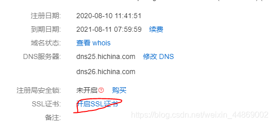
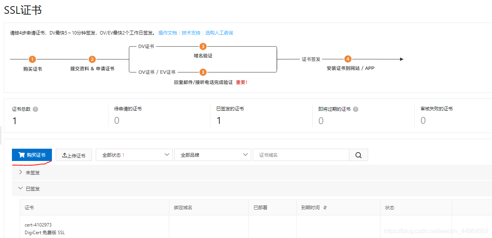
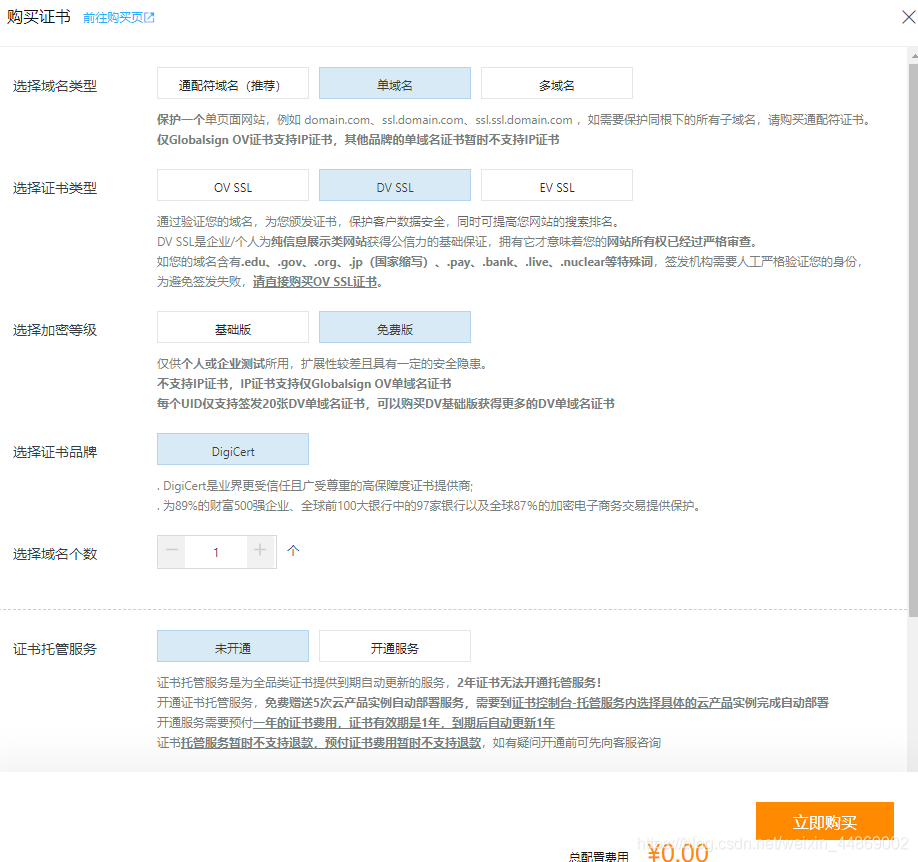
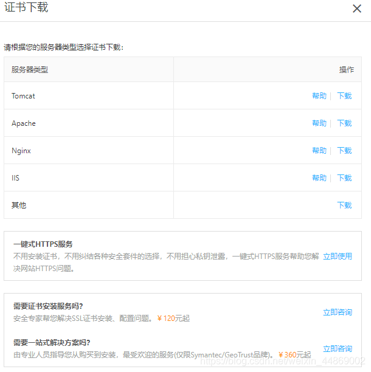

---
author: 王志杰
date: 2024-11-08
description: 记录了在阿里云上购买域名、备案、购买 SSL 证书、安装 SSL 证书、配置 HTTPS 协议的过程。
keywords: 阿里云,域名,备案,SSL证书,HTTPS协议
---

# 架设服务器实记：第 2 篇——关于域名、备案、SSL 证书、HTTPS 协议那些事

## 前言

昨天，我非常顺利的部署了服务器。今天，我就开始着手微信小程序上线一个体验版试试效果。然而，微信小程序去要求服务器必须使用申请域名且完成 ICP 备案，另外还必须使用 HTTPS 协议。没方法，只能按要求完成了。

## 域名购买与备案

域名购买有两种途径，一种是在阿里云上注册一个新的域名，另外一种方法就是购买别人出售的域名了。

域名购买成功后，还需要在阿里云中域名模块添加解析规则成功才能使用。

备案呢！也是在阿里云上进行备案。但需要注意的是，因为信息延迟的原因，备案一定是要等域名购买成功后，2-3 天才能进行。还有就是，阿里云要求你进行备案的服务器必须拥有三个月以上（三个月前购买的服务器或者直接续费三个月都行）才能进行购买。等你提交成功后，阿里云会进行一个初审，会有短信验证或者钉钉视频验证个人真实信息。至于那种方式，具体按政府的规定。

> 注意，我是在阿里云购买的服务器，所以才在阿里云上 进行域名购买和备案。

## 使用 HTTPS 协议

### 购买 SSL 证书

要给服务器配置 HTTPS 协议，首先需要根据服务器的域名来购买 SSL 证书。证书的购买可以直接在阿里云个人域名基本信息中购买。

1. 进入域名基本信息页面，点击开启 SSL 证书。就可以跳转的 SSL 证书购买页面了。



2. 接着点击购买按钮



3. 选择你想要的 SSL 证书。可以选择付费或者免费版本的。



这样就完成 SSL 证书的购买了。

### 下载 SSL 证书

购买完 SSL 证书后，我们需要把 SSL 证书下载下来，然后安装到云服务器上。



如上图，可以下载的 SSL 证书类型有很多。我们不用全部下载，只需要依照云服务器上安装 Web 服务器来下载就行了。

### 安装 SSL 证书

不同的 Web 服务器，安装 SSL 证书的方法不同。在阿里云上都有相应的安装教程。

> 这里说是安装证书，实际上只是将证书解压放到云服务器上，然后开启 Web 服务器的 SSL 功能。

因为我使用的是 Nginx，所以我这里只讲解 Nginx 的一些注意事项。

1. 需要开放服务器 443 端口。因为 HTTPS 使用的是 443 端口。

   端口的开放需要在阿里云服务器控制台中选择：网络安全 -> 安全组 -> 配置规则 -> 入方向 -> 快速添加 -> 勾选 HTTPS (443) ，最后确认添加。

2. Nginx 需要安装 SSL 对应的扩展模块：http_ssl_module 。

   这一点是最坑的。如果你的 Nginx 是通过 APT 安装的。你就会难以成功安装这个模块。因为网上基本所有的教程中的 Nginx 都是使用安装包安装。我就是因为这个原因，搞得头都大了。最后不得不屈服。重装了 Nginx。

   当然，并不是说用 APT 安装的 Nginx 不能扩展。可以扩展，但是需要根据你暗转的 Nginx 版本到 Nginx 的官网下载对应的安装包。然后解压，接着安装 http_ssl_module 扩展模块。再然后就是覆盖 Nginx 和 配置什么的了。如果，你用安装包安装过 Nginx 你就会发现上面的步骤跟重装没什么区别。更何况，网上教程少得可怜。所以，对于不熟悉 Nginx 的同学，我建议就是重装 Nignx。

#### 第一步：卸载 Nignx。参考自：[ubuntu 16.04.1 nginx 彻底删除](https://blog.csdn.net/fg_411/article/details/54928159)

1. 删除 nginx，-purge 包括配置文件

   ```shell
   sudo apt-get --purge remove nginx
   ```

2. 移除全部不使用的软件包

   ```shell
   sudo apt-get autoremove
   ```

3. 罗列出与 nginx 相关的软件并删除

   ```shell
   dpkg --get-selections|grep nginx
   ```

   ```shell
   sudo apt-get --purge remove nginx
   ```

   ```shell
   sudo apt-get --purge remove nginx-common
   ```

   ```shell
   sudo apt-get --purge remove nginx-core
   ```

4. 查看 nginx 正在运行的进程，如果有就 kill 掉

   ```shell
   ps -ef |grep nginx
   ```

   ```shell
   sudo kill -9 XXX
   ```

5. 全局查找与 nginx 相关的文件

   ```shell
   sudo  find  /  -name  nginx*
   ```

   ```shell
   sudo rm -rf file
   ```

#### 第二步：使用安装包安装 Nginx。参考：[ubuntu 安装 nginx](https://blog.csdn.net/qq_23832313/article/details/83578836)

1. 安装依赖包

   ```shell
   apt-get install gcc
   ```

   ```shell
   apt-get install libpcre3 libpcre3-dev
   ```

   ```shell
   apt-get install zlib1g zlib1g-dev
   ```

   ```shell
   sudo apt-get install openssl
   ```

   ```shell
   sudo apt-get install libssl-dev
   ```

2. 安装 Nginx

   ```shell
   cd /usr/local
   ```

   ```shell
   mkdir nginx
   ```

   ```shell
   cd nginx
   ```

   ```shell
   wget http://nginx.org/download/nginx-1.13.7.tar.gz
   ```

   ```shell
   tar -xvf nginx-1.13.7.tar.gz
   ```

3. 编译 NIgnx

   进入 nginx 目录

   ```shell
   cd /usr/local/nginx/nginx-1.13.7
   ```

   执行命令

   ```shell
   ./configure
   ```

   执行 make 命令

   ```shell
   make
   ```

   执行 make install 命令

   ```shell
   make install
   ```

这时候先不要启动 Nginx.

#### 第三步：安装扩展 http_ssl_module

1. 进入 Nginx 安装包解压后的目录

   ```shell
   cd /usr/local/nginx/nginx-1.13.7
   ```

2. configure 安装扩展

   ```shell
   ./configure --prefix=/usr/local/nginx --with-http_stub_status_module --with-http_ssl_module
   ```

3. 编译 make

   ```shell
   make
   ```

4. 备份原有的 nginx

   ```shell
   cp /usr/local/nginx/sbin/nginx /usr/local/nginx/sbin/nginx_bak\
   ```

5. 然后将刚刚编译好的 nginx 覆盖掉原有的 nginx（nginx 需要停止）

   ```shell
   cp ./objs/nginx /usr/local/nginx/sbin/
   ```

6. 启动 Nginx

   ```
   /usr/local/nginx/sbin/nginx
   ```

#### 第四步：安装证书。参考：[在 Nginx 或 Tengine 服务器上安装证书](https://help.aliyun.com/document_detail/98728.html?spm=5176.2020520163.0.dexternal.7f0256a7wbv7MH)

1. 在 `/usr/local/nginx/conf`下创建 cert 目录

   ```shell
   cd /usr/local/nginx/conf
   ```

   ```shell
   mkdir cert
   ```

2. 将 SSL 证书解压后放到 cert 目录下

3. 在`/usr/local/nginx/conf/nginx.conf`中添加如下配置：

   ```shell
   server {
   listen 443 ssl;
   server_name localhost;
   root html;
   index index.html index.htm;
   ssl_certificate cert/domain name.pem;   #将domain name.pem替换成您证书的文件名。
   ssl_certificate_key cert/domain name.key;   #将domain name.key替换成您证书的密钥文件名。
   ssl_session_timeout 5m;
   ssl_ciphers ECDHE-RSA-AES128-GCM-SHA256:ECDHE:ECDH:AES:HIGH:!NULL:!aNULL:!MD5:!ADH:!RC4;
   ssl_protocols TLSv1 TLSv1.1 TLSv1.2;
   ssl_prefer_server_ciphers on;
   location / {
   index index.html index.htm;
   }
   ```

4. 最后，重启 Nginx 服务

   ```
   /usr/local/nginx/sbin/nginx -s reload
   ```

至此，SSL 证书安装完成。

## 结语

以上就是我关于域名申请、ICP 备案以及 HTTPS 协议开启的讲解了。希望对您有所帮助。
自此，关于项目部署到服务器的过程讲解完毕。因为是第一次部署，可能存在诸多不足与错误，望悉知！

关于服务器购买、服务器环境搭建可查看：[第一次架设服务器实记：献给初次接触项目部署、云服务器的朋友们](../架设服务器实记：第1篇——献给初次接触项目部署、云服务器的朋友们)
