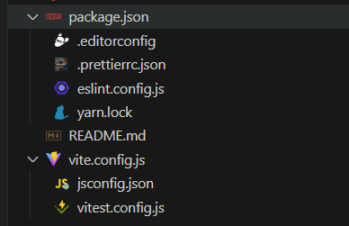
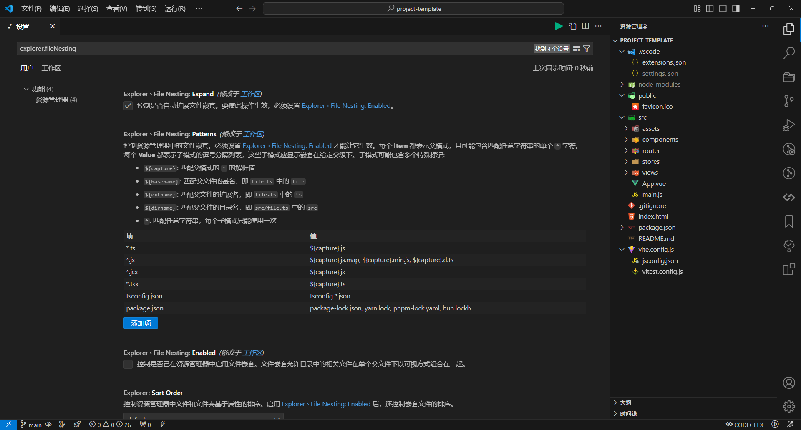

# explorer.fileNesting：一个可以帮助你更好的管理文件的配置项

最近在新建 Vue 3.0 项目的时候，突然发现`package.json`文件非常神奇的变成了文件夹。如下图：



不过点击`package.json`文件还是可以正常打开的。说明`package.json`依旧没有变，只是在组织形式上变成了文件夹。

很有趣！

经过一番摸索，发现是 VS Code 的`explorer.fileNesting`配置项搞得“鬼”。

我觉得这个配置项很有用，特别是现在的项目越来越庞大，文件越来越多，这个配置项可以帮我们更好的管理文件。

## `explorer.fileNesting` 说明

`explorer.fileNesting` 是 Visual Studio Code（VS Code）中一个与文件嵌套显示相关的设置项。它允许用户根据文件名或自定义规则来嵌套相关文件，从而在文件资源管理器中提高文件组织的清晰度和工作效率。

### 配置项说明

1. `explorer.fileNesting.enabled`

   - 功能：控制是否启用文件嵌套功能。
   - 设置值：true（启用）或 false（禁用）。
   - 备注：该设置可以全局设置，也可以针对特定工作区进行设置。

2. `explorer.fileNesting.expand`

   - 功能：控制嵌套的文件是否被默认展开。
   - 设置值：true（默认展开）或 false（默认折叠）。

3. `explorer.fileNesting.patterns`

   - 功能：控制文件的嵌套方式，允许用户自定义嵌套规则。
   - 设置值：一个 JSON 对象，键为要匹配的文件夹或文件名模式，值为嵌套的文件名模式。例如，`{ "_.js": "$(capture).js.map, $(capture)._.js" }` 表示将 .js 文件与其对应的 .js.map 文件和以其他 .js 结尾的文件嵌套在一起。

## 使用方法

### 全局设置

在 VS Code 中，可以通过以下步骤来使用 `explorer.fileNesting` 配置项：

1. 打开 VS Code。
2. 进入设置界面，可以通过快捷键 `Ctrl + ,`（Windows/Linux）或 `Cmd + ,`（Mac）来打开设置。
3. 在设置界面中，搜索 `explorer.fileNesting`。
4. 根据需要启用或禁用 `explorer.fileNesting.enabled` 配置项。
5. 如果需要，可以设置 `explorer.fileNesting.expand` 配置项来控制嵌套的文件是否默认展开。
6. 在 `explorer.fileNesting.patterns` 配置项中，根据需要定义文件嵌套规则。

如图所示：



### 项目设置

我们还可以在项目根目录中添加一个 `.vscode/settings.json` 文件，并在其中添加 `explorer.fileNesting` 配置项。这样，该配置项将只对当前项目生效，而不会影响其他项目。

```json
{
  "explorer.fileNesting.enabled": true,
  "explorer.fileNesting.expand": false,
  "explorer.fileNesting.patterns": {
    "tsconfig.json": "tsconfig.*.json, env.d.ts",
    "vite.config.*": "jsconfig*, vitest.config.*, cypress.config.*, playwright.config.*",
    "package.json": "package-lock.json, pnpm*, .yarnrc*, yarn*, .eslint*, eslint*, .prettier*, prettier*, .editorconfig"
  }
}
```

## 总结

`explorer.fileNesting` 配置项可以帮助我们更好地管理文件，提高工作效率。通过自定义文件嵌套规则，我们可以将相关的文件组织在一起，从而更方便地查找和使用它们。希望这个配置项能够帮助到你！
