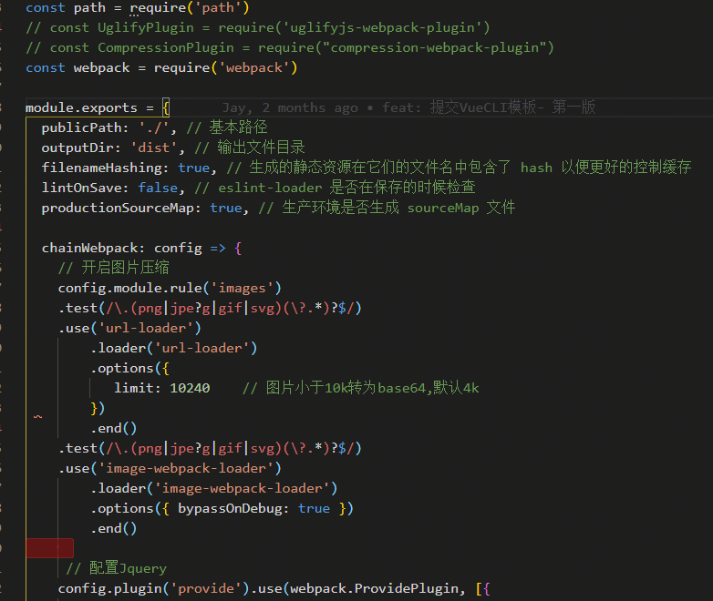
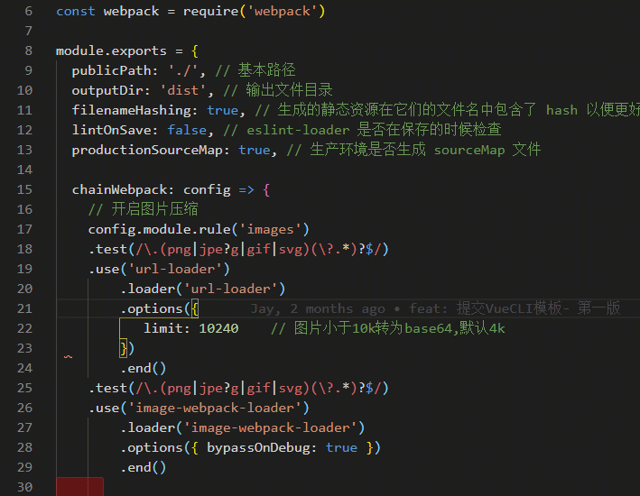

# 选择多行

## 1. Alt + 鼠标点击

> 在每一个点击的地方添加输入光标

## 2. Alt + Shift + 鼠标左键按住拖动

> 竖列多行选择。先选择起始点，然后按住 Alt + Shift 加上左键按住拖动。

## 3. 鼠标中键选中多行

> 效果和 `Alt + Shift + 鼠标左键按住拖动` 一样，不过不用先选择起始点，而是鼠标浮动那哪里，按住鼠标中键，起始点就是哪里。

## 4. Ctrl + D

> 逐一查找并选中，您选中的内容。

## 5. Ctrl + U

> 回退到上一个 `Ctrl + U` 选中的内容

## 6. Ctrl + Shift + L

> 类似 `Ctrl + D `, 不过这是立即选中全部匹配项

## 7. Home/End

> `Home` 跳转行首

> `End` 跳转行尾
>
> 

## 8. Shift + Alt + i

> 为选中的多行代码末尾插入光标

