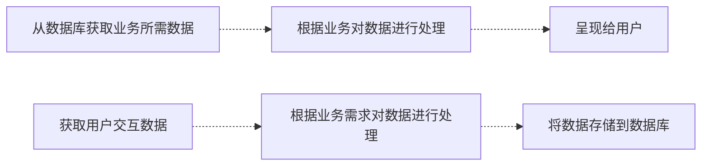
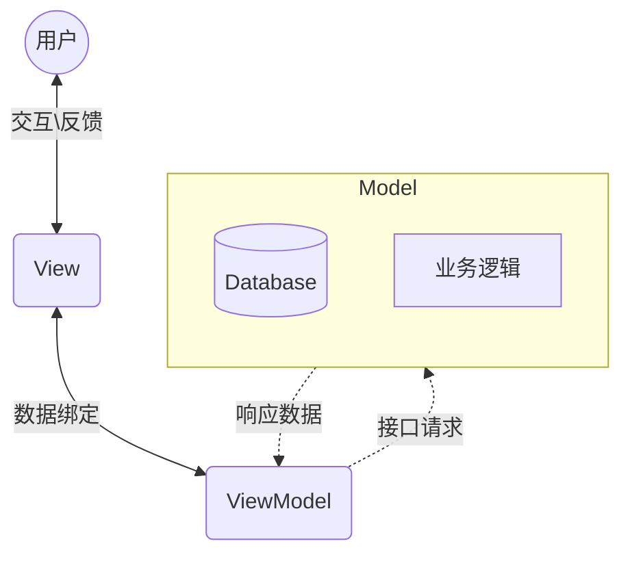
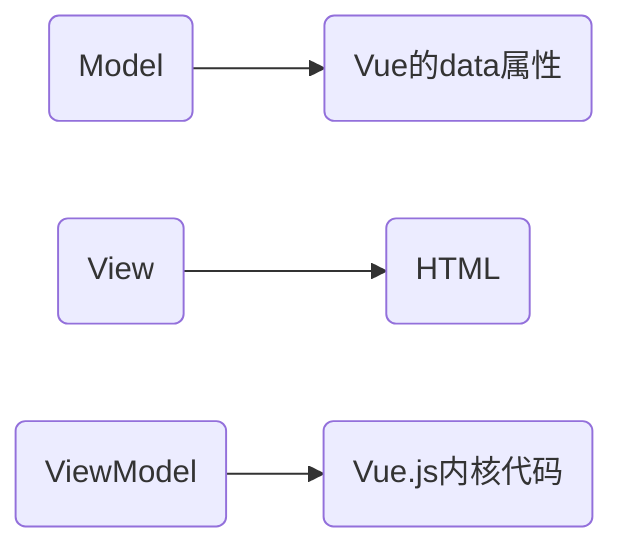
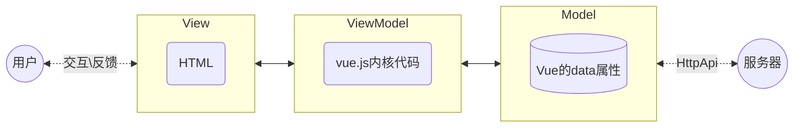
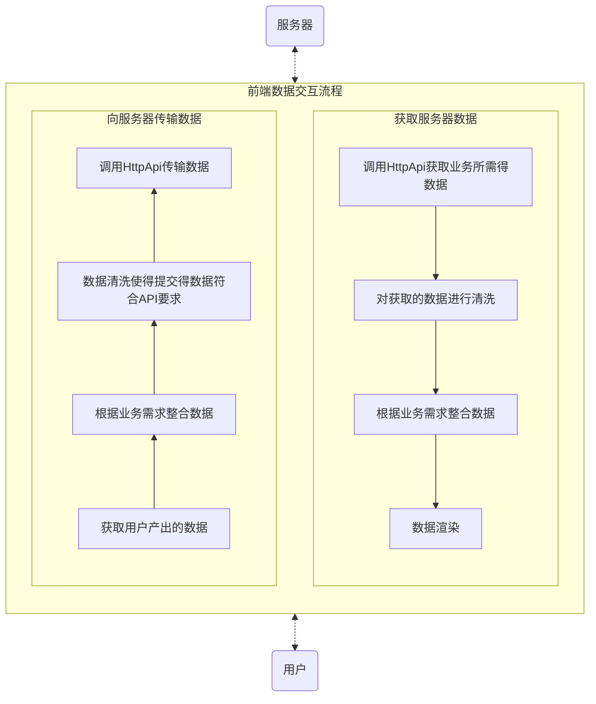
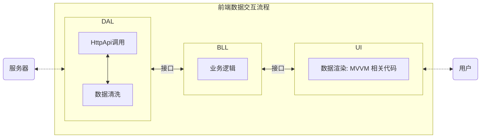
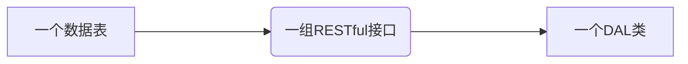
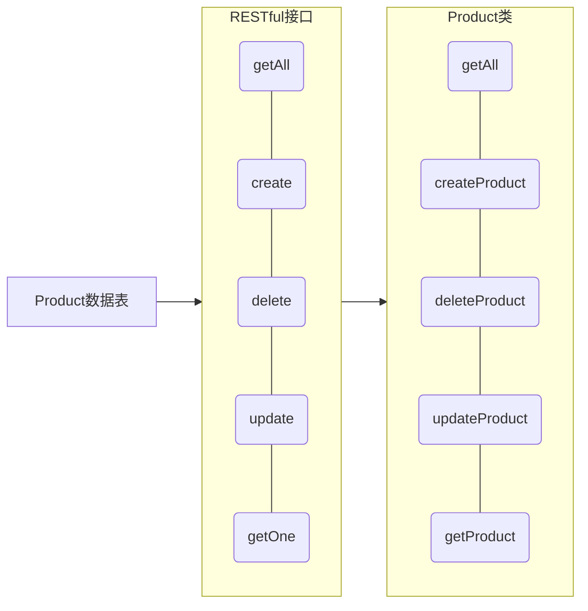
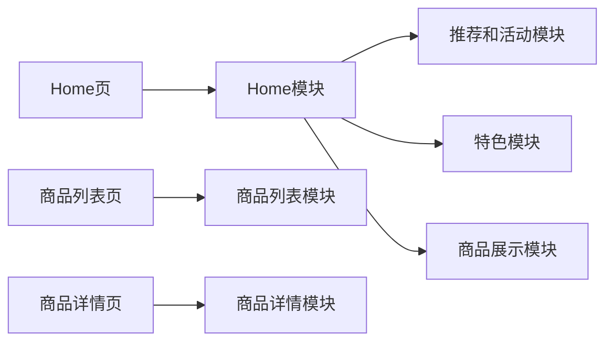
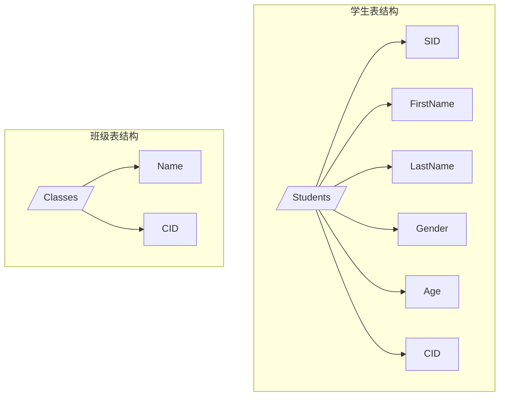

# 关于三层架构在前端项目的应用

## 前言

本文的阅读需要具备一定的技术知识基础，特别是关于 MVVM 框架（如 Vue）的理解。若您对这些知识尚不熟悉，建议您先行进行相关知识的学习与探索。

> 本文名词说明：
>
> 接口：指一个模块对外暴露的方法，用于与自身通讯。例如类的方法。
>
> HttpApi: 特指前后端交互的 HTTP 请求。

## 背景

在开发比较复杂的 Vue 项目的时候，我们常常会遇到这样一个问题：Vue 组件的代码容易变得异常庞大且复杂，这不仅降低了代码的可读性，也极大地影响了项目的可维护性。

### 常用优化方法与不足

针对这个问题，常用的优化方法有：

- **通用方法抽离到`utils/`目录**：将项目中频繁使用的通用函数或方法集中抽离到`utils/`目录下，通过模块化的方式管理，既减少了代码的冗余，也便于复用和维护。
- **`<script>`和`<style>`抽离成独立的文件**：将 Vue 组件中的`<script>`逻辑代码和`<style>`样式代码分别抽离到独立的文件中，提高了代码的组织性。
- **业务组件和公用组件抽离**：根据组件的功能和用途，明确区分业务组件和公用组件，将公用组件抽离出来进行统一管理；将复杂的业务组件从页面代码中分离。有助于减少代码的重复，提高组件的复用率，同时也使得项目结构更加清晰。
- **利用 Mixins 进行功能抽离**：借助 Mixins 将组件的公共逻辑或选项抽离出来，以便多个组件中共享，从而避免在多个组件中重复编写相同的代码，简化组件结构，提高代码的可维护性。

综合运用上述优化方法，可以极大地改善 Vue 组件代码的可读性和可维护性。

然而，上述优化方法并不能很好的对业务逻辑错综复杂的组件进行优化，其`<script>`代码依然显得相当繁复。这主要是因为`<script>`内部承载了过多职责，包括但不限于**调用外部接口**、**处理接口响应数据的转换**、**整理传递给接口的参数**，以及**实现复杂的业务逻辑**等，从而导致了代码的冗余与难以理解。

如何更好的整理组织这部分代码呢？记得之前看过一遍文章，文中提到前端项目应借鉴后端开发中广泛采用的 B/C（业务逻辑层/控制层）架构设计模式，以实现代码的“高内聚、低耦合”目标。 这个想法启发了我。在对**MVC**、**三层架构**等 B/C 架构深入了解后，发现**三层架构的项目组织模式**可以很好的解决`<script>`臃肿问题。它不仅能够帮助我们清晰地划分代码职责，还能有效提升代码的可读性与可维护性。

下面我将从“三层架构的定义”、“MVVM 架构的定义”、“前端 MVVM 架构的说明以及存在的问题”、“三层架构在前端项目上的应用”、“优缺点”四个方面分享我的思路。

## 什么是三层架构（3-tier architecture）

三层架构是一种极其**实用且广泛应用**的软件设计方法。通过将功能代码进行分层，以便更好地组织代码，从而提高代码的可维护性和可扩展性。

详细定义如下：

> 三层架构就是为了符合“**高内聚，低耦合**”思想，把各个功能模块划分为表示层（UI）、业务逻辑层（BLL）和数据访问层（DAL）三层架构，各层之间采用接口相互访问，并通过对象模型的实体类（Model）作为数据传递的载体，不同的对象模型的实体类一般对应于数据库的不同表，实体类的属性与数据库表的字段名一致。
>
> ——《[百度百科——三层架构](https://baike.baidu.com/item/%E4%B8%89%E5%B1%82%E6%9E%B6%E6%9E%84/11031448)》

三层架构最核心的思想是**根据业务流程不同阶段将代码进行拆分整合**。一般来说，一个业务模块的大体流程如下：



从上图可以看到，业务流程主要划分为三个阶段：数据在数据库中的读取与存储操作、业务处理、用户交互。因此，**三层架构将一个业务的实现代码划分为数据访问、业务逻辑、表示三个维度的模块，各个模块间通过接口进行通信**。将所有业务进行划分并水平整合后，就形成了表示层（UI）、业务逻辑层（BLL）和数据访问层（DAL）。

> 各个层级的职责简述：
>
> - 表示层：负责应用程序的用户界面和交互。
> - 业务逻辑层：处理应用程序的核心业务规则和数据验证。
> - 数据访问层：管理对底层数据源的访问和操作。

三层架构优点：

1. 高内聚、低耦合，可以降低层与层之间的依赖。
2. 容易移植、维护，如 B/S 转 C/S、SQL Server 转 Oracle、添加、修改、删除等。
3. 有利于标准化。
4. 有利于各层逻辑的复用。
5. 安全性高。用户端只能通过业务逻辑层来调用数据访问层，减少了入口点，把很多危险的系统功能都屏蔽了。

## 前端 MVVM 架构的说明以及存在的问题

现代前端项目的构建广泛依赖于采用 MVVM（Model-View-ViewModel）架构模式的框架。与三层架构一样，MVVM 同样是一种高效的软件设计架构模式，在前端开发领域占据着举足轻重的地位。那么，既然已经采用了 MVVM 架构，那为什么还需要三层架构呢？在回答这个问题前，我们需要先了解 MVVM 架构在前端中充当什么角色？发挥什么作用？

> 注：本文提及的前端项目特指**前后端分离开发模式下的前端项目**。

### 什么是 MVVM?

MVVM (Model-View-ViewModel) 是一种软件架构设计模式，它旨在将 View（用户界面）与 Model（业务逻辑和数据处理）分离，同时引入 ViewModel 作为它们之间的媒介串联起来。MVVM 架构特别适用于构建复杂的用户界面，特别是在数据绑定机制的支持下，能够显著提升开发效率与用户体验。

和三层架构一样，MVVM 也将功能代码进行分层。其中的 ：

- Mode 层：负责数据库数据的存储检索以及业务逻辑；
- View 层：负责 UI 界面的实现，展示数据给用户并接收用户的输入；
- ViewModel 层：是 Model 和 View 之间的桥梁，实现数据的双向流通、自动响应，负责将 Model 层的数据转换为 View 层可以展示的信息，同时也将 View 层的用户操作转换为 Model 层可以处理的数据变更。

最初的 MVVM 架构涵盖了整个开发流程（包括前端与后端）。随着前后端分离的兴起，以及 MVVM 架构在解决前端开发“痛点”方面的优秀表现，因此被广泛应用于前端项目中。



#### MVVM 在前端上的应用

在前端开发早期阶段，实现 JavaScript 中数据与页面展示内容之间的实时响应，不得不依赖于繁琐的手动编码，通过 JavaScript 直接操作 DOM 元素来完成。这一过程在处理简单交互倒还行，但一旦涉及构建复杂的表单页面，其代码量与复杂度飞速激增，严重制约了开发效率与可维护性。

好在，随着 MVVM（Model-View-ViewModel）架构的设计理念的出现和普及，人们发现得 MVVM 这个思路特别好。其核心思想——ViewModel 作为桥梁，实现数据与视图之间的双向绑定与自动响应，恰好能够解决前端开发中的这一“痛点”。基于这一思路，诸如 Vue.js、React、Angular 等现代前端框架应运而生，它们极大地简化了数据绑定与界面更新的流程，进一步提升了前端开发的效率与项目的可扩展性。

在前端的 MVVM 架构中，Model、View、ViewModel 三者的含义则发生了变化。 以 Vue.js 为例：



不过需要注意的是，**前端的 MVVM 架构服务的仅仅是三层架构中的表示层**，与服务器的通讯部分并未发生变动。



### MVVM 架构存在的问题

尽管 MVVM 架构的引入极大简化的前端开发复杂度。但随着互联网的飞速发展，前端项目的需求已远远超越了简单的文本、表单及数据展示范畴。如今，项目不仅追求丰富的页面视觉效果、错综复杂的交互逻辑，还承载着日益庞大的业务逻辑体系，动辄涵盖数十乃至上百个页面。在这样的背景下，无论是单个页面的精细度还是整体项目的复杂度，都呈现出爆炸性增长的态势。这时 MVVM 架构存在的一些问题就暴露出来了。

下面以 Vue 项目为例，简单讲讲有哪些问题：

#### 问题一：Vue 组件的`Script`臃肿，可阅读性、可维护性差

在小型前端项目中，前端的主要任务确实侧重于基础的数据展示与页面交互。然而，随着页面规模的不断膨胀，前端所需处理的数据量及其复杂度也急剧攀升。以电商首页为例，页面内集成了搜索、推荐、活动、分类、商品展示及特色等多个功能模块，每个模块都承载着独特的交互逻辑、业务逻辑及复杂的数据交互需求。若不加区分地将所有代码混杂一处，必将严重限制代码的可读性与可维护性，成为开发过程中的一大障碍。

面对如此复杂的项目场景，首要策略便是**根据功能点进行组件化拆分**。将上述各个模块提炼为独立的组件，并在主页面中以组件化的方式进行组装与集成。这是一种非常有效且很常用的"**高内聚、低耦合**"的代码优化手段，不仅能够显著提升代码的组织性与可维护性，还能促进团队成员之间的协作效率，降低因代码混乱而引发的潜在风险。

然而，组件化并非万能的解决方案。在面对一些**内聚性很高且规模很大**模块就不是哪么有效了。就比如一张复杂的表单。表单作为一个整体，其内部控件间往往存在着紧密的联系与复杂的交互逻辑，过度拆分不仅会破坏组件的完整性，还可能加剧组件间的通信成本。此外，表单业务逻辑的多样性与复杂性，如数据校验、提交、暂存恢复及获取等，也进一步增加了组件化拆分的难度。

#### 问题二：跨框架的代码迁移成本过高

> 当然啦！这个场景不太常见！

假设你所在的项目组决定将项目框架从 Vue 替换为 React，并对现有项目进行快速技术替换。这时我们应该怎么做？从零开始开发？不现实且费时费力。

一般的工作流程是：

1. 甄别与**框架无关的**可复用代码，进行代码抽离。可以从**通用方法**、**业务逻辑相关**、**数据获取相关**、**数据处理相关**等维度进行这项工作。
2. 将可复用代码迁移至新项目中。
3. 调整迁移代码，适配新框架。

正如问题一所说的那样，大多数代码都会杂糅在 Vue 组件内部，所以我们需要逐一抽离出来。这项工作注定是非常繁琐艰难且意外不断的。

### 解决方案——引入三层架构设计思路

为什么说三层架构能解决这些问题呢？

我们需要分析一下**前端在与服务器进行通讯前做了哪些工作**。前端与后端交互分为**获取服务器数据**以及**向服务器传输数据**两部分。大致流程如下：



> PS. 是不是发现和三层架构的分层很像。

对上面两个流程进行分析不难发现，真正和 Vue 组件强绑定的只有"**数据渲染**"以及“**获取用户产出的数据**”两个环节。因此，可以将其余六个环节涉及到代码从 Vue 组件中分离出来，从而实现组件简化的目的。然而，单纯的抽离若缺乏合理的组织与管理框架，将无法从根本上解决复杂性与维护性问题。为此，**推荐采用三层架构设计原则来重构并管理这些抽离出的代码**。

## 三层架构在前端项目上的应用

基于三层架构思路，将前端项目代码划分为数据访问层（DAL）、业务逻辑层（BLL）、表示层（UI），层与层之间通过暴露的接口（如：方法、类等）进行相互间的调用与通讯。



### 各个层级的工作概述

#### 数据访问层（DAL）

数据访问层在三层架构的具体职责如下：

> 数据访问层主要负责数据库的访问，具体包括对数据表的 Select（查询）、Insert（插入）、Update（更新）、Delete（删除）等操作。

不过前端无法直接访问数据库的，那应该怎么定义前端的数据访问层呢？

其实可以将服务器当作广义上的前端数据库，前端通过调用 HttpApi 来对数据库进行访问。所以，前端的数据访问层的职责如下：

> 数据访问层主要负责对服务器访问，具体包括对服务器数据的 Select（查询）、Insert（插入）、Update（更新）、Delete（删除）等操作。

因此，**HttpApi 调用代码**、**HttpApi 传递参数处理代码**、**回传数据处理代码**等都应被抽离整合到 DAL 中。

> 注意：HTTP 设置相关代码（如：HttpApi 配置代码、接口拦截器代码等）与业务没有相关性，所以不用抽离到 DAL 中。

> 关于 HttpApi 声明（定义）代码：
>
> 要不要将 HttpApi 声明（定义）代码归纳到 DAL 中，可实际项目的情况来决定。有些项目为了统一管理 HttpApi，会创建一个类似`api/`的目录来统一管理 HttpApi。我认为这种代码组织管理就很好，没必要变动这部分的代码。当然，将接口声明拆分整合到 DAL 模块中也有好处——可以减少代码嵌套深度。

##### DAL 层的代码组织——模块划分

> 比较推荐采用类（`Class`）的形式来组织 DAL 代码。

我们可以更具 HttpApi 所处理的数据表来创建类。

以[RESTful 接口](https://www.ruanyifeng.com/blog/2011/09/restful.html)为例。由于 RESTful 接口是面向资源的，所以一组 RESTful 接口对应一张数据表。那我们就可以根据 RESTful 接口来创建相对应的一个 DAL 类。



看具体案例：

数据库中有一个 Product 表，Product 表对应的 HttpApi 有增删改查等接口。那我们就可以在 DAL 创建一个 Product 类。如下：



Product 类定义如下：

```js
class Product {
  constructor() {}

  // 获取所有产品
  getAll() {}

  // 获取产品
  getProduct(id) {}

  // 新增产品
  createProduct(data) {}

  // 更新产品
  updateProduct(id) {}

  // 删除产品
  deleteProduct(id) {}
}
```

> 注：
>
> 1. 并不是所有的项目都会采用 RESTful 接口规范。但无论什么接口规范，接口的本质都是对数据表的增删改查。只要我们透过接口看到背后的数据表，就可以根据看到的数据表来创建 DAL 类。
> 2. DAL 类的定义并不是一定要与真实的数据表一一对应。应按实际情况灵活变通。例如一个接口对表 A 和表 B 进行联表查询。这时有三种选择：1. 创建一个新的 AB 类；2. 将 B 表字段到合并到 A 类中；3. A 表字段合并到 B 类中。可根据实际情况来决定。

#### 业务逻辑层（BLL）

> 业务逻辑层位于数据访问层和表示层之间，是数据交换的桥梁。

业务逻辑层需要根据业务需求按需调用 DA 层暴露的接口来获取数据，然后将获取到的数据处理成 UI 层所需的数据并将处理后的数据传递给 UI 层。对于 UI 层产生的数据，同样需要进行数据处理转化成 DAL 层所需的数据格式，传递给 DAL 层。

##### 业务的划分

怎么划分业务模块？

不同的人有不同的理解。有的人喜欢较大的颗粒度，一个业务模块可能横跨好几个相关性较强的页面；有的人喜欢较细的颗粒度，一个页面可以划分出好几个业务模块。但无论怎么划分，都需要保证”**高内聚，低耦合原则**“。

这里提供一种划分思路：以单个页面为最大颗粒度，一个页面对应一个（**页面层次的**）业务模块。对于比较复杂的页面，则向下进一步细分较小的业务模块，然后再整合为**页面层次的业务模块**。



#### 表示层（UI）

毋庸置疑，表示层就是 HTML 页面。不过这里的 UI 层概念要更加宽泛一些，包含了与页面直接相关的所有代码。以 Vue 项目为例，有`pages/`、`comppnents/`、`assets/`、`css/`、`store/`、`router/`等等。可以看到基本都是的`src/`目录下的文件。对这些目录或文件，不需要做过多的调整，保持原来的组织结构就好。

> 注意：有些项目会把`api/`和`utils/`也放在`src/`目录下。依照三层架构的分类方法，这两个目录下的文件是不属于 UI 层（因为两者并不依赖于某个具体的 MVVM 框架）。所以，如果要进行 MVVM 框架切换，记得抽离这部分代码直接复用或者直接调整两者的存放位置——提升为与`src/`同一层级。

#### 实体层（Entities）

在传统的三层架构中，实体层中的实体是对数据表的映射，一个实体对应一个数据表。实体有一个很重要的作用——**对数据的定义，实现了对数据的封装，保证的各层之间的数据统一性**。

##### 实体的构建

前端的实体构建稍有不同。其一，传统的三层架构构建实体是**根据数据表结构来进行的，大体上与数据表结构统一**。但是前端的数据是经过后端处理再由接口传递给前端的，在这个过程中数据结构或多或少发生了变动。如果还是根据数据表结构来构建实体，必然存在数据结构冲突的问题。其二，接口数据有时候并不能完全满足业务需求，需要额外的字段。因此，前端在构建实体时应**以接口回传数据格式为主，以业务数据为辅，一个实体对应 DAL 层的类**。

以学生信息为例：

学生信息由**学生表**和**班级表**组成。表结构如下：



> 现需要开发一个学生信息展示模块，有如下需求：
>
> - 展示学生基础信息和班级信息；
> - 需将`FirstName`、`LastName`合并为`FullName`来展示；
>
> 基于该需求，后端开发一个`/api/student`接口，对`Studens`表和`Classes`表进行联表查询返回所需的数据。
>
> ```json
> // 接口回传数据如下：
> {
>   "sid": "",
>   "first_name": "",
>   "last_name": "",
>   "gender": "",
>   "age": "",
>   "cid": "",
>   "c_name": ""
> }
> ```

那么前端该怎么创建实体呢？

根据"**以接口回传数据格式为主，以业务数据为辅**"原则。我们只需构建一个`Student`实体就行。此外，业务需要将`FirstName`、`LastName`合并为`FullName`来展示，还需要额外新增一个`FullName`属性。

```js
// Student 实体类
class student {
  constructor(sid, firstName, lastName, gender, age, cid, cName) {
    this.sid = sid
    this.firstName = firstName
    this.lastName = lastName
    this.fullName = firstName + ' ' + lastName
    this.gender = gender
    this.age = age
    this.cid = cid
    this.cName = cName
  }
}
```

### 项目目录构成

接下来就是如何组织引入三层架构后的项目目录结构。

在一级目录中增加`dal/`、`bll/`、`entities/`三个二级目录，分别用来存放**数据访问层**、**业务逻辑层**、**实体层**代码。此外，还可以将`api/`、`utils/`提升到`src/`外面。具体如下：

```bash
……
--api/ # HttpApi声明
--bll/  # 业务逻辑层代码
----home.js # 首页业务逻辑模块
----productList.js # 商品列表页业务逻辑模块
----productDetail.js # 商品详情业务逻辑模块
……
--dal/	# 数据访问层代码
----product.js # 商品数据处理模块
----classification.js # 分类数据处理模块
----hotSale.js # 热销活动处理模块
……
--entities/ # 实体层代码
----Product.js # Product类实体
----Classification.js # Classification类实体
----HotSale.js # HotSale类实体
……
--src/	# 表示层代码
----assets/
----components/
----views/
------home.vue # 首页
------productList.vue # 商品列表页
------productDetail.vue # 商品详情页
……
--utils/
……
```

可查看模板项目：[Z-J-wang/project-template-vue3 (github.com)](https://github.com/Z-J-wang/project-template-vue3)

## 优缺点分析

在前端项目中引入三层架构有着如下的优缺点：

### 优点

1. **高内聚低耦合**：此架构模式显著降低了各层之间的依赖关系，使得每一层都更加专注于其特定的职责，从而提升了系统的整体清晰度和可维护性。
2. **增强的可维护性、可扩展性和移植性**：通过清晰的分层，当需要修改或扩展功能时，可以更容易地定位到相关层进行操作，而不影响其他层的稳定性。同时，这种架构也使得代码库更容易在不同项目或环境间迁移和复用。
3. **促进并行开发与灵活响应需求变化**：不同层可以由不同的团队或开发者并行开发，加快了开发进度。同时，面对需求变更时，可以更快地调整业务逻辑层而无需大规模重构，提高了项目的灵活性。
4. **标准化与规范化**：三层架构为前端开发提供了一套标准化的开发模式和规范，有助于提升团队协作效率，减少因开发风格不一导致的后期整合问题。

### 缺点

1. **学习成本增加**：对于新加入团队的开发者来说，理解和掌握三层架构的设计理念及其在各层间的协作方式需要一定的时间和努力。
2. **潜在的性能影响**：虽然理论上三层架构不会直接导致性能下降，但过多的抽象层和调用可能会引入一定的性能开销，尤其是在处理大量数据或高频请求时。
3. **代码量和开发工作量增加**：为了实现清晰的分层和层间通信，可能需要编写更多的接口和辅助代码，这在一定程度上增加了项目的复杂性和开发工作量。

综上所述，尽管引入三层架构在前端项目中存在一定的挑战和成本，但其带来的优势在多数情况下是显而易见的。对于复杂度较高、需要长期维护的前端项目而言，三层架构无疑是一个值得考虑的选择。

## 结语

**在前端项目中引入三层架构**这一构想，仅仅是我个人的一个畅想。其是否符合实际的开发需求，优化后的效果是否真正超越所投入的开发成本，以及代码组织的合理性等诸多方面，均需在实战中深入验证与细致权衡。若你的项目正面临架构优化、代码维护或扩展性提升的迫切需求，且本文提出的架构思路恰好能够直击项目中的‘痛点’，那么，何不将其视为一个极具潜力的备选方案，纳入你的考量之中呢？
