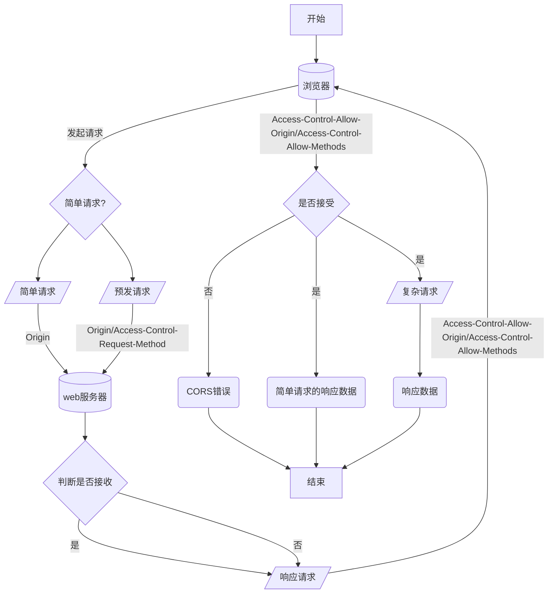

---
author: 王志杰
date: 2024-09-22
keywords: 跨域, CORS, 同源策略, 前端, Web, JSONP, DevServer
description: 在 Web 开发过程中，跨域的出现源于浏览器的同源策略。解决跨域问题最好的方式是采用 CORS 协议。同源策略是什么？CORS为什么能解决跨域问题？工作机制如何？前后端开发者在各自岗位中如何共同解决跨域问题？本文将带你解答以上问题。
---

# 跨域问题浅析

## 一、什么是源（域）

在 Web 开发中，源（域）是一个重要的概念，它由**协议**、**主机**（IP 地址或域名）和**端口**三者共同确定。只有当两个 URL 的协议、主机和端口全部相同时，这两个 URL 才被视为同源的。这一规定是基于 Web 安全的考虑，因为不同源之间的资源访问可能会带来潜在的安全风险。

## 二、同源策略

由于不同源之间的资源交互存在**未知性**和**不可控性**，早期的互联网曾允许不同源内容随意访问，但这也引发了诸如[XSS 攻击](https://developer.mozilla.org/zh-CN/docs/Glossary/Cross-site_scripting)和[CSRF 网络攻击](https://developer.mozilla.org/zh-CN/docs/Web/Security/Types_of_attacks#%E8%B7%A8%E7%AB%99%E8%AF%B7%E6%B1%82%E4%BC%AA%E9%80%A0%EF%BC%88csrf%EF%BC%89)等安全问题。为了应对这些威胁，Netscape 公司于 1995 年率先在其浏览器中引入了同源策略，对跨域的资源交互进行了限制。随后，其他浏览器厂商也跟进实施了这一策略，至今已成为所有浏览器的标准政策。

值得注意的是，虽然同源策略限制了跨域资源交互，但诸如`<script>`和``等标签仍允许跨域访问，这为后续跨域资源共享的实现提供了一定的基础。

> **不同源**也称为**跨域**。一般情况下，两者是同一个意思。

## 三、如何实现跨域资源共享

尽管**同源策略**保证了 Web 的安全性，但它在很多场景下也限制了资源访问的灵活性。如何在确保安全的前提下，实现跨域资源的有效共享，成为了前端开发中绕不开的话题。这一难题，就像是两个国家之间需要进行商品进出口交易，面临着政策限制和跨境物流的挑战。为了解决这一问题，开发人员通常有两种思路来“通关”：

1. **找代购（使用代理服务器）**：这种方法类似于寻找国际代购或中间商来代为处理跨域请求。具体实现上，就是通过代理服务器（如 nginx、DevServer 等）来转发跨域请求，因为同源策略是浏览器的安全策略，而代理服务器并非浏览器，所以它不受同源策略的限制。这种方法能够有效地绕过浏览器的安全限制，使得 A 域能够顺利访问 B 域的资源。（这里就不详细展开，不是本文的重点内容。）
2. **走海关（利用浏览器与服务器协商机制）**：此方法又可细分为两种途径：“暗度陈仓”与“申请备案，正常进出”。
   - **暗度陈仓（早期技术手段如 JSONP 和图片 Ping）**：这些技术巧妙地利用了 HTML 标签（如`<script>`、``）的跨域加载能力，绕过了浏览器的同源策略限制。但正如其名称所暗示的，这些做法虽然能够临时解决问题，却存在一定的安全风险和局限性，因此在现代 Web 开发中逐渐被淘汰。
   - **申请备案，正常进出（CORS 标准）**：为了解决跨域资源共享的安全、可控和可靠性问题，W3C 在 2014 年推出了 CORS（Cross-Origin Resource Sharing）标准。CORS 通过浏览器与服务器之间的一系列 HTTP 头部信息进行协商，确保了跨域请求在安全可控的前提下得以实现。这一标准的实施，不仅让跨域资源共享成为了一项主流技术，也大大提升了 Web 应用的安全性和互操作性。

现在，最常用的跨域资源共享的技术是 **CORS**；**JSONP** 更多情况下是 **CORS** 的一种替代方案（例如，不支持 CORS 的老浏览器）；而**图片 Ping** 技术基本很少见了。

接下来，深入了解 CORS 以及 JSONP。

### 跨域资源共享（CORS）

**CORS**（Cross-Origin Resource Sharing，跨域资源共享）由一系列的 [HTTP header](https://developer.mozilla.org/zh-CN/docs/Glossary/HTTP_header) 组成。根据这些 HTTP 标头浏览器决定是否允许 JavaScript 代码获取跨域请求的响应。**借助 CORS，web 服务器可以选择哪些跨域请求允许访问资源**。

#### CORS 工作过程

CORS 工作机制很简单，浏览器将 CORS 需要的相关信息通过请求头发送给服务器，服务器根据请求过来的信息判断是否允许该请求访问，并把结果回传给浏览器。浏览器对接收的到信息进一步做处理，对于被拒绝的请求给出 CORS 错误。具体如下：

1. 首先浏览器依照 CORS 的规定，根据请求接口的复杂度区分为**简单请求**和**复杂请求**。
   1. 简单请求：将在请求头中附带`Origin`发送给 web 服务器
   2. 复杂请求：将根据请求的基本信息（包括`Origin`、`Access-Control-Request-Method`等）生成一个预检请求（[Preflight request](https://developer.mozilla.org/zh-CN/docs/Glossary/Preflight_request)），向 web 服务器询问是否允许访问 。
2. 当 web 服务器接收到请求时， 针对不同请求有如下处理：
   1. 简单请求：根据请求头中的`Origin`来决定是否拒绝响应。
      - 如果`Origin`指定的源，不在许可范围内，服务器会返回一个不携带`Access-Control-Allow-Origin`响应头的 HTTP 响应。浏览器发现响应信息**没有包含**`Access-Control-Allow-Origin`字段就知道出错了，从而**拦截响应数据并抛出 CORS 错误**；
      - 如果服务器认为这个请求可以接受，则将**允许请求的源**赋值给`Access-Control-Allow-Origin`响应头，并携带所请求的资源回传给浏览器。
   2. 预检请求：根据请求头中的`Origin`、`Access-Control-Request-Method`以及`Access-Control-Request-Headers`来判断是否允许这类请求。
      - 如果服务器确认允许这一类的请求，则响应正常并在响应头中携带`Access-Control-Allow-Origin`、`Access-Control-Allow-Methods`、`Access-Control-Allow-Headers`以及`Access-Control-Max-Age`等字段。浏览器接收到响应后立即发送真实请求。这时发送的真实请求的处理逻辑和简单请求一致。
      - 如果服务器拒绝这类请求，同样会返回一个正常的 HTTP 响应。但是没有任何 CORS 相关的响应头字段。这时，浏览器就会认定服务器不同意这类请求，**拦截响应数据并触发 CORS 错误**。

> **关于浏览器拦截跨域请求的响应内容**：
>
> 当一个请求被浏览器识别为**不允许的跨域请求**时，浏览器会自动拦截请求的响应内容，阻止响应内容加载到渲染进程中。这也就是为什么在 Devtools 的 Network 中查看被阻止的跨域请求时，Response 是一片空白的原因。
>
> 其中，针对跨域标签（如：`<script>`，``）请求的响应内容，浏览器主要采用**CORB（跨源读取阻止器，Cross-Origin Read Blocking）**技术来进行拦截。

> **CORB 概述**：
>
> CORB 是一种浏览器安全机制，旨在减少跨站脚本（XSS）攻击的风险。当浏览器接收到来自不同源的响应时，CORB 会检查响应的内容类型（Content-Type）和响应体（response body）的“嗅探”（sniffing）结果。如果响应被标记为可执行的脚本类型（如 JavaScript），但其内容看起来更像是 HTML 或其他非脚本类型的数据，CORB 会阻止该响应的加载和执行，以防止潜在的恶意脚本执行。
>
> 简而言之，CORB 通过阻止那些看似被错误标记为脚本但实际上包含 HTML 或其他类型数据的跨域响应，来增强 Web 应用的安全性。这种机制与 CORS（跨域资源共享）相辅相成，CORS 主要处理跨域请求的授权问题，而 CORB 则关注于响应内容的安全性。
>
> 详见：[Cross-Origin Resource Policy (CORP) - HTTP | MDN (mozilla.org)](https://developer.mozilla.org/en-US/docs/Web/HTTP/Cross-Origin_Resource_Policy)



#### CORS 相关的 Request header

- [`Origin`](https://developer.mozilla.org/zh-CN/docs/Web/HTTP/Headers/Origin)：指示获取资源的请求是从什么源发起的（协议、主机、端口）。
- [`Access-Control-Request-Method`](https://developer.mozilla.org/zh-CN/docs/Web/HTTP/Headers/Access-Control-Request-Method)：告知服务器正式请求会使用哪一种 [HTTP 请求方法](https://developer.mozilla.org/zh-CN/docs/Web/HTTP/Methods)。仅用于预检请求。
- [`Access-Control-Request-Headers`](https://developer.mozilla.org/zh-CN/docs/Web/HTTP/Headers/Access-Control-Request-Headers)：（可选）告知服务器正式请求会使用哪些 HTTP 标头。仅用于预检请求。

#### CORS 相关的 Response header

- [`Access-Control-Allow-Origin`](https://developer.mozilla.org/zh-CN/docs/Web/HTTP/Headers/Access-Control-Allow-Origin)：指示响应的资源是否可以被给定的来源共享。可以将其设置为`*`，表示可以被任意源访问。

- [`Access-Control-Allow-Methods`](https://developer.mozilla.org/zh-CN/docs/Web/HTTP/Headers/Access-Control-Allow-Methods)：指定对预检请求的响应中，哪些 HTTP 方法允许访问请求的资源。

- [`Access-Control-Max-Age`](https://developer.mozilla.org/zh-CN/docs/Web/HTTP/Headers/Access-Control-Max-Age)：指示预检请求的结果能被缓存多久。

- [`Access-Control-Allow-Headers`](https://developer.mozilla.org/zh-CN/docs/Web/HTTP/Headers/Access-Control-Allow-Headers)：（可选）用在对预检请求的响应中，指示实际的请求中可以使用哪些 HTTP 标头。

#### 预检请求的缓存

浏览器会自动缓存预检请求的结果，`Access-Control-Max-Age`就是用于指示浏览器要将当前预检请求的结果缓存多久的。当浏览器发起一个预检请求时，优先在缓存中查找是否有已存在对应的结果，从而减少预检请求的开销。

#### 附带身份凭证的请求

一般而言，对于跨域请求，浏览器**不会**发送身份凭证信息（例如 Cookies）。如果要发送凭证信息，需要将`XMLHttpRequest`对象的`withCredentials`设置为`true`。

服务器在响应这类预检请求时，需要在响应头中添加`Access-Control-Allow-Credentials`属性并设为`true`。此外还有如下限制：

- 服务器**不能**将 `Access-Control-Allow-Origin` 的值设为通配符“`*`”，而应将其设置为特定的域，如：`Access-Control-Allow-Origin: https://example.com`。
- 服务器**不能**将 `Access-Control-Allow-Headers` 的值设为通配符“`*`”，而应将其设置为标头名称的列表，如：`Access-Control-Allow-Headers: X-PINGOTHER, Content-Type`
- 服务器**不能**将 `Access-Control-Allow-Methods` 的值设为通配符“`*`”，而应将其设置为特定请求方法名称的列表，如：`Access-Control-Allow-Methods: POST, GET`

### JSONP

JSONP 的实现原理是基于浏览器对于`<script>`标签的处理逻辑来实现的。`<script>`标签有如下两个特点：

- 允许加载其他域的 JavaScript 文件。
- 当加载解析完 JavaScript 文件后，会立即执行里面的代码。

基于上面两个特性，有人就想到了**如果将要传递给前端的数据通过`JSON.stringify()`序列化成字符串生成 JavaScript 文件，然后前端通过`<script>`标签加载该文件就可以获取到数据了**。

为了让前端知道数据什么时候回传完毕，JSONP 还规定了前端需要定义一个`callback`函数，并把函数名通过`request.query`传递给后端。后端根据传递`callback`函数名生成 JavaScript 文件，该 JaveScript 文件只有一句`callback`函数的执行代码，所要回传数据则是`callback`函数的传参。这样当 JavaScript 文件被解析完后会立即调用前端定义的`callback`函数。详见下面的案例：

前端代码：

```html
<html>
  <head>
    <meta charset="UTF-8" />
    <meta http-equiv="X-UA-Compatible" content="IE=edge" />
    <meta name="viewport" content="width=device-width, initial-scale=1.0" />
    <title>JSONP简单实现</title>
  </head>
  <body>
    <button id="btn">点击发送请求</button>
    <script>
      function getJsonpData(data) {
        console.log('获取数据成功')
        console.log(data) //{name:'tom'}
      }
      var btn = document.getElementById('btn')
      btn.onclick = function () {
        //创建script标签
        var script = document.createElement('script')
        script.src = 'http://localhost:3000/user?callback=getJsonpData'
        document.body.appendChild(script)
        script.onload = function () {
          document.body.removeChild(script)
        }
      }
    </script>
  </body>
</html>
```

后端代码：

```js
const express = require('express')
const app = express()
const port = 3000

//路由配置
app.get('/user', (req, res) => {
  //1.获取客户端发送过来的回调函数的名字
  let fnName = req.query.callback
  //2.得到要通过JSONP形式发送给客户端的数据
  const data = { name: 'tom' }
  //3.根据前两步得到的数据，拼接出个函数调用的字符串
  let result = `${fnName}(${JSON.stringify(data)})` // 即，getJsonpData("{name:'tom'}")
  //4.把上步拼接得到的字符串，响应给客户端的<script> 标签进行解析执行
  res.send(result)
})

app.listen(port, () => {
  console.log(`Example app listening on port ${port}`)
})
```

#### JSONP 的局限性

在 CORS 被现代浏览器广泛支持之前，JSONP 曾是跨域数据访问的主要手段。然而，JSONP 方法并非完美无缺，其存在以下显著的缺点：

1. **安全隐患**：JSONP 的核心机制使其在安全性方面存在显著漏洞。由于 JSONP 依赖于`<script>`标签来加载跨域资源，这意味着任何通过 JSONP 返回的响应都将被浏览器当作 JavaScript 代码执行。因此，如果响应数据被恶意篡改，攻击者可以轻易地插入并执行恶意脚本，从而发起 XSS（跨站脚本）攻击，严重威胁用户数据和网站安全。

2. **请求方法限制**：JSONP 仅支持 GET 请求。这一限制极大地缩减了 JSONP 的应用场景。在需要执行 POST、PUT 等 HTTP 方法以发送大量数据或进行敏感操作的场景中，JSONP 显得力不从心。此外，GET 请求的 URL 长度限制也可能导致数据传输受限，进一步限制了 JSONP 的实用性。

## 四、前后端在实现跨域中的角色

在 Web 开发中，**无论是采用 CORS（跨源资源共享）还是 JSONP 技术来实现跨域资源的访问，都需要前端与后端的紧密配合**。单独依赖任何一方都无法实现有效的跨域通信。

记得第一次遇到浏览器报**CORS 错误**的时候，两眼抓瞎，照着网上的方法配置还是不行。然后就甩锅给后端，后端也不会，认为跨域是浏览器问题。在互相推诿中，各自查找资料瞎搞，然后稀里糊涂的搞通了。现在想想，估计后端把所有域都设置成可允许访问了。

**其实对于前端开发人员来说，在开发中遇到的 CORS 错误大多数是在前后端联调的时候遇到的**。这是因为前后端代码运行在不同的主机上导致的。对于这种 CORS 错误，不应该盲目去用 CORS、JSONP 等方法解决。因为将代码部署到服务器后，前后端代码基本都是运行在同一个域上，是不会出现**CORS 错误**的。前端人员应该通过**代理转发**来解决这类跨域问题。一个前端项目比较推荐的常用解决方案是**Webpack 的 DevServer**。

## 参考文档

- [跨域资源共享（CORS） - HTTP | MDN (mozilla.org)](https://developer.mozilla.org/zh-CN/docs/Web/HTTP/CORS)
- 【JavaScript 高级程序设计（第三版）】
- [http CORS options 请求（预检请求）详解 - 知乎 (zhihu.com)](https://zhuanlan.zhihu.com/p/528620968)
- [浏览器的同源策略 - Web 安全 | MDN (mozilla.org)](https://developer.mozilla.org/zh-CN/docs/Web/Security/Same-origin_policy)
