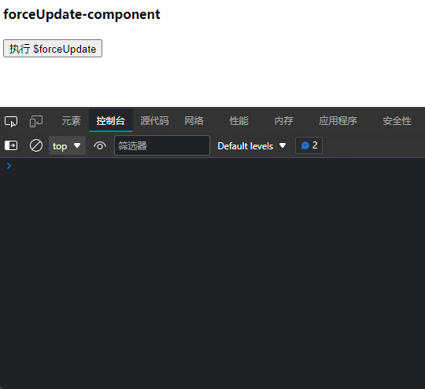
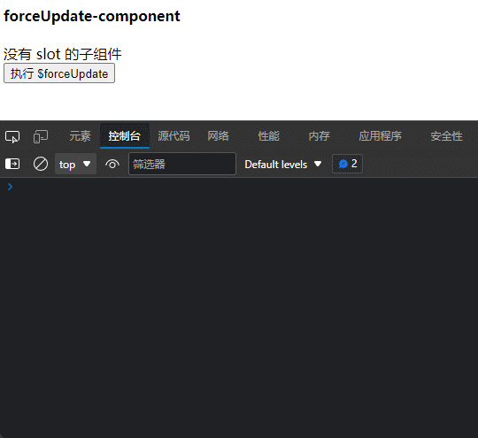
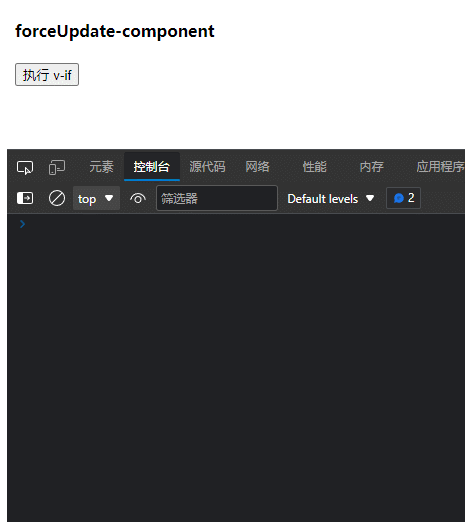
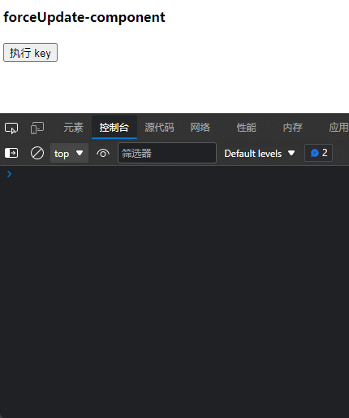

# Vue 三种强制刷新方法的机制、使用场景、开销说明

## 前言

在日常 Vue 项目开发中，我们或多或少需要对组件进行**强制刷新**操作。比如，明明更新了 `data` 属性的值，但是页面上显示的还是旧的数据。又比如，在某些时候，我们想要一个全新的、干净的组件；或者是想要重新触发`created`、`mounted`的生命周期钩子等等。

**组件强制刷新的需求出发点千千万，但是不少需求并不是真的需要强制刷新组件，只是因为强制刷新组件往往是最直接、最便捷的方式而已**。强制刷新虽然好用，但是不能滥用。强制刷新对浏览器来说是一笔不小的开销，我们更应该通过优化代码设计来解决问题。**在我们尽可能的减少使用强制刷新来实现需求时，也是锻炼我们编码能力，逻辑设计能力的机会。**

下面，一起来认识三种强制刷新的方法吧！

> 如果你具备以下知识，将有助于你更好的理解本文。
>
> 前置知识储备：
>
> - Vue 虚拟 DOM(VNodes)
> - Vue diff 算法
>
> 如果你有兴趣了解，而苦于没有资料学习，我推荐下面几篇文章：
>
> - [为什么 Vue 中不要用 index 作为 key？（diff 算法详解）](https://juejin.cn/post/6844904113587634184)
> - [Vue 的 diff 算法详解和 key 作用(较详细)](https://blog.csdn.net/qq_39414417/article/details/104763824)
> - [vue 核心之虚拟 DOM(vdom)](https://www.jianshu.com/p/af0b398602bc)
> - [你真的了解 Vue Key 吗？概述 Vue Key，以及如何合理的使用 Vue Key](https://blog.csdn.net/weixin_44869002/article/details/118435784)

## 方法一： $forceUpdate

`$forceUpdate` 方法是官方提供的方法。不过它是一个**伪组件强制刷新**方法。可能很多人对其存在误解误用的情况。

### 官方文档相关描述摘抄

官方文档有关`$forceUpdate` 有如下两段话。

> 如果你发现你自己需要在 Vue 中做一次强制更新，99.9% 的情况，是你在某个地方做错了事。
>
> 你可能还没有留意到[数组](https://cn.vuejs.org/v2/guide/list.html#注意事项)或[对象](https://cn.vuejs.org/v2/guide/list.html#对象变更检测注意事项)的变更检测注意事项，或者你可能依赖了一个未被 Vue 的响应式系统追踪的状态。
>
> 然而，如果你已经做到了上述的事项仍然发现在极少数的情况下需要手动强制更新，那么你可以通过 [`$forceUpdate`](https://cn.vuejs.org/v2/api/#vm-forceUpdate) 来做这件事。

> #### [vm.$forceUpdate()](https://cn.vuejs.org/v2/api/#vm-forceUpdate)
>
> - **示例**：
>
>   迫使 Vue 实例重新渲染。注意它仅仅影响实例本身和插入插槽内容的子组件，而不是所有子组件。

可以看到，第一段是关于`$forceUpdate` 使用场景的描述。第二段是`$forceUpdate` 功能的描述。要想完全了解`$forceUpdate` ，第二段是最重要的依据。

第二段话向我们透露出了两个关键信息点：

1. `$forceUpdate` 会使组件**重新渲染**
2. `$forceUpdate` 仅仅会使**自身以及插入插槽内容的子组件**重新渲染

知道这两个信息点，是不是就完全了解`$forceUpdate` 了呢？并不是。如果你仅仅根据这两点就去判断`$forceUpdate` 的使用场景，你将可能会错误使用`$forceUpdate` 。

### 机制

现在，我们根据上面两个信息点来进一步了解`$forceUpdate` 。首先抛出两个结论：

1. `$forceUpdate` 会使组件**重新渲染**，但是并不会触发**完整的生命周期**
2. `$forceUpdate` 会使**自身以及插入插槽内容的子组件**重新渲染。但是如果子组件声明了插槽而父组件不插入内容，`$forceUpdate`是不会使子组件重新渲染的。

#### `$forceUpdate` 会触发哪些生命周期钩子？

接下来，我们来看看在组件中使用`$forceUpdate` 方法，vue 会对组件进行哪些操作。

首先创建如下的子组件：

```js
const forceupdateComponent = {
  name: 'forceupdateComponent',
  template: `
        <div>
          <h4>forceUpdate-component</h4>
          <button type="button" @click="triggerforceUpdate">执行 $forceUpdate </button>
        </div>
        `,
  name: 'forceUpdate-component',
  props: ['fnName'],
  methods: {
    triggerforceUpdate() {
      this.$forceUpdate()
      this.$emit('set-fn-name', '$forceUpdate')
    },
    triggerUpdateKey() {
      this.$emit('reset-by-key')
      this.$emit('set-fn-name', 'key')
    },
    triggerUpdateVIf() {
      this.$emit('reset-by-if')
      this.$emit('set-fn-name', 'v-if')
    }
  },
  created() {
    console.log(`${this.fnName} 触发了 created 钩子函数`)
  },
  mounted() {
    console.log(`${this.fnName} 触发了 mounted 钩子函数`)
  },
  beforeUpdate() {
    console.log(`${this.fnName} 触发了 beforeUpdate 钩子函数`)
  },
  updated() {
    console.log(`${this.fnName} 触发了 updated 钩子函数`)
  },
  beforeDestroy() {
    console.log(`${this.fnName} 触发了 beforeDestroy 钩子函数`)
  },
  destroyed() {
    console.log(`${this.fnName} 触发了 destotyed 钩子函数`)
  }
}
```

然后在父组件调用该子组件：

```js
const vm = new Vue({
  el: '#app',
  data: {
    msg: 'Hello World',
    compKey: '',
    fnName: '',
    hiddenChild: false
  },
  created() {
    this.compKey = Symbol()
  },
  methods: {
    resetByKey() {
      this.compKey = Symbol()
    },
    setFnName(val) {
      console.log('************************************************************************')
      this.fnName = val
    },
    resetByIf() {
      this.hiddenChild = true
      let timer = setTimeout(() => {
        this.hiddenChild = false
        clearTimeout(timer)
      }, 0)
    }
  },
  components: {
    forceupdateComponent
  }
})
```

HTML 如下：

```html
<div id="app">
  <forceupdate-component
    v-if="!hiddenChild"
    :key="compKey"
    :fn-name="fnName"
    @set-fn-name="setFnName"
    @reset-by-key="resetByKey"
    @reset-by-if="resetByIf"
  ></forceupdate-component>
</div>
```

接下来，看看子组件执行`$forceUpdate` 方法将会触发哪些生命周期钩子。



可以看到，`$forceUpdate` 仅仅触发`beforeUpdate`以及`updated`钩子。也就是说，**`$forceUpdate` 只是让 vue 重新渲染了一遍试图，并不会让组件先注销再重新创建。`data`、`computed` 不会被重置，`created`、`mounted`等钩子函数也不会被执行。** **重新渲染不等于组件重载**，这一点需要注意。也这是为什么我称呼为“**伪组件强制刷新**”

> **如果你是想通过`$forceUpdate` 来获取一个全新的子组件，很遗憾`$forceUpdate` 并不能帮助我们。**相反的，如果组件中的 DOM 跟`data`、`computed` 无关；或者跟`data`、`computed` 有关的 DOM， 如果其关联的`data`或`computed`在调用`$forceUpdate` 前后并没有发生改变的话，`$forceUpdate`也不会使这些 DOM 重渲染。
>
> ---
>
> 上面这段话的第二句描述可能有点难以理解，没关系，你只需要记住第一句话就可以了。如果你想要完全读懂，可能需要先去了解 vue 的**VNodes**以及 **diff 算法** 相关知识。

#### `$forceUpdate` 会使插入插槽内容的子组件重新渲染，存在猫腻

`$forceUpdate` 会使插入插槽内容的子组件重新渲染。但是这个`插入插槽内容的子组件`的界定有点“神奇”。

对上面的子组件代码做如下调整，为其添加两个子组件。一个设置了`slot`，另一个没有设置`slot`。但是在使用的时候，我们**给没有设置 `slot` 的子组件插入了内容，而设置`slot`的子组件没有插入内容**。

```js
const forceupdateComponent = {
  name: 'forceupdateComponent',
  template: `
        <div>
          <h4>forceUpdate-component</h4>
          <child-slot></child-slot>
          <child-no-slot>
            <div>child-no-slot</div>
          </child-no-slot>
          <button type="button" @click="triggerforceUpdate">执行 $forceUpdate </button>
        </div>
        `,
  name: 'forceUpdate-component',
  props: ['fnName'],
  components: {
    childSlot: {
      template: `<div><slot></slot></div>`,
      created() {
        console.log(`childSlot 的 created 钩子函数被触发了`)
      },
      mounted() {
        console.log(`childSlot 的 mounted 钩子函数被触发了`)
      },
      beforeUpdate() {
        console.log(`childSlot 的 beforeUpdate 钩子函数被触发了`)
      },
      updated() {
        console.log(`childSlot 的 updated 钩子函数被触发了`)
      },
      beforeDestroy() {
        console.log(`childSlot 的 beforeDestroy 钩子函数被触发了`)
      },
      destroyed() {
        console.log(`childSlot 的 destotyed 钩子函数被触发了`)
      }
    },
    childNoSlot: {
      template: `<div>没有 slot 的子组件</div>`,
      created() {
        console.log(`childNoSlot 的 created 钩子函数被触发了`)
      },
      mounted() {
        console.log(`childNoSlot 的 mounted 钩子函数被触发了`)
      },
      beforeUpdate() {
        console.log(`childNoSlot 的 beforeUpdate 钩子函数被触发了`)
      },
      updated() {
        console.log(`childNoSlot 的 updated 钩子函数被触发了`)
      },
      beforeDestroy() {
        console.log(`childNoSlot 的 beforeDestroy 钩子函数被触发了`)
      },
      destroyed() {
        console.log(`childNoSlot 的 destotyed 钩子函数被触发了`)
      }
    }
  },
  methods: {
    triggerforceUpdate() {
      this.$forceUpdate()
      this.$emit('set-fn-name', '$forceUpdate')
    },
    triggerUpdateKey() {
      this.$emit('reset-by-key')
      this.$emit('set-fn-name', 'key')
    },
    triggerUpdateVIf() {
      this.$emit('reset-by-if')
      this.$emit('set-fn-name', 'v-if')
    }
  },
  created() {
    console.log(`${this.fnName} 触发了 created 钩子函数`)
  },
  mounted() {
    console.log(`${this.fnName} 触发了 mounted 钩子函数`)
  },
  beforeUpdate() {
    console.log(`${this.fnName} 触发了 beforeUpdate 钩子函数`)
  },
  updated() {
    console.log(`${this.fnName} 触发了 updated 钩子函数`)
  },
  beforeDestroy() {
    console.log(`${this.fnName} 触发了 beforeDestroy 钩子函数`)
  },
  destroyed() {
    console.log(`${this.fnName} 触发了 destotyed 钩子函数`)
  }
}
```

结果如下：



可以看到，定义了`slot`的子组件并没有重新渲染，相反的没有定义`slot`的子组件重新渲染了。

由此我们可以看出，**在父组件执行`$forceUpdate` 时，子组件是否被渲染取决于组件标签内是否添加了内容。**

> 发生这样的现象的原因和 **diff 算法** 有关。可自行了解。

### 开销

`$forceUpdate` 方法会使 Vue 对整个组件视图进行一次完全的重新渲染。相比于单个 `data` 属性或者 `computed` 属性的变更触发的视图重新渲染，`$forceUpdate` 引发的重新渲染的范围更大，故而开销较大。

### 应用场景

经过上面的分析，我们了解了`$forceUpdate` 的机制。那什么时候使用`$forceUpdate` 呢？

其实第一段官方文档的描述中已经说得很明确了。`$forceUpdate` 适用于那些无法被 vue 监听到了 `data` 属性操作，比如对**对象**、**数组**的修改；或者你可能依赖了一个未被 Vue 的响应式系统追踪的状态，比如某个 `data` 属性被 `Object.freeze()` 冻结了等等情况。

## 方法二：v-if

`v-if` 是 Vue 用来控制 DOM 显示隐藏的。谈起 `v-if` 总难免会提到与 `v-show`，**“如果需要非常频繁地切换，则使用 `v-show` 较好；如果在运行时条件很少改变，则使用 `v-if` 较好。”**这是因为 `v-if` 会真的销毁 DOM，渲染开销比较大。

借助 `v-if` 这个特性，我们正好可以实现**子组件强制刷新**的目的。

### 官方文档相关描述摘抄

相信我们对 `v-if` 已经非常了解了。不过还是建议过一遍官方文档对 `v-if` 的描述。

> `v-if` 是“真正”的条件渲染，因为它会确保在切换过程中条件块内的事件监听器和子组件适当地被销毁和重建。

> #### [v-if](https://cn.vuejs.org/v2/api/#v-if)
>
> - **预期**：`any`
>
> - **用法**：
>
>   根据表达式的值的 [truthiness](https://developer.mozilla.org/zh-CN/docs/Glossary/Truthy) 来有条件地渲染元素。在切换时元素及它的数据绑定 / 组件被销毁并重建。如果元素是 `<template>`，将提出它的内容作为条件块。
>
>   当条件变化时该指令触发过渡效果。

上面的描述主要告诉我们一件事，`v-if`切换过程中会销毁重建子组件。

下面，我们通过代码来了解 `v-if` 实现**强制刷新**的机制。

### 机制

`v-if` 能实现**强制刷新**正是借助其可以**销毁/重建**子组件的特性。

下面我们通过代码来进一步验证：

```html
<div id="app">
  <forceupdate-component v-if="!hiddenChild" :fn-name="fnName" @set-fn-name="setFnName" @reset-by-if="resetByIf">
  </forceupdate-component>
</div>
<script>
  window.onload = function () {
    const forceupdateComponent = {
      name: 'forceupdateComponent',
      template: `
        <div>
          <h4>forceUpdate-component</h4>
          <button type="button" @click="triggerUpdateVIf">执行 v-if </button>
        </div>
        `,
      name: 'forceUpdate-component',
      props: ['fnName'],
      methods: {
        triggerUpdateVIf() {
          this.$emit('reset-by-if')
          this.$emit('set-fn-name', 'v-if')
        }
      },
      created() {
        console.log(`${this.fnName} 触发了 created 钩子函数`)
      },
      mounted() {
        console.log(`${this.fnName} 触发了 mounted 钩子函数`)
      },
      beforeUpdate() {
        console.log(`${this.fnName} 触发了 beforeUpdate 钩子函数`)
      },
      updated() {
        console.log(`${this.fnName} 触发了 updated 钩子函数`)
      },
      beforeDestroy() {
        console.log(`${this.fnName} 触发了 beforeDestroy 钩子函数`)
      },
      destroyed() {
        console.log(`${this.fnName} 触发了 destotyed 钩子函数`)
      }
    }

    const vm = new Vue({
      el: '#app',
      data: {
        msg: 'Hello World',
        compKey: '',
        fnName: '',
        hiddenChild: false
      },
      created() {
        this.compKey = Symbol()
      },
      methods: {
        setFnName(val) {
          console.log('************************************************************************')
          this.fnName = val
        },
        resetByIf() {
          this.hiddenChild = true
          let timer = setTimeout(() => {
            this.hiddenChild = false
            clearTimeout(timer)
          }, 0)
        }
      },
      components: {
        forceupdateComponent
      }
    })
  }
</script>
```

执行效果：



可以看到通过 `v-if` 强制刷新子组件会使子组件触发`beforeDestroy` 、`destroyed`、`created`和`mounted`s 生命周期钩子。证明了 `v-if` 确实会**销毁/重建**子组件。所以，`v-if` 完全满足了我们的需求，是真正的**强制刷新**。

#### 弊端：闪动现象

不过，如果`v-if` 有个弊端。仔细观察上面的动图，可以看到`forceUpdate-component`文字的**闪动**。受限于帧率，表现不是很明显。如果在本地执行上面的代码，你就可以清楚的看到了。

这个闪动是无法消除的。这是因为 `v-if` 需要**先注销子组件后再创建子组件**。这个过程是线性的。

### 开销

通过 `v-if` 实现强制刷新的开销远远大于 `$forceUpdate`

### 应用场景

`v-if` 方法适用于`$forceUpdate` 无法满足的强制刷新的情况（也就是需要触发完整的生命周期钩子）。不过因为存在闪动现象，一般的不建议使用该方法。

## 方法三：key

谈论起 `key` 属性，很容易联想到其在 `v-for` 中的使用。每当我们要在页面中添加一个`v-for`，Vue 都会强烈建议我们给生成的列表子项设置`key`。

### 官方文档相关描述摘抄

要想真正理解透 `key` 在 Vue 所扮演的角色，就需要去深入去理解 Vue 的虚拟 DOM 以及 diff 算法。其涉及到了 虚拟 DOM 的复用。

先来看看官方文档怎么描述的：

> #### [key](https://cn.vuejs.org/v2/api/#key)
>
> - **预期**：`number | string | boolean (2.4.2 新增) | symbol (2.5.12 新增)`
>
>   `key` 的特殊 attribute 主要用在 Vue 的虚拟 DOM 算法，在新旧 nodes 对比时辨识 VNodes。如果不使用 key，Vue 会使用一种最大限度减少动态元素并且尽可能的尝试就地修改/复用相同类型元素的算法。而使用 key 时，它会基于 key 的变化重新排列元素顺序，并且会移除 key 不存在的元素。
>
>   有相同父元素的子元素必须有**独特的 key**。重复的 key 会造成渲染错误。
>
>   最常见的用例是结合 `v-for`：
>
>   ```
>   <ul>
>     <li v-for="item in items" :key="item.id">...</li>
>   </ul>
>   ```
>
>   它也可以用于强制替换元素/组件而不是重复使用它。当你遇到如下场景时它可能会很有用：
>
>   - 完整地触发组件的生命周期钩子
>   - 触发过渡
>
>   例如：
>
>   ```
>   <transition>
>     <span :key="text">{{ text }}</span>
>   </transition>
>   ```
>
>   当 `text` 发生改变时，`<span>` 总是会被替换而不是被修改，因此会触发过渡。

这段描述提炼一下要点，如下：

- 作用于 **Vue 的 VNodes 算法**
- 有相同父元素的子元素必须有**独特的 key**。重复的 key 会造成渲染错误。
- 完整地触发组件的生命周期钩子
- 触发过渡

第一点是对 `key` 作用的解释，后三点是 `key` 发挥作用的后的效果说明。所以理解第一点很重要。

#### 作用于 _Vue 的 VNodes 算法_

**Vue 的 VNodes 算法** 主要包含两部分： **VNodes** 和 **diff 算法** 。熟悉页面加载渲染原理的朋友都清楚，**DOM 的变更操作对浏览器来说是一种极其消耗资源的操作**。所以开发过程中，我们都会尽量避免直接对 DOM 进行操作的。在 Vue 中，自然也是考虑了这一点。**其通过虚拟 DOM 以及 diff 算法等手段，最大限度的减少对 DOM 的操作**。而 key 是 diff 算法中一个很重要的属性。

简而言之，`key` 有助于 VNodes 的复用。**diff 算法**在判断一个 **VNodes** 是否可以复用时，优先判断 `key`，之后才是 VNodes 的其他属性。只要 `key ` 不一样，就认为该 **VNodes** 不能复用了。

所以官方文档做了如下的描述：

> 在新旧 nodes 对比时辨识 VNodes。如果不使用 key，Vue 会使用一种最大限度减少动态元素并且尽可能的尝试就地修改/复用相同类型元素的算法。而使用 key 时，它会基于 key 的变化重新排列元素顺序，并且会移除 key 不存在的元素。

#### 有相同父元素的子元素必须有**独特的 key**。重复的 key 会造成渲染错误。

这一点的字面意思不难理解。无非就是保证 `key` 的**唯一性**就行了。但是要完完全全的避免“**重复的 key 造成渲染错误**”这个情况，你还需要维持 key 值的**稳定性**。由于篇幅原因，这里就不具体展开了。如有兴趣，推荐两篇文章：

- [你真的了解 Vue Key 吗？概述 Vue Key，以及如何合理的使用 Vue Key](https://blog.csdn.net/weixin_44869002/article/details/118435784)
- [为什么 Vue 中不要用 index 作为 key？（diff 算法详解）](https://juejin.cn/post/6844904113587634184)

> 其余两点的解释，将在下面小结做具体说明。

### 机制

我们能通过 `key` 来实现组件的强制刷新，正是借助 `diff` 算法原理。只要将子组件的 `key` 修改了，Vue 就会认为子组件不能再使用了。会把旧 `key` 对应的子组件注销卸载，然后创建基于新 `key` 的子组件。因此，会触发完整的生命周期钩子。如果你为组件设置了过渡效果，过渡效果同时也会触发。

下面我们来看一下实际效果：

```html
<div id="app">
  <forceupdate-component
    :key="compKey"
    :fn-name="fnName"
    @set-fn-name="setFnName"
    @reset-by-key="resetByKey"
  ></forceupdate-component>
</div>
<script>
  window.onload = function () {
    const forceupdateComponent = {
      name: 'forceupdateComponent',
      template: `
        <div>
          <h4>forceUpdate-component</h4>
          <button type="button" @click="triggerUpdateKey">执行 key </button>
  </div>
        `,
      name: 'forceUpdate-component',
      props: ['fnName'],
      methods: {
        triggerforceUpdate() {
          this.$forceUpdate()
          this.$emit('set-fn-name', '$forceUpdate')
        },
        triggerUpdateKey() {
          this.$emit('reset-by-key')
          this.$emit('set-fn-name', 'key')
        },
        triggerUpdateVIf() {
          this.$emit('reset-by-if')
          this.$emit('set-fn-name', 'v-if')
        }
      },
      created() {
        console.log(`${this.fnName} 触发了 created 钩子函数`)
      },
      mounted() {
        console.log(`${this.fnName} 触发了 mounted 钩子函数`)
      },
      beforeUpdate() {
        console.log(`${this.fnName} 触发了 beforeUpdate 钩子函数`)
      },
      updated() {
        console.log(`${this.fnName} 触发了 updated 钩子函数`)
      },
      beforeDestroy() {
        console.log(`${this.fnName} 触发了 beforeDestroy 钩子函数`)
      },
      destroyed() {
        console.log(`${this.fnName} 触发了 destotyed 钩子函数`)
      }
    }

    const vm = new Vue({
      el: '#app',
      data: {
        msg: 'Hello World',
        compKey: '',
        fnName: '',
        hiddenChild: false
      },
      created() {
        this.compKey = Symbol()
      },
      methods: {
        resetByKey() {
          this.compKey = Symbol()
        },
        setFnName(val) {
          console.log('************************************************************************')
          this.fnName = val
        }
      },
      components: {
        forceupdateComponent
      }
    })
  }
</script>
```



可以看到触发`beforeDestroy` 、`destroyed`、`created`和`mounted`s 生命周期钩子。

不过不同于`v-if` 方法的强制刷新，这些钩子的触发时机并不是如下顺序：`beforeDestroy` 、`destroyed`、`created`、`mounted` 。**这是因为新子组件的创建和旧子组件的卸载是同时进行的。也正是这个原因，通过 `key` 进行的强制刷新并不会存在闪动的现象（如果你替组件设置了过渡效果，那当我没说）。**

### 开销

同 `v-if` 一样，开销远远大于 `$forceUpdate`，与 `v-if`开销等同。

### 应用场景

`key` 和 `v-if` 的应用场景完全一致的：适用于`$forceUpdate` 无法满足的强制刷新，需要触发完整的生命周期钩子。因为通过 `key` 进行的强制刷新不存在闪动现象。所以认为 **通过`key`实现强制刷新方法**是 **`v-if` 强制刷新方法**的最好替代者。

## 三种方法的使用取舍

三种方法的使用场景在上面已经做了明确的说明。这里做一下汇总：

- `$forceUpdate` 适用于那些无法被 vue 监听到了 `data` 属性操作，比如对**对象**、**数组**的修改；或者你可能依赖了一个未被 Vue 的响应式系统追踪的状态，比如 某个 `data` 属性被 `Object.freeze()` 冻结了等等情况。
- `v-if` 和`key`方法适用于`$forceUpdate` 无法满足的强制刷新，需要触发完整的生命周期钩子。由于`v-if`会有闪动的现象，基本弃用。

## 结语

以上是我个人对 Vue 强制刷新的见解，其中可能存在描述不足甚至错误的地方，请多包容。如果你能指出来，更是感激不尽。如果有不同看法，欢迎评论区留言。希望这篇文章对你有所帮助。

愿共同进步！！！

## 参考资料

- [vue[强制刷新组件之$forceupdate、v-if、key 属性三种方式的适用]](https://blog.csdn.net/lxy869718069/article/details/106140090/)
- [vue 中$forceUpdate 的使用](http://www.qiutianaimeili.com/html/page/2019/03/7802qotr1x9.html)
- [Vue 官方文档](https://cn.vuejs.org/)

## 最后附上完整的 DEMO 代码

```html
<!DOCTYPE html>
<html lang="en">
  <head>
    <meta charset="UTF-8" />
    <meta http-equiv="X-UA-Compatible" content="IE=edge" />
    <meta name="viewport" content="width=device-width, initial-scale=1.0" />
    <title>vue 强制刷新方法对比</title>
    <script
      crossorigin="anonymous"
      integrity="sha512-qRXBGtdrMm3Vdv+YXYud0bixlSfZuGz+FmD+vfXuezWYfw4m5Ov0O4liA6UAlKw2rh9MOYULxbhSFrQCsF1hgg=="
      src="https://lib.baomitu.com/vue/2.6.14/vue.common.dev.js"
    ></script>
  </head>

  <body>
    <div id="app">
      <forceupdate-component
        v-if="!hiddenChild"
        :key="compKey"
        :fn-name="fnName"
        @set-fn-name="setFnName"
        @reset-by-key="resetByKey"
        @reset-by-if="resetByIf"
      ></forceupdate-component>
    </div>
    <script>
      window.onload = function () {
        const forceupdateComponent = {
          name: 'forceupdateComponent',
          template: `
        <div>
          <h4>forceUpdate-component</h4>
          <child-slot>
            <div>child-slot</div>
          </child-slot>
          <child-no-slot></child-no-slot>
          <button type="button" @click="triggerforceUpdate">执行 $forceUpdate </button>
          <button type="button" @click="triggerUpdateKey">执行 key </button>
          <button type="button" @click="triggerUpdateVIf">执行 v-if </button>
        </div>
        `,
          name: 'forceUpdate-component',
          props: ['fnName'],
          components: {
            childSlot: {
              template: `<div><slot></slot></div>`,
              created() {
                console.log(`childSlot 的 created 钩子函数被触发了`)
              },
              mounted() {
                console.log(`childSlot 的 mounted 钩子函数被触发了`)
              },
              beforeUpdate() {
                console.log(`childSlot 的 beforeUpdate 钩子函数被触发了`)
              },
              updated() {
                console.log(`childSlot 的 updated 钩子函数被触发了`)
              },
              beforeDestroy() {
                console.log(`childSlot 的 beforeDestroy 钩子函数被触发了`)
              },
              destroyed() {
                console.log(`childSlot 的 destotyed 钩子函数被触发了`)
              }
            },
            childNoSlot: {
              template: `<div>没有 slot 的子组件</div>`,
              created() {
                console.log(`childNoSlot 的 created 钩子函数被触发了`)
              },
              mounted() {
                console.log(`childNoSlot 的 mounted 钩子函数被触发了`)
              },
              beforeUpdate() {
                console.log(`childNoSlot 的 beforeUpdate 钩子函数被触发了`)
              },
              updated() {
                console.log(`childNoSlot 的 updated 钩子函数被触发了`)
              },
              beforeDestroy() {
                console.log(`childNoSlot 的 beforeDestroy 钩子函数被触发了`)
              },
              destroyed() {
                console.log(`childNoSlot 的 destotyed 钩子函数被触发了`)
              }
            }
          },
          methods: {
            triggerforceUpdate() {
              this.$forceUpdate()
              this.$emit('set-fn-name', '$forceUpdate')
            },
            triggerUpdateKey() {
              this.$emit('reset-by-key')
              this.$emit('set-fn-name', 'key')
            },
            triggerUpdateVIf() {
              this.$emit('reset-by-if')
              this.$emit('set-fn-name', 'v-if')
            }
          },
          created() {
            console.log(`${this.fnName} 触发了 created 钩子函数`)
          },
          mounted() {
            console.log(`${this.fnName} 触发了 mounted 钩子函数`)
          },
          beforeUpdate() {
            console.log(`${this.fnName} 触发了 beforeUpdate 钩子函数`)
          },
          updated() {
            console.log(`${this.fnName} 触发了 updated 钩子函数`)
          },
          beforeDestroy() {
            console.log(`${this.fnName} 触发了 beforeDestroy 钩子函数`)
          },
          destroyed() {
            console.log(`${this.fnName} 触发了 destotyed 钩子函数`)
          }
        }

        const vm = new Vue({
          el: '#app',
          data: {
            msg: 'Hello World',
            compKey: '',
            fnName: '',
            hiddenChild: false
          },
          created() {
            this.compKey = Symbol()
          },
          methods: {
            resetByKey() {
              this.compKey = Symbol()
            },
            setFnName(val) {
              console.log('************************************************************************')
              this.fnName = val
            },
            resetByIf() {
              this.hiddenChild = true
              let timer = setTimeout(() => {
                this.hiddenChild = false
                clearTimeout(timer)
              }, 0)
            }
          },
          components: {
            forceupdateComponent
          }
        })
      }
    </script>
  </body>
</html>
```
