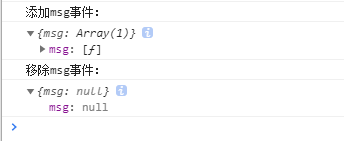

# Vue 组件间通讯之非父子组件间通讯——事件总线（EventBus）

## 前言

在 Vue 中，父子组件的通讯有 Vue 提供的一套操作方法，常用的借助`props`、`ref`等来实现。那非父子组件间的通讯如何实现呢？一般的可以使用`vuex`来实现。但是，`vuex`一般处理的是全局的组件状态管理。而且，有些项目根本就没有用到`vuex`。为此，这里提供另一种组件通讯方式：Vue 事件总线—— `EventBus`。

## EventBus 的简介

> `EventBus` 又称事件总线。在 Vue 中可以使用 `EventBus` 来作为沟通桥梁的概念，就像是所有组件共用相同的事件中心，可以向该中心注册发送事件或接收事件。所以，组件都可以上下、平行地与其他组件沟通。

## EventBus 使用方法

案例假设：

> 假设，A,B 两个组件需要通讯——A 传送数据给 B。

##### 1. 创建 EventBus——初始化

在项目目录任意地方创建`EventBus`文件—— `event-bus.js`

```js
// event-bus.js
import Vue from 'vue'
export const EventBus = new Vue()
```

##### 2. 添加监听事件

```html
<template>
  <div class="B">{{ msg }}</div>
</template>
<script>
  import { EventBus } from './event-bus.js'
  export default {
    data() {
      return {
        msg: ''
      }
    },
    mounted() {
      // 为EventBus添加监听时间 msg，
      // callback 参数（msg）用于接收触发监听事件传递过来的value
      EventBus.$on('msg', (msg) => {
        this.msg = msg
      })
    }
  }
</script>
```

##### 3. 触发监听事件

```html
<template>
  <div class="A">
    <button @click="change()">change</button>
  </div>
</template>

<script>
  import { EventBus } from './event-bus.js'
  export default {
    methods: {
      change() {
        // 触发EventBus事件 msg，第二个参数是可传递给监听事件的callback
        EventBus.$emit('msg', 'Hello B!')
      }
    }
  }
</script>
```

##### 4. 移除事件监听者

```js
import { eventBus } from './event-bus.js'
EventBus.$off('msg')
```

> 注意：
>
> 如果设置监听事件的组件被销毁了，应该及时移除销毁组件添加的自定义事件。

如果不移除自定义事件，组件再次加载添加自定义事件时，并不会覆盖`eventBus `已存在的事件，而是在已存在的事件`callback`数组里重复添加自定义事件 callback。

如下图，这是重复对添加事件组件进行加载销毁操作，在控制台输出`eventBus._events`的结果：


所以，应该对不需要的事件及时移除。一般的，是在组件销毁后执行移除操作。

```js
destroyed(){
    // 组件销毁后，移除添加的事件
    EventBus.$off('msg')
}
```



## 后记

事件总线(`EventBus`)的实现是基于 Vue 的自定义事件机制来实现的。从`event-bus.js`的代码可以看出，`event-bus.js`实例化的另一个 Vue 实例。因为，可以在主 Vue 的任何地方访问另一个 Vue 实例（也就是，`EventBus`Vue 实例）。基于这个特性，实现了任意组件间的通信。这里要注意**任意**一词。理论上，借助`EventBus`确实可以实现任意组件间的通讯。不但可以一对一，也可以一对多，也不局限与兄弟组件，父子组件、祖辈组件与孙辈组件也都可以。

事件总线（`EventBus`）非常灵活，但是使用时记得移除不需要的事件。
好用是好用，但不要滥用。适度才是最好，按需使用。
