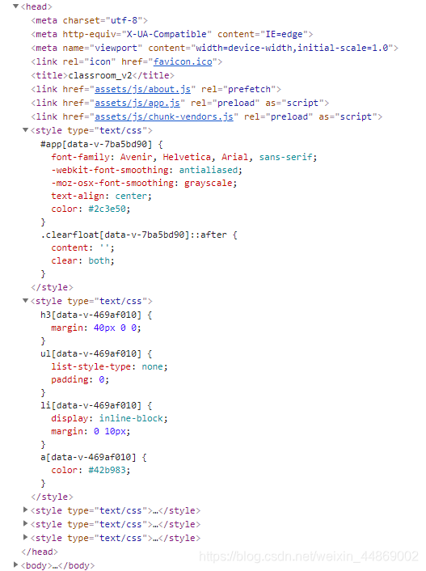

# 浅谈 style-scoped

## `style scoped`的作用

在使用 Vue-Cli 开发时，我们都知道，在组件的``加上 `scoped`属性，可以让``里的样式只在当前组件生效。

那，这是如何实现的呢？

## Vue 对 scoped 的渲染规则

- 对于所有的 Vue 组件，只要设置了``，Vue 就会给该组件生成一个唯一 data 值。
- Vue 会将 data 值作为一个属性添加到组件内所有 HTML 的 DOM 节点
- 如果组件内部包含子组件，这有两种情况
  - 情况一：子组件没有设置``，则只会给子组件的最外层标签加上当前组件的 data 属性
  - 情况二：子组件设置了``，则子组件会自动生成一个自己的唯一 data 值，然后子组件最外层标签在自己的 data 属性后面添加父组件的 data 属性。
- 对于组件内写在``里的样式，Vue 均会自动在每句 css 选择器的末尾添加一个当前组件的 data 属性选择器来私有化样式。

基于上面四点，Vue 就实现的`scoped`的功能。**因为，组件`scoped`里的样式都加了当前组件的唯一标识 data 属性。也就是说，即使当前组件的 class 跟其他组件重名，因为每个组件的 data 属性不一样，当前组件的样式也就不能再其他组件生效了。**

## 渲染规则证明：

1. **规则一**：对于所有的 Vue 组件，只要设置了``，Vue 就会给该组件生成一个唯一 data 值。

   对于这一点的证明，很容易。我们知道，一般的，Vue 入口文件`App.vue`里的样式是默认全局样式的，也就没有添加``。所以，编译出来的结果如下图：

那在``添加`scoped`属性后呢？

可见`App.vue`编译后，增加里 data 属性。由此可知，组件的 data 属性存在是依据`scoped`来控制的。

2. **规则二**：Vue 会将 data 值作为一个属性添加到组件内所有 HTML 的 DOM 节点

3. **规则三**：如果组件内部包含子组件，这有两种情况

   情况一：子组件没有设置``，则只会给子组件的最外层标签加上当前组件的 data 属性

   情况二：子组件设置了``，则子组件会自动生成一个自己的唯一 data 值，然后子组件最外层标签在自己的 data 属性后面添加父组件的 data 属性。

规则二、三结合来证明：

用上面的例子来证，展开`App.vue`组件得：

`App.vue`全部 HTML 的 DOM 标签都添加的 data 属性。

仔细看上图，我们发现，`

`标签有两个 data 属性而且`App.vue`的 data 属性在后面。这是应为该标签为`Home.vue`的最外层标签，而且也添加``。如下图：

由此可证，**子组件设置了``，则子组件会自动生成一个自己的唯一 data 值，然后子组件最外层标签在自己的 data 属性后面添加父组件的 data 属性。**

去掉`Home.vue`的``后，编译结果如下：

`

`标签的 data 属性只剩下`App.vue`的了。所以可证，**子组件没有设置``，则只会给子组件的最外层标签加上当前组件的 data 属性**

4. **规则四：**对于组件内写在``里的样式，Vue 均会自动在每句 css 选择器的末尾添加一个当前组件的 data 属性选择器来私有化样式。

对于这一点，我们直接看控制台可知：

## 参考文献

[vue 中 style 下 scope 的使用和坑](https://blog.csdn.net/margin_0px/article/details/83014024)
