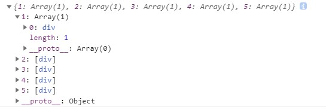
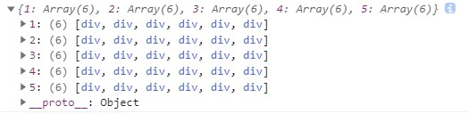
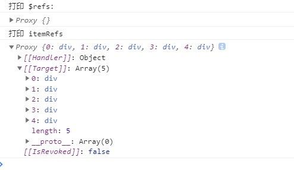

# 第 1 节：v-for 中的 Ref 数组

## 前言

> 本笔记主要基于官方文档《[迁移策略—— v-for 中的 Ref 数组](https://v3.cn.vuejs.org/guide/migration/array-refs.html)》汇总而来。

## Vue 2.x v-for 中的 Ref 数组的问题

在 Vue 2 中，在 `v-for` 语句中使用`ref`属性时，会生成`refs`数组插入`$refs`属性中。

如下：

```html
<div v-for="item in 5" :key="item" :ref="item">{{ item }}</div>
```

`$refs`的结果如下：



由于当存在嵌套的`v-for`时，这种处理方式会变得复杂且低效。

```html
<div v-for="item in 5" :key="item" :ref="item">
  <div v-for="y in 5" :key="y" :ref="y">{{ item }} - {{ y }}</div>
</div>
```

`$refs`的结果如下：



## Vue 3.x 的优化

因此，在 Vue 3，**在 `v-for` 语句中使用`ref`属性** 将不再会自动在`$refs`中创建数组。而是，将 `ref` 绑定到一个 `function` 中，在 `function` 中可以灵活处理`ref`。

如下：

```html
<template>
  <div>
    <h1>v-for Array Refs</h1>
    <div>
      <div v-for="item in 5" :key="item" :ref="setItemRef">{{ item }}</div>
      <button @click="print">打印 $refs</button>
    </div>
  </div>
</template>
<script>
  export default {
    name: 'VforArrayRefs',
    data() {
      return {
        itemRefs: []
      }
    },
    methods: {
      setItemRef(el) {
        this.itemRefs.push(el)
      },
      print() {
        console.log('打印 $refs：')
        console.log(this.$refs)
        console.log('打印 itemRefs')
        console.log(this.itemRefs)
      }
    }
  }
</script>
```

结果如下：



> 注意：
>
> - `itemRefs`不强制要求是数组，也可以是对象；
> - 如有必要，`itemRef` 也可以是响应式的且可以被监听。（这点很好理解，因为`itemRefs`是`data`属性）
