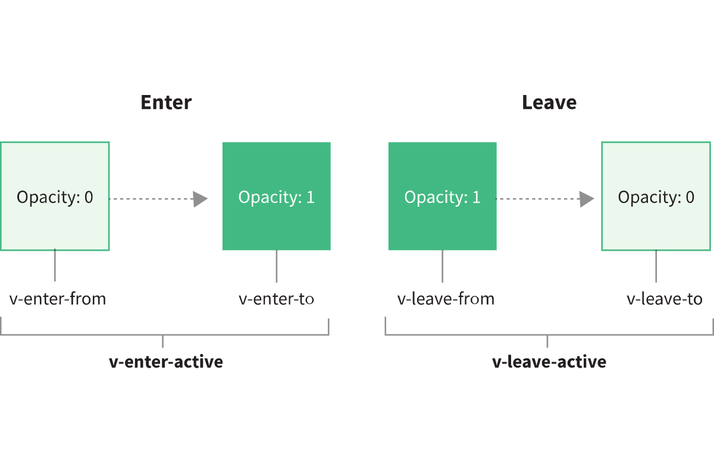

# 第 23 节：Transition Class 的变化

## 前言

> 本笔记主要基于官方文档《[迁移策略——过渡的 class 名更改](https://v3.cn.vuejs.org/guide/migration/transition.html)》汇总而来。如有理解出入，请以官方文档为主。

## 概述

过渡类名的改变：

- `v-enter`重命名为`v-enter-from`
- `v-leave`重命名为`v-leave-from`

## Vue 2.x 的过渡类

> 在进入/离开的过渡中，会有 6 个 class 切换。
>
> 1. `v-enter`：定义进入过渡的开始状态。在元素被插入之前生效，在元素被插入之后的下一帧移除。
> 2. `v-enter-active`：定义进入过渡生效时的状态。在整个进入过渡的阶段中应用，在元素被插入之前生效，在过渡/动画完成之后移除。这个类可以被用来定义进入过渡的过程时间，延迟和曲线函数。
> 3. `v-enter-to`：**2.1.8 版及以上**定义进入过渡的结束状态。在元素被插入之后下一帧生效 (与此同时 `v-enter` 被移除)，在过渡/动画完成之后移除。
> 4. `v-leave`：定义离开过渡的开始状态。在离开过渡被触发时立刻生效，下一帧被移除。
> 5. `v-leave-active`：定义离开过渡生效时的状态。在整个离开过渡的阶段中应用，在离开过渡被触发时立刻生效，在过渡/动画完成之后移除。这个类可以被用来定义离开过渡的过程时间，延迟和曲线函数。
> 6. `v-leave-to`：**2.1.8 版及以上**定义离开过渡的结束状态。在离开过渡被触发之后下一帧生效 (与此同时 `v-leave` 被删除)，在过渡/动画完成之后移除。

在 v2.1.8 之前，每个过渡方向都有两个过渡类：初始状态和活动状态。

到了 v2.1.8，增加了 `v-enter-to`/`v-leave-to` 过渡类来补充 `enter`/`leave` 过渡状态切换的这部分时间空隙。但是，为了向后兼容（兼容之前的版本），Vue 并没有将 `v-enter`/`v-leave` 重命名为更加合理的命名。

## Vue 3.x 的过渡类

为了使过渡类名更加明确和易读，Vue 3.x 对 `v-enter`/`v-leave` 进行了重命名。

```css
.v-enter-from,
.v-leave-to {
  opacity: 0;
}

.v-leave-from,
.v-enter-to {
  opacity: 1;
}
```



变化后的过渡类：

- `v-enter-from`
- `v-enter-active`
- `v-enter-to`
- `v-leave-from`
- `v-leave-active`
- `v-leave-to`

自定义过渡类名的属性也相应改变了：

- `leave-class`被重命名为`leave-from-class`
- `enter-class`被重命名为`enter-from-class`

> Vue 3.x 自定义过渡类名的属性：
>
> - `enter-from-class`
> - `enter-active-class`
> - `enter-to-class`
> - `leave-from-class`
> - `leave-active-class`
> - `leave-to-class`

更多相关知识，请看：[《Enter & Leave Transitions》](https://v3.vuejs.org/guide/transitions-enterleave.html#enter-leave-transitions)
