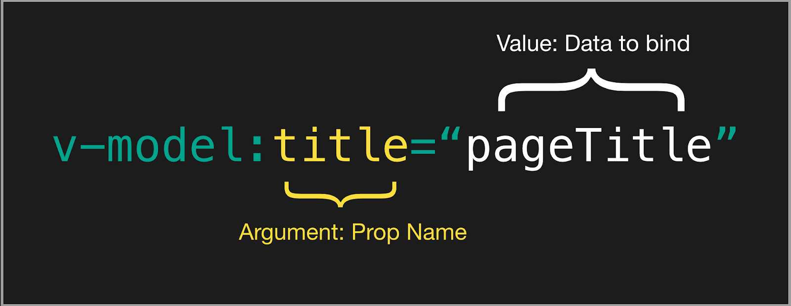

# 第 26 节：在组件上使用 v-model 的变化

## 前言

> 本笔记主要基于官方文档《[迁移策略—— v-model](https://v3.cn.vuejs.org/guide/migration/v-model.html)》汇总而来。如有理解出入，请以官方文档为主。
>
> #### 知识储备：
>
> 在阅读本文前，您最好熟知一下知识：
>
> - [自定义组件的 `v-model`](https://cn.vuejs.org/v2/guide/components-custom-events.html#自定义组件的-v-model)
> - [`.sync` 修饰符](https://cn.vuejs.org/v2/guide/components-custom-events.html#sync-修饰符)

## 概述

- `v-model` 的 `prop` 和 `event`重命名：
  - prop: `value` -> `modelValue`;
  - event: `input` -> `update:modelValue`;
- `v-bind.sync`和`model`选项被移除
- 同一组件实现添加多`v-model`
- `v-model` 可添加自定义修饰符

## v-model 的前世今生

​ 在 Vue 2.0 版本，组件上自定义`v-model`，Vue 要求开发者必须使用`prop`: `value`来接收父组件传递过来的双向绑定值。如果，开发者还需要对其他 `prop` 进行双向绑定，则需要使用 `v-bind.sync` 来实现。因此，这个版本的组件自定义 `v-model` 和 `value` 强制绑定了。从而导致了”如何处理原生标签和自定义标签的问题“。

​ 到了 Vue 2.2 版本，Vue 引入了 `model` 的组件选项（component option），允许开发者自由指定 `v-model` 的 `prop` 和 `event`。从而解决了**"`v-model`和`value`强制绑定"**的问题。但是，这次改进还存在一个问题，即**”一个组件上只能自定义一个`v-model`，其他的双向绑定还是只能通过`v-bind.sync`来实现“**。

## Vue 2.x 组件自定义`v-model`

在 Vue 2.x 中，在组件上使用 `v-model` 将相当于传递一个 `prop` 和一个 `input` 事件:

```html
<ChildComponent v-model="pageTitle" />

<!-- 等价于: -->
<ChildComponent :value="pageTitle" @input="pageTitle = $event" />
```

如果我们想要修改 `prop` 和 `event`，可以在子组件中的 `model` 选项中设置：

```js
// ChildComponent.vue

export default {
  model: {
    prop: 'title', // 声明 prop 中用来接收 v-model 的绑定值
    event: 'change' // 声明修改 v-model 绑定值的事件，注意事件需要在子组件主动触发
  },
  props: {
    // 这里的 value 另作他用
    value: String,
    // 用 title 来替代默认的 value,来接收 v-model 的绑定值
    title: {
      type: String,
      default: 'Default title'
    }
  }
}
```

在父组件中调用：

```html
<ChildComponent :title="pageTitle" @change="pageTitle = $event" />
```

> 一个完整的例子：
>
> ```js
> Vue.component('base-checkbox', {
>   model: {
>     prop: 'checked',
>     event: 'change'
>   },
>   props: {
>     checked: Boolean
>   },
>   template: `
>     <input
>       type="checkbox"
>       v-bind:checked="checked"
>       v-on:change="$emit('change', $event.target.checked)"
>     >
>   `
> })
> ```
>
> ```html
> <base-checkbox v-model="lovingVue"></base-checkbox>
> ```
>
> 摘自——《[自定义组件的 `v-model`](https://cn.vuejs.org/v2/guide/components-custom-events.html#自定义组件的-v-model)》

## Vue 2.x 的`v-bind.sync`

前面提到过，因为组件中只能定义一个 `v-model`，如果我们需要对多个值进行双向绑定就需要借助`.sync`修饰符来实现。

`.sync`和`v-model`非常相似，唯一的变化就是触发事件变成了`update:myPropName`。例如前面有 `prop:title` 的例子`ChildComponent`，可以修改成：

```html
<ChildComponent :title="pageTitle" @update:title="pageTitle = $event" />
```

使用`.sync`的简写：

```html
<ChildComponent :title.sync="pageTitle" />
```

> 一个完整的例子：
>
> ```html
> // 父组件
> <template>
>   <Children :message.sync="message" />
> </template>
> <script>
>   import children from './children.vue'
>   export default {
>     components: { children },
>     data() {
>       return {
>         message: 'parent'
>       }
>     },
>     watch: {
>       // 监听message变化
>       message(n, o) {
>         console.log(n, o)
>       }
>     }
>   }
> </script>
>
> // 子组件
> <template>
>   <h1>{{ message }}</h1>
> </template>
> <script>
>   export default {
>     props: {
>       message: String
>     },
>     mounted() {
>       setTimeout((_) => {
>         this.$emit('update:message', 'children')
>       }, 1500)
>     }
>   }
> </script>
> ```
>
> 摘自——《[ vue 中 v-model 与.sync 修饰符的使用差异](https://blog.csdn.net/qq_36209248/article/details/104020954)》
>
> 上面的例子还可以看到`.sync`并不需要添加`model`选项。

## `v-model`和`v-bind.sync`的关系

现在看来，我们很明显的发现，两者个作用是一致的——都是用来在组件间实现双向绑定。我们可以说，`v-bind.sync` 是 `v-model` 的替代品，是延续；也可以说，`v-model` 是 `v-bind.sync` 的一个"子集"。

> 两者区别的详细讲解可参考：《[ vue 中 v-model 与.sync 修饰符的使用差异](https://blog.csdn.net/qq_36209248/article/details/104020954)》

既然两者这么相似，为什么不合并呢？

很显然，Vue 也注意到这个问题了，Vue 3.x 就将两者合并了。

## Vue 3.x 的 组件自定义 `V-model`

在 Vue 3.x , `v-model` 变化如下：

- prop: `value` -> `modelValue`;
- event: `input` -> `update:modelValue`;

换而言之，Vue 3.x 使用了一个特定的`prop` ——`modelValue`，从而避免了对`value`的占用。而绑定值修改的触发事件采用了`v-bind.sync`的`update:modelValue`形式。

```html
<ChildComponent v-model="pageTitle" />

<!-- 等价于: -->
<ChildComponent :modelValue="pageTitle" @update:modelValue="pageTitle = $event" />
```

此外，Vue 3.x 的`v-model` 移除了`model`选项。取而代之的是，`v-bind.sync` 的 `.PropName` 传参形式。如下：

```html
<ChildComponent v-model:title="pageTitle" />

<!-- 等价于: -->
<ChildComponent :title="pageTitle" @update:title="pageTitle = $event" />
```



> 需要注意的是，Vue 3.x 新增 `emits` 选项。所以，`update:title` 是需要在其中声明的。如下：
>
> ```js
> app.component('ChildComponent', {
>   props: {
>     title: String
>   },
>   emits: ['update:title']
> })
> ```

正是这样的改变，从而实现在组件上的可以多`v-model`。

```html
<ChildComponent v-model:title="pageTitle" v-model:content="pageContent" />

<!-- 等价于: -->
<ChildComponent
  :title="pageTitle"
  @update:title="pageTitle = $event"
  :content="pageContent"
  @update:content="pageContent = $event"
/>
```

#### 新增`v-model`自定义修饰词

在 Vue 3.x, 我们除了可以给`v-model`添加 Vue 提供的修饰词外（如：`.trim`）,还可以自定义修饰词：

```html
<my-component v-model.capitalize="myText"></my-component>
```

```js
app.component('my-component', {
  props: {
    modelValue: String,
    modelModifiers: {
      default: () => ({})
    }
  },
  emits: ['update:modelValue'],
  template: `
    <input type="text"
      :value="modelValue"
      @input="$emit('update:modelValue', $event.target.value)">
  `,
  created() {
    console.log(this.modelModifiers) // { capitalize: true }
  }
})
```

> 关于事件自定义修饰符更多知识，可查看：《[Custom Events](https://v3.vuejs.org/guide/component-custom-events.html#event-names)》

## 参考资料

- 《[Migration Guide——v-model](https://v3.vuejs.org/guide/migration/v-model.html#v-model)》
- 《[Custom Events](https://v3.vuejs.org/guide/component-custom-events.html#event-names)》
- 《[自定义组件的 `v-model`](https://cn.vuejs.org/v2/guide/components-custom-events.html#自定义组件的-v-model)》
- 《[`.sync` 修饰符](https://cn.vuejs.org/v2/guide/components-custom-events.html#sync-修饰符)》
- 《 [Using `v-model` on Components](https://v3.vuejs.org/guide/component-basics.html#using-v-model-on-components)》
- 《[ vue 中 v-model 与.sync 修饰符的使用差异](https://blog.csdn.net/qq_36209248/article/details/104020954)》
