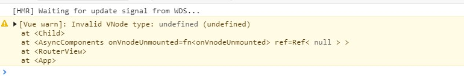

# 第二节：Async Components 异步组件

## 前言

> 本笔记主要基于官方文档《[迁移策略——异步组件](https://v3.cn.vuejs.org/guide/migration/async-components.html)》汇总而来。如有理解出入，请以官方文档为主。
>
> #### 知识储备：
>
> - [异步组件](https://cn.vuejs.org/v2/guide/components-dynamic-async.html#异步组件)

## 概述

Vue 3.x 中，对异步组件的使用跟 Vue 2.x 不同了。变化主要有三点：

1. 异步组件声明方法的改变：Vue 3.x 新增一个辅助函数`defineAsyncComponent`，用来显示声明异步组件;
2. 异步组件高级声明方法中的 `component` 选项更名为`loader`；
3. `loader`绑定的组件加载函数不再接收`resolve`和`reject`参数，而且必须返回一个`Promise`；

## 辅助函数`defineAsyncComponent`

在 Vue 2.x 中，声明一个异步组件只需这样：

```js
const asyncPage = () => import('./NextPage.vue')
```

但是，到了 Vue 3.x 上面的用法就不适用了。

如下例子：

```html
<template>
  <div>
    <h1>Async Components</h1>
    <p>异步组件测试</p>
    <child></child>
  </div>
</template>

<script>
  const child = () => import('@/components/async-component-child.vue')

  export default {
    name: 'async-components',
    components: {
      child: child
    }
  }
</script>
```

异步加载的组件将不会再页面显示，且控制台报如下错误：



在 Vue 3.x 中，异步组件的导入需要使用辅助函数`defineAsyncComponent`来进行显式声明。如下：

```html
<template>
  <div>
    <h1>Async Components</h1>
    <p>异步组件测试</p>
    <child></child>
  </div>
</template>

<script>
  import { defineAsyncComponent } from 'vue'
  const child = defineAsyncComponent(() => import('@/components/async-component-child.vue'))

  export default {
    name: 'async-components',
    components: {
      child: child
    }
  }
</script>
```

> Vue 3.x 引入`defineAsyncComponent`辅助函数的原因：
>
> > Now, in Vue 3, since functional components are defined as pure functions, async components definitions need to be explicitly defined by wrapping it in a new `defineAsyncComponent` helper.
>
> 机器翻译如下：
>
> > 现在，在 Vue 3 中，由于函数组件被定义为纯函数，异步组件定义需要通过将其包装在一个新的 defineAsyncComponent helper 中来显式定义。
>
> 想要对其进一步了解，可查阅：[0008-render-function-api-change](https://github.com/vuejs/rfcs/blob/master/active-rfcs/0008-render-function-api-change.md)

## `component` 选项更名为`loader`

Vue 2.x 中异步组件的声明有更高级的声明方式。

```js
const asyncPageWithOptions = {
  component: () => import('./NextPage.vue'),
  delay: 200,
  timeout: 3000,
  error: ErrorComponent,
  loading: LoadingComponent
}
```

所以，下面的异步组件声明

```js
const asyncPage = () => import('./NextPage.vue')
```

等价于

```js
const asyncPageWithOptions = {
  component: () => import('./NextPage.vue')
}
```

同样的，Vue 3.x 中也可以这样声明异步组件。只是，其中的`component`需要改为`loader`。

```js
const asyncPageWithOptions = defineAsyncComponent({
  loader: () => import('./NextPage.vue'),
  delay: 200,
  timeout: 3000,
  error: ErrorComponent,
  loading: LoadingComponent
})
```

## 组件加载函数不再接收`resolve`和`reject`参数，而且必须返回一个`Promise`

此外，Vue 3.x 的异步组件加载函数将不再接收`resolve`和`reject`，而且必须始终返回`Promise`

```js
// 2.x version
const oldAsyncComponent = (resolve, reject) => {
  /* ... */
}

// 3.x version
const asyncComponent = defineAsyncComponent(
  () =>
    new Promise((resolve, reject) => {
      /* ... */
    })
)
```

也就是说，工厂函数接收 `resolve` 回调的方式定义异步组件在 Vue 3.x 不能使用了：

```js
export default {
  components: {
    asyncPage: (resolve) => require(['@/components/NextPage.vue'], resolve)
  }
}
```

> 在 Vue 2.x，异步组件的声明有两种方式：
>
> 1. 结合 [webpack 的 code-splitting 功能](https://webpack.js.org/guides/code-splitting/) 声明异步组件，其工厂函数接收 `resolve` 回调；
> 2. 基于 ES2015 和 Webpack 2 声明异步组件，其工厂函数返回一个 `Promise` 对象。
>
> 想了解更多，请查阅：《[异步组件](https://cn.vuejs.org/v2/guide/components-dynamic-async.html#异步组件)》

## 与路由懒加载的区分

上面提及的变化只适用于<font color="#8076a3">异步组件</font>，对于<font color="#8076a3">路由懒加载</font>是无效的。也就是说，Vue 2.x 路由懒加载怎么写，在 Vue 3.x 就怎么写。

这里我们需要区分路由懒加载和异步组件。

#### 路由懒加载写法

```js
// router/index.js
const routes = [
  {
    path: '/async-component',
    name: 'asyncComponent',
    component: () => import(/* webpackChunkName: "asyncComponent" */ '@/components/async-component.vue')
  }
]
```

#### 异步组件的写法

```html
<template>
  <div>
    <h1>Async Components</h1>
    <p>异步组件测试</p>
    <child></child>
  </div>
</template>

<script>
  import { defineAsyncComponent } from 'vue'
  const child = defineAsyncComponent(() => import('@/components/async-component-child.vue'))

  export default {
    name: 'async-components',
    components: {
      child: child
    }
  }
</script>
```

简单来说，写在<font color="#8076a3">路由配置文件</font>中的异步加载就是<font color="#8076a3">路由懒加载</font>的用法，而写在<font color="#8076a3">组件内部</font>的异步加载就是<font color="#8076a3">异步组件</font>用法。
