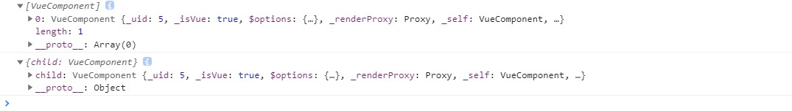
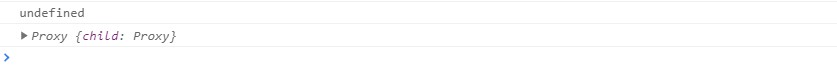

## 第五节：移除 $children

> 本笔记主要基于官方文档《[迁移策略——[移除 `$children`](https://v3.cn.vuejs.org/guide/migration/children.html)》汇总而来。如有理解出入，请以官方文档为主。

## 概述

在 Vue 3.x 中，将移除且不再支持 `$children` 。

## Vue 2.x 中的 `$children`

### 官方描述：

> ### [vm.$children](https://cn.vuejs.org/v2/api/#vm-children)
>
> - **类型**：`Array<Vue instance>`
>
> - **只读**
>
> - **详细**：
>
>   当前实例的直接子组件。**需要注意 `$children` 并不保证顺序，也不是响应式的。**如果你发现自己正在尝试使用 `$children` 来进行数据绑定，考虑使用一个数组配合 `v-for` 来生成子组件，并且使用 Array 作为真正的来源。

### 用法

借助`$children`，可以获取到当前组件的所有子组件的全部实例。所以，借助`$children`可以访问子组件的 data、方法等。一种常用的用法就是用于父子组件间的通讯途径。

## Vue 3.x 中 `$children`的替代形式`$refs`

因为 Vue 3.x 中，`$children`被移除了。如果我们要想访问子组件实例，可以通过`$refs`来实现。

### Vue 2.x 中，`$children`和`$refs`对比

在 Vue 2.x 中[`$refs`](https://cn.vuejs.org/v2/api/#vm-refs)就已经存在了。

如下例子：

```html
<template>
  <div>
    <child id="my-id" class="my-class" attrA="inProps" attrB="outProps" ref="child"></child>
  </div>
</template>
<script>
  import child from '@/components/classANdStyle/child.vue'
  export default {
    components: {
      child
    },
    mounted() {
      console.log(this.$children)
      console.log(this.$refs)
    }
  }
</script>
```

控制台输出：



结论：

​ 可以看出，两者获取到的数据基本没有什么差别。所以，`$refs`替代`$children`完成没问题。

上面例子在 Vue 3.x 运行的结果：


