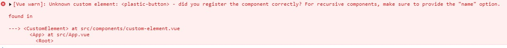

# 第 7 节：自定义元素交互

## 前言

> 本笔记主要基于官方文档《[迁移策略—— 自定义元素交互](https://v3.cn.vuejs.org/guide/migration/custom-elements-interop.html)》汇总而来。如有理解出入，请以官方文档为主。

## 概述

- 自定义元素（Vue 之外）白名单变为在模板编译期间执行；而且白名单应该通过编译器`option`配置而不是通过运行时的`config`来配置；
- Vue 2.x `is` 的用法，现只在 Vue 保留标签`component`中有效。
- 新增`v-is`来实现在普通的 HTML 元素渲染组件

## 添加 Vue 外的自定义元素

如果我们想要将 Vue 外部定义的自定义元素(例如使用 Web 组件 API)添加到 Vue 中，我们需要告诉 Vue 将其当作自定义元素来处理。简而言之，为需要为 Vue 外部定义的自定义元素，在 Vue 内注册个合法的“身份”。不然，Vue 就会报错。

例如，`<plastic-button>`是 Vue 外的一个自定义元素。我们想要在 Vue 中使用它：

```html
<plastic-button></plastic-button>
```

如果不做特殊声明直接使用，控制台会报如下错误：



### Vue 2.x 添加 Vue 外的自定义元素

在 Vue 2.x 中，我们可以通过`Vue.config.ignoredElements`来添加一个自定义元素白名单。对于白名单中的元素，Vue 就不会报错了。

```js
Vue.config.ignoredElements = ['plastic-button']
```

> ### [ignoredElements](https://cn.vuejs.org/v2/api/#ignoredElements)
>
> - **类型**：`Array<string | RegExp>`
>
> - **默认值**：`[]`
>
> - **用法**：
>
> ```
> Vue.config.ignoredElements = [
>   'my-custom-web-component',
>   'another-web-component',
>   // 用一个 `RegExp` 忽略所有“ion-”开头的元素
>   // 仅在 2.5+ 支持
>   /^ion-/
> ]
> ```
>
> 须使 Vue 忽略在 Vue 之外的自定义元素 (e.g. 使用了 Web Components APIs)。否则，它会假设你忘记注册全局组件或者拼错了组件名称，从而抛出一个关于 `Unknown custom element` 的警告。

### Vue 3.x 添加 Vue 外的自定义元素

在 Vue 3.x 中，对 Vue 外部定义的自定义元素做白名单声明，调整为模板编译期间进行。有两种写法：

- 如果使用构建工具创建 Vue 项目（例如：Vue CLI）：通过 `vue-loader`的`compilerOptions `来声明：

  ```js
  // in webpack config
  rules: [
    {
      test: /\.vue$/,
      use: 'vue-loader',
      options: {
        compilerOptions: {
          isCustomElement: (tag) => tag === 'plastic-button'
        }
      }
    }
    // ...
  ]
  ```

- 如果使用动态模板编译，通过 `app.config.isCustomElement` 来声明：

  ```js
  const app = Vue.createApp({})
  app.config.isCustomElement = (tag) => tag === 'plastic-button'
  ```

  值得注意的是，运行时配置只会影响运行时模板编译——它不会影响预编译模板。

## 另一种使用自定义元素的方法

自定义元素规范提供了一种将自定义元素用作[自定义内置模板](https://html.spec.whatwg.org/multipage/custom-elements.html#custom-elements-customized-builtin-example)的方法，方法是向内置元素添加 `is` 属性：

```html
<button is="plastic-button">Click Me!</button>
```

然而，在 Vue 2.x 中，上面代码被解释为：渲染`plastic-button`组件。

因此，Vue 3.x 对 `is`做了新的限制：

- 当在 Vue 保留的 `component `标签上使用`is`时，它的行为将与 Vue 2.x 中的一致；

  ```html
  <component is="plastic-button">Click Me!</component>
  ```

- 当在不同组件标签上使用`is`时，`is`会被当做一个不同的`prop`;

  ```html
  <bar is="plastic-button" />
  ```

- 当在普通的 HTML 元素上使用`is`，`is`将会被当做元素的属性。

  ```html
  <button is="plastic-button">Click Me!</button>
  ```

## 新增`v-is`来实现在普通的 HTML 元素渲染组件

前面提及到，`is`在普通的 HTML 元素上不再被用作渲染组件的一种方法。但是，Vue 3.x 并不是要放弃这种使用方法。为此，Vue 3.x 新增了`v-is`，专门来实现在普通的 HTML 元素渲染组件。

```html
<template>
  <div>
    <div v-is="'child'">渲染 child 组件</div>
  </div>
</template>

<script>
  import child from '@/components/classANdStyle/child.vue'
  export default {
    name: 'customElement',
    components: {
      child: child
    }
  }
</script>
```

`<div>`将被`child`组件替代。

> 注意：`v-is`绑定值的写法。`v-is`需要通过组件的名称来渲染组件，所以其值应该是 JS 字符串。
>
> ```html
> <!-- 错误, 没有任何东西将被渲染 -->
> <tr v-is="blog-post-row"></tr>
>
> <!-- 正确 -->
> <tr v-is="'blog-post-row'"></tr>
> ```
