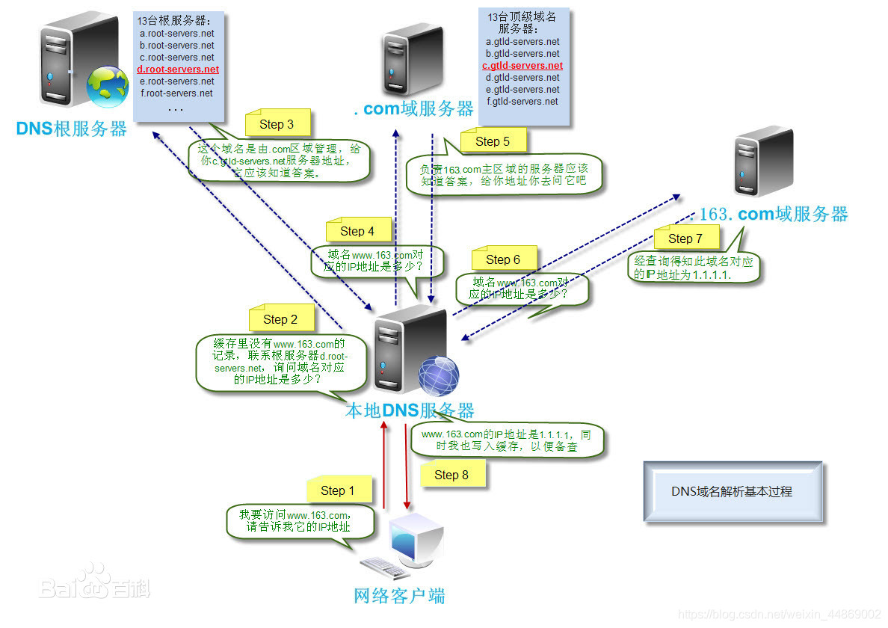
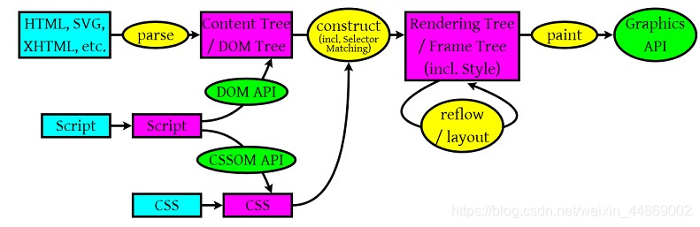
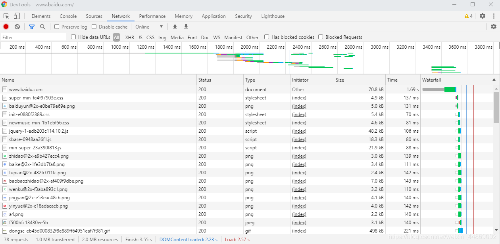
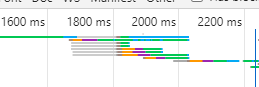

# Web 性能优化——简述访问某个网址浏览器背后所做的工作

> [!warning] 阅前悉知
>
> - 其一、**本文是《Web 性能优化》系列的第一篇。该系列是我查阅了大量资料总结而来的。其中可能存在不足之处。`希望大家在阅读时，抱着质疑的态度去阅读`**。
> - 其二、本文从加载、解析、渲染三个方面讲解浏览器访问某个网址的所做工作。

### 前言

我们都知道，用户访问一个网站只需要在浏览器的网址栏输入对应的网址，就可以打开相应的网址了。非常人性化！！对于用户来说，只需要了解这么使用就行了。但是，对于从事开发的人员来说，了解浏览器背后的工作是非常必要的。因为只有了解了浏览器的工作原理，才能更好的优化网站（这里的优化指的是减少网站打开时间，以及响应时间）。

### 知识前提：

> 在讲解之前，需要大家明白三件事：
>
> ​ 第一，浏览器打开某个网站都是需要读取该网站的 HTML、CSS、JS 等相关的文件的。
>
> ​ 第二，网站相关的文件都是存放 web 服务器上的。
>
> ​ 第三，在实际的网络通信中需要根据 IP 地址来访问主机的，一个 IP 地址对应一个主机。

这三件事，大家如果不了解不明白的话，就先默认这是对的吧！只有这样，才能更好的对下面的进行理解。

### 浏览器所做的工作

**那么，当用户在浏览器输入网址后，浏览器之后做了什么呢？**

概括来讲，浏览器主要做了三件事：

1. 加载资源
2. 解析资源
3. 渲染资源

这三个过程的详细讲解请看下面的解析。不过在看之前，需要注意一点：下面的解析是将三个过程独立出来讲解的，跟实际的浏览器操作有些许出入。实际上，这三个过程是有交叉的。浏览器具体的工作流程将在小节《浏览器的工作流程》详细说明。

#### 加载

> 加载就是浏览器从服务器获取资源的过程。需要加载的资源包括：HTML 文件、CSS 文件、JS 文件、图片等等。

加载单个资源的过程大致如下：

1. 浏览器根据 DNS 服务器得到域名的 IP 地址
2. 向这个 IP 的机器发送 http(s)请求
3. 服务器收到，处理并返回 http 请求，比如返回图片或 html 代码等
4. 浏览器接收返回内容，并自上而下的读取返回内容。**期间如果遇到引用外部的 CSS、JS 或图片等静态资源,浏览器会开设新的线程去获取这些资源。但需要注意的是，如果遇到的是获取 JS，浏览器会暂停 HTML 文档的渲染线程。直到 JS 加载、解析完毕**。

大家可能对 DNS 服务器、IP 地址以及 http(s)请求不太了解。简单解释一下：

##### http(s)请求：

http(s)请求是浏览器根据 HTTP 协议进行的一种跟服务器交互的方式。这种交互交互方式只能是浏览器主动发起的。http(s)请求就好比是浏览器的”信使“。它可以随时指派”信使“去访问服务器。比如，浏览器想服务器的获取某张图片。就会让 http(s)请求去访问服务器。服务器收到信使带来的信息后，就会做出相应的应答。然后 http(s)请求带着服务器应答的结果返回给浏览器。

##### DNS 服务器与 IP 地址

先看一个情景：

> 某天，你妈妈叫你去 XX 超市买酱油（假设你根本不知道 XX 超市在哪）。但是你不知道超 XX 市在哪里？你只好去问邻居。邻居告诉你，XX 超市在本小区的八巷一号。你根据邻居的指示去到 XX 超市，最后购买酱油。

上面例子中你就是浏览器，你妈妈就是用户，酱油就是用户所要的资源，而超市就是存放网站文件的 web 服务器，

邻居就是 DNS 服务器、IP 地址就是超市的位置。

上面例子提到，你要买到酱油，需要知道超市在哪，然后再去到超市购买酱油。当你知道超市的位置之后，无形中你就与超市建立了一条“通道”。

其实，**浏览器与 web 服务器交互也是要建立一条“通道”，一条给 http(s)请求“行走”的通道。**

“通道”建立步骤如下：

1. 首先，DNS 解析域名获取对应的 IP 地址（寻找超市）

   上面我们说到，在网络通信中实际上是根据 IP 地址来访问。也就是说，如果我们要访问 A 主机必须要知道 A 主机的 IP 地址。IP 地址的构成是数字+‘.’组合而成的（如：192.168.152.107）。因为 IP 地址结构复杂，很难去记忆。这样就造成直接使用 IP 地址访问主机变得很繁琐。

   > 就好比，你去问一个人超市怎么走。他竟然告诉你超市的坐标是北纬 130°，东经 50°。内心是不是一万个草泥马奔腾而过。

   所以，为了便于记忆和使用。人们为 IP 地址设计了别名——域名（如：www.baidu.com）。**一个域名对应一个IP地址，一个IP地址可以对应多个域名。域名与IP地址记录在一张表（域名与IP地址映射表）里面**。

   现在，当我们想要访问某一台主机时，只需要记住域名，然后再到**域名与 IP 地址映射表**里查找到对应的 IP 地址，最后使用 IP 地址访问主机。这个**根据域名查找 IP 地址就是——DNS(域名解析)**。

   随着网站的增多，域名与 IP 地址映射表变得越来越巨大，对于映射表的维护和查找变得越来越繁琐。为此，DNS 服务器开始诞生。现在域名查询就变成了向 DNS 服务器查询。查询过程如下图：

经过上图的一系列查询，浏览器最终会获得用户输入的域名所对应的 IP 地址。

> 注意：上面关于 DNS 的解释可能存在错误，想要详细了解学习，建议查看[域名解析](https://baike.baidu.com/item/%E5%9F%9F%E5%90%8D%E8%A7%A3%E6%9E%90/574285?fr=aladdin)、[什么是 DNS？](https://blog.csdn.net/jiayu5100687/article/details/81985968)

2. “三次握手”与 web 服务器建立 TCP 连接

   当浏览器获取到 IP 地址后，就开始与 web 服务器进行联系，建立可靠、稳固的沟通渠道——TCP 连接。这个连接的建立需要经过“三次握手”。

   关于这一部分的内容，如果只是为了优化 web 页面，可以不用去了解。因为 TCP 基本不涉及 web 优化。如果感兴趣可查阅：动画：[用动画给面试官解释 TCP 三次握手过程](https://blog.csdn.net/qq_36903042/article/details/102513465?utm_medium=distribute.pc_relevant.none-task-blog-OPENSEARCH-1&depth_1-utm_source=distribute.pc_relevant.none-task-blog-OPENSEARCH-1)

以上就是对资源加载的解释了。这部分主要解释了浏览器加载资源的过程。浏览器获取的网址资源，都是需要经过这个加载过程的。
现在，浏览器已经获取到了所要的资源。但是想要使用这些资源，还需要对资源进行解析。

#### 解析

> 对加载到的资源（HTML、JS、CSS 等）进行语法解析，建立相应的内部数据结构。

解析过程如下图：

_注意：上图的`Content Tree/DOM Tree`以及`Rendering Tree/Frame Tree`存在两种叫法是因为浏览器渲染引擎不同。Firefox 使用 Geoko—— Mozilla 自主研发的渲染引擎，Safari 和 Chrome 都使用 webkit_

从上图可以看出，浏览器主要解析`HTML/SVG/XHTML`、`CSS`、`Javascript`:

- `HTML/SVG/XHTML`:产生`Content Tree/DOM Tree`
- `CSS`:产生`CSS Rule Tree`
- `Javascript`:通过`DOM API`以及 `CSSOM API` 来操作 `Content Tree/DOM Tree`和`CSS Rule Tree`

#### 渲染

> 构建渲染树，对各个元素进行位置计算、样式计算等等，然后根据渲染树对页面进行渲染（可以理解为“画”元素）

继续看上图，在第二个黄色椭圆上写着*construct(构建)*，然后生成`Rendering(渲染) Tree`。也就是说，解析完后，`DOM Tree`和`CSS Rule Tree`结合，构建成`Rendering(渲染) Tree`。在构建`Rendering(渲染) Tree`过程中，不可见的 Dom 元素不会被插入渲染树，例如 head 元素。另外，display 属性为 none 的元素也不会在渲染树中出现。

构建完`Rendering(渲染) Tree`后，浏览器接着根据`Rendering(渲染) Tree`来计算每个节点在屏幕中的位置（`layout`和`reflow`）。

最后，通过调用操作系统 Native GUI 的 API，paint(绘制)`Rendering(渲染) Tree`每个节点，最终形成用户所看到的页面。

**Reflow（回流）与 Repaint（重绘）**：

Reflow: 在浏览器渲染过程中或者渲染结束后，如果某些操作影响了已经渲染好的部分，改变了布局，那浏览器会重新进行渲染。

Repaint：如果改变不影响元素页面布局，只是改变了背景颜色，文字颜色等的话，浏览器只需要重新 paint(绘制)那个部分。

Reflow 比 Repaint 更加花费时间。结合上图可以看出，触发 Reflow 需要进行`Rendering Tree`、`paint`两个操作，而 Repaint 则只需进行`paint`。所以，我们应该尽量避免触发 Reflow。

#### 加载、解析、渲染三者的关系

请看下面这段话。

> 上述这个过程是`逐步完成`的，为了更好的用户体验，渲染引擎将会尽可能早的将内容呈现到屏幕上，并不会等到所有的 HTML 都解析完成之后再去构建和布局 render 树。它是解析完一部分内容就显示一部分内容，同时，可能还在通过网络下载其余内容。
> ————————————————
> 版权声明：本文为 CSDN 博主「季诗筱」的原创文章，遵循 CC 4.0 BY-SA 版权协议，转载请附上原文出处链接及本声明。
> 原文链接：https://blog.csdn.net/XIAOZHUXMEN/article/details/52014901

结合上面这段话以及三者的作用可知。最先开始的是加载，加载完后才进行解析，最后根据解析的`DOM Tree`和`CSS Rule Tree`进行渲染。这三者的顺序是固定的。但是呢！为了提高用户体验，浏览器做了优化，将加载（这里的加载专指最后一步：读取）、解析、渲染的粒度调小了（至于这个力度有多小，我就不太清楚了）。也就是，浏览器将这个操作分为三个同时进行的线程。然后只要读取到一部分（例如`<head>`标签），就开始对`<head>`进行解析（这时候的加载线程并没有停下来，而是继续往后读取）；当`<head>`解析完后，就开始渲染操作。（这是的解析线程也没有停止，而是解析已经读取好的 HTML 部分）。

### 浏览器访问某一个网址的工作流程

当用户输入访问的网址后，浏览器的工作流程是这样的：

1. 首先是根据用户输入的网址向对于的服务器进行第一次加载。这次获取的是用户输入的 URL 对于的 HTML 文件。在这期间，浏览器会一直等待，直到浏览器接收到服务器返回的第一个字节（TTFB）。期间，浏览器不会有其他操作。
2. 当浏览器接收到服务器返回的第一个字节后，浏览器理解开始读取这次资源（HTML 文件）。读取是自上而下的。先读取`<head>`里面的内容，再读取`<body>`里面的内容。**期间如果遇到引用外部的 CSS、JS 或图片等静态资源,浏览器会开设新的线程去获取这些资源。但需要注意的是，如果遇到的是获取 JS，浏览器会暂停 HTML 文档的渲染线程。直到 JS 加载、解析完毕**。
3. 在开始读取的同时，浏览器也同时开始进行解析、渲染。**读取一部分，解析一部分，渲染一部分。**
4. 当所有的资源渲染完毕，浏览器也就完成了用户所认为的整个页面加载。

以访问百度为例。查看 Chrome DevTools 的 Network:

可以看到第一个请求“www.baidu.com”请求的类型是document，而且在这个请求执行到Content Download（内容下载）之前，并没有其他请求执行。

放大时间轴：

可以看到，在第一次加载请求的 Content Download 期间，其他请求开始发起了，并且有些事同时进行的。这就可以证明第二点：

> 读取是自上而下的。先读取`<head>`里面的内容，再读取`<body>`里面的内容。**期间如果遇到引用外部的 CSS、JS 或图片等静态资源,浏览器会开设新的线程去获取这些资源。但需要注意的是，如果遇到的是获取 JS，浏览器会暂停 HTML 文档的渲染线程。直到 JS 加载、解析完毕**。

> 关于 Chrome DevTools 的 Network 更多知识，可查看：[网络分析参考](https://docs.microsoft.com/zh-cn/microsoft-edge/devtools-guide-chromium/network/reference)、[Network Analysis Reference](https://developers.google.com/web/tools/chrome-devtools/network/reference)

### 结语

以上就是用户访问一个网页，浏览器所作的大致工作了。进行 web 优化的所有操作都是基于浏览器这些工作去进行的。大致上可以分为下面几点：

1. 减少浏览器获取资源的时间

   1. 减少 web 服务器拥挤
   2. 减少获取资源次数
   3. 避免资源过大

2. 减少浏览器解析的时间

   1. 减低 DOM 深度

3. 减少浏览器渲染的时间
   1. 避免**Reflow（回流）与 Repaint（重绘）**
   2. 避免渲染线程等待

参考文献：

- [浏览器加载、解析、渲染的过程](https://blog.csdn.net/XIAOZHUXMEN/article/details/52014901?utm_medium=distribute.pc_relevant.none-task-blog-BlogCommendFromMachineLearnPai2-1&depth_1-utm_source=distribute.pc_relevant.none-task-blog-BlogCommendFromMachineLearnPai2-1)
- [知乎：在前端开发中，页面渲染指什么？](https://www.zhihu.com/question/20117417/answer/14032003)
- [《how browsers work》中文译本](http://kb.cnblogs.com/page/129756/)
- [浏览器页面加载过程](https://blog.csdn.net/qq_39795538/article/details/82764250?utm_medium=distribute.pc_relevant.none-task-blog-BlogCommendFromBaidu-4&depth_1-utm_source=distribute.pc_relevant.none-task-blog-BlogCommendFromBaidu-4)
- [浏览器~加载，解析，渲染](https://www.jianshu.com/p/e141d1543143)
