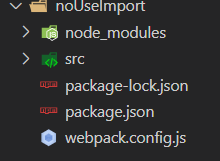
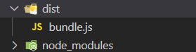
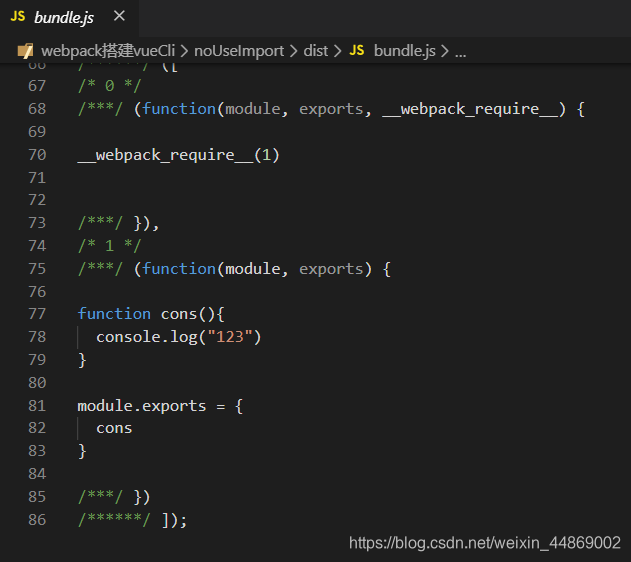
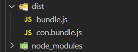
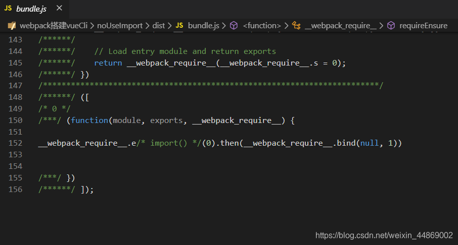
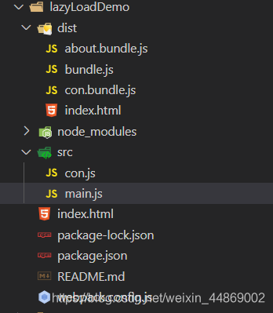
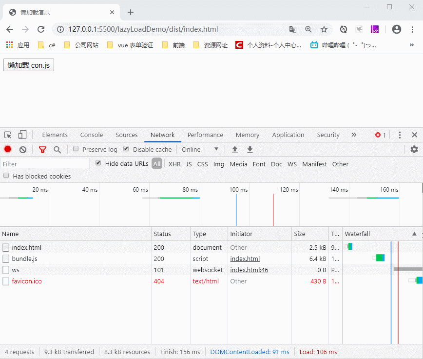

# Web 性能优化——正确放置 CSS 和 Javascript，减少页面渲染时间

> [!warning] 阅前悉知
>
> **本文是《Web 性能优化》系列的第四篇。该系列是我查阅了大量资料总结而来的。其中可能存在不足之处。`希望大家在阅读时，抱着质疑的态度去阅读`**。

### 前言

###### Vue 为什么需要懒加载（按需加载）？

学习 Vue 的时候，各类教程都会告诉我们：Vue 的特点是 SPA——**Single Page Application**（单页应用程序）。它有着诸如：_“只有第一次会加载页面, 以后的每次页面切换，只需要进行组件替换；减少了请求体积，加快页面响应速度，降低了对服务器的压力”_ 等等优点。

但是呢！因为 Vue 是 SPA，所以首页第一次加载时会把所有的组件以及组件相关的资源全都加载了。这样就会导致首页加载时加载了许多首页用不上的资源，造成网站首页打开速度变慢的问题，降低用户体验。

为了解决上面问题，我们需要对 Vue 实现组件懒加载（按需加载）。

> ###### 阅前悉知：
>
> 下面，我将简单讲解一下 Javascript 的懒加载（按需加载）原理以及在 Vue 上的应用。
> **原理部分为我个人参考多篇文章总结而来，有可能存在错误。`希望大家在阅读时，抱着质疑的态度去阅读`。**
> ·········································································································································
> 本文所讲的 JS、webpack 以及 VueCLI 版本分别为：
>
> - Javascript：ES2015(ES6)及以上
> - webpack：webpack v4 及以上
> - VueCLI: VueCLI v4

### 什么是懒加载（按需加载）？

> 懒加载或者按需加载，是一种很好的优化网页或应用的方式。这种方式实际上是先把你的代码在一些逻辑断点处分离开，然后在一些代码块中完成某些操作后，立即引用或即将引用另外一些新的代码块。这样加快了应用的初始加载速度，减轻了它的总体体积，因为某些代码块可能永远不会被加载。
> —— 摘自[《webpack——懒加载》](https://webpack.docschina.org/guides/lazy-loading/)

上面这段话，用一句俗语讲就是“占着茅坑不拉屎”。先占着茅坑，屎意来的时候再来！

也就是，组件先在路由里注册但不进行组件的加载与执行，等到需要访问组件的时候才进行真正的加载。

### 懒加载（按需加载）的前提

> `懒加载前提`：
> 进行懒加载的子模块（子组件）需要是一个单独的文件。

为什么呢？因为懒加载是对子模块（子组件）进行延后加载。如果子模块（子组件）不单独打包，而是和别的模块掺和在一起，那其他模块加载时就会将整个文件加载出来了。这样子模块（子组件）就被提前加载出来了。

所以，**要实现懒加载，就得先将进行懒加载的子模块（子组件）分离出来**。

##### 懒加载前提的实现：ES6 的动态地加载模块——`import()`。

> 调用 import() 之处，被作为分离的模块起点，意思是，被请求的模块和它引用的所有子模块，会分离到一个单独的 chunk 中。
> ——摘自[《webpack——模块方法》的 import()小节](https://webpack.docschina.org/api/module-methods/#import-)

简单来讲就是，通过`import()`引用的子模块会被单独分离出来，打包成一个单独的文件（打包出来的文件被称为 chunk ）。

> **这里有个知识的前提：**
> 项目通过`webpack`打包时会进行资源整合，也就是会把项目中的 JS、CSS 等文件按照一定的规则进行合并，已达到减少资源请求的目的。

依照`webpack`原本的打包规则打包项目，我们就无法确定子模块在打包出来的哪个 JS 文件中，而且子模块的代码会和其他代码混合在同一个文件中。这样就无法进行懒加载操作。所以，要实现懒加载，就得保证懒加载的子模块代码单独打包在一个文件中。

###### 代码示例：

构建一个简单的 webpack 项目：

1. 首先，`webpack.config.js` 文件配置如下：

```json
/*webpack.config.js*/

const path = require('path')

module.exports = {
    entry:'./src/main.js', //入口文件
    output: {
        path: path.resolve(__dirname, 'dist'),
        chunkFilename: '[name].bundle.js',
        filename: 'bundle.js',
    }
}
```

2. 创建入口文件`main,js`

```javascript
/* main.js */

// 这里引入con.js，注意没有使用import()

require('./con.js')
```

3. 创建被引入文件`con.js`

```js
/* con.js */
function cons() {
  console.log('123')
}

module.exports = { cons }
```

具体目录结构如下：

接着运行`npm run build`进行打包。结果如下：

可以看到使用`require()`引入`con.js`，打包后的结果是`con.js`合并到的`bundle.js`。

打开`bundle.js`，可以看到`con.js`代码被嵌入`bundle.js`

接下来，使用`import()`引入`con.js`：

```js
/* main.js */

// 这里使用import()引入con.js
import(/* webpackChunkName: "con" */ './con.js')
```

打包结果如下：


展开`bundle.js`

可以看到，使用`import()`引入`con.js`，`con.js`打包成独立的 js 文件。

> 注意：
> 上面的例子，使用的都是同一套`webpackconfig.js`配置文件。所以，实现上面功能仅仅是因为`import()`的使用。

###### 小知识点：`import()`中的注释

我们注意到，`import()`括号里面有一串注释。如：

```js
import(/* webpackChunkName: "con" */ './con.js')
```

它并不是可有可无的东西。通过这个注释，再配合`webpack.config.js`的`output.chunkFilename`，我们可以设置打包生成的文件(`chunk`)的名字。
例如，上面例子的 webpack 配置：

```json
module.exports = {
    entry:'./src/main.js', //入口文件
    output: {
        path: path.resolve(__dirname, 'dist'),
        chunkFilename: '[name].bundle.js',
        filename: 'bundle.js',
    }
}
```

这里设定了 chunkFilename 的命名规则为：`[name]`+`.`+`bundle.js`。这里的`[name]`就是`/* webpackChunkName: "con" */`设定的值。

除了`webpackChunkName`，还有其他属性设定，详情请看[webpack——Magic Comments](https://webpack.docschina.org/api/module-methods/#magic-comments) 。

> 再说明一点：
> webpack 打包生成的 chunk 有一下几种：
>
> - webpack 当中配置的入口文件（entry）是 chunk，可以理解为 entry chunk；
> - 入口文件以及它的依赖文件通过 code split （代码分割）出来的也是 chunk（也就是我们这里一直讲到的），可以理解为 children chunk；
> - 通过 commonsChunkPlugin 创建出来的文件也是 chunk，可以理解为 commons chunk；
>   —— 摘自《 [webpack 配置中常用的 CommonsChunkPlugin 认识](https://www.jianshu.com/p/c0fce0c764ed)》

> 注意：CommonsChunkPlugin 已经从 webpack v4（代号 legato）中移除。想要了解最新版本是如何处理 chunk，请查看 [SplitChunksPlugin](https://webpack.docschina.org/plugins/split-chunks-plugin/)。

借助`import()`，我们实现了子模块（子组件）的独立打包（children chunk）。现在，距离实现**懒加载（按需加载）** 还差关键的一步——`如何正确使用独立打包的子模块文件（children chunk）实现懒加载`。这也是懒加载的原理。

### 借助函数实现懒加载（按需加载）

首先，我们先来回顾一下 JavaScript 函数的特性。

> 无论使用函数声明还是函数表达式创建函数，函数被创建后并不会立即执行函数内部的代码，只有等到函数被调用之后，才执行内部的代码。

相信对于这个函数特性，大家都十分清楚的。看到这里，大家对于懒加载的实现可能已经有了思路。

没错！

> 只要将需要进行懒加载的`子模块文件（children chunk）`的引入语句（本文特指`import()`）放到一个函数内部。然后在需要加载的时候再执行该函数。这样就可以实现**懒加载（按需加载）**。

这也是懒加载的原理了。

**将上面例子补充完整：**

新增页面文件`index.html`

```html
<!DOCTYPE html>
<html lang="en">
  <head>
    <meta charset="UTF-8" />
    <meta name="viewport" content="width=device-width, initial-scale=1.0" />
    <title>懒加载演示</title>
  </head>
  <body>
    <button class="button1" style="cursor: pointer;">懒加载 con.js</button>
    <script src="bundle.js"></script>
  </body>
</html>
```

`main.js`改动如下：

```js
window.onload = () => {
  const btn = document.querySelector('.button1')

  // 给按钮添加click事件，按钮被点击后，加载 con.js
  btn.onclick = () => import(/* webpackChunkName: "con" */ './con.js')
}
```

目录结构如下：

打包后，运行项目：


可以看到，`con.js`实现了**懒加载（按需加载）**。

### 懒加载（按需加载）实现原理的概括

回顾前两节的内容，懒加载（按需加载）原理分为两步：

1. 将需要进行懒加载的子模块打包成独立的文件（`children chunk`）；
2. 借助函数来实现延迟执行子模块的加载代码；

是不是很简单呀！这里的技术难点就是`如何将懒加载的子模块打包成独立的文件`。好在`ES6`提供了`import()`。然后这一切就变得十分简单了。

### 在 Vue-router 实现路由懒加载（按需加载）

讲了这么多，最后再来讲讲懒加载在`vue-router`的使用吧！
有了前面的基础，在 vue 上使用懒加载就变得很简单了。

以往，我们配置`vue-router`是这样的：

```js
import Vue from 'vue'
import VueRouter from 'vue-router'

// 这里引入子模块
import Home from '../views/Home.vue'

Vue.use(VueRouter)

const routes = [{
    path: '/',
    name: 'Home',
    component: Home
  }
]

const router = new VueRouter({
  mode: 'history'，
  routes
})

export default router
```

上面的例子先加载子组件，然后将子组件命名为`Home `,最后再将`Home`赋给 Vue 的 `component`。这样就导致子组件的提前加载。

接下来，实现子组件懒加载，则改动如下：

```js
import Vue from 'vue'
import VueRouter from 'vue-router'

Vue.use(VueRouter)

const routes = [{
    path: '/',
    name: 'Home',
    // 将子组件加载语句封装到一个function中，将function赋给component
    component: () => import( /* webpackChunkName: "home" */ '../views/Home.vue')
  }
]

const router = new VueRouter({
  mode: 'history'，
  routes
})

export default router
```

将子组件加载语句封装到一个`function`中，将`function`赋给`component`。这样就可以实现`Vue-router`**懒加载（按需加载）**。

是不是非常简单！哈哈！

可能这里有人会疑惑，`component`可以接收一个`function`吗？
这确实可以的。不要被以往的观念束缚。`component`是对象的一个属性，在 Javascript 中属性的值是什么类型都可以。

关于**懒加载（按需加载）** 在 Vue 中的应用，详细可参考：[《Lazy Load in Vue using Webpack's code splitting》](https://alexjoverm.github.io/2017/07/16/Lazy-load-in-Vue-using-Webpack-s-code-splitting/)

### 简述另一种子模块打包方法：

除了 ES6 的`import()`这个方法，`webpack`本身还提供了另一个方法—— [require.ensure()](https://webpack.docschina.org/api/module-methods#require-ensure)

> require.ensure() 是 webpack 特有的，已经被 import() 取代。
> ——摘自[《webpack——module-methods：require.ensure》](https://webpack.docschina.org/api/module-methods#require-ensure)

大概用法如下：

```js
  {
    path: '/home',
    name: 'home',
    component: resolve  => require.ensure([], () => resolve (require('@/components/home')), 'demo')
  },
```

关于`require.ensure()`更多内容可查看：[《webpack——module-methods：require.ensure》](https://webpack.docschina.org/api/module-methods#require-ensure)、[《vue 路由懒加载》](https://blog.csdn.net/weixin_38704338/article/details/79103230?utm_medium=distribute.pc_relevant.none-task-blog-BlogCommendFromMachineLearnPai2-2.nonecase&depth_1-utm_source=distribute.pc_relevant.none-task-blog-BlogCommendFromMachineLearnPai2-2.nonecase)

### 结语

至此，关于**懒加载（按需加载）** 的说明就结束了。刚开始时对这部分还是挺畏惧的。心想着懒加载，这么高大上的东西一定非常难。后来查阅许多资料，仔细研究后，逐渐了解了懒加载，并借着写这篇文章的机会，边写边学，进一步巩固知识点，算是对懒加载有了较深的理解吧。其实，仔细看来懒加载的原理并不是很复杂。希望本文对大家有所启发与帮助。

**其中可能存在错误，希望各位大佬踊跃指出。**

### 参考文档

- [webpack 配置中常用的 CommonsChunkPlugin 认识](https://www.jianshu.com/p/c0fce0c764ed)
- [「Vue.js」Vue-Router + Webpack 路由懒加载实现](https://blog.csdn.net/weixin_33964094/article/details/88762056?utm_medium=distribute.pc_relevant.none-task-blog-BlogCommendFromMachineLearnPai2-1.nonecase&depth_1-utm_source=distribute.pc_relevant.none-task-blog-BlogCommendFromMachineLearnPai2-1.nonecase)
- [代码分离](https://webpack.docschina.org/guides/code-splitting/)
- [Lazy Load in Vue using Webpack's code splitting](https://alexjoverm.github.io/2017/07/16/Lazy-load-in-Vue-using-Webpack-s-code-splitting/)
- [Vue 中的 SPA](https://www.jianshu.com/p/1b4d9d319a7b)
- [webpack——module-methods](https://webpack.docschina.org/api/module-methods/)
- [vue 中使用 import 路由懒加载的原理、import 和 require 的区别](https://blog.csdn.net/weixin_44309374/article/details/100916617?utm_medium=distribute.pc_relevant.none-task-blog-BlogCommendFromMachineLearnPai2-1.nonecase&depth_1-utm_source=distribute.pc_relevant.none-task-blog-BlogCommendFromMachineLearnPai2-1.nonecase)
- [vue 路由懒加载](https://blog.csdn.net/weixin_38704338/article/details/79103230?utm_medium=distribute.pc_relevant.none-task-blog-BlogCommendFromMachineLearnPai2-2.nonecase&depth_1-utm_source=distribute.pc_relevant.none-task-blog-BlogCommendFromMachineLearnPai2-2.nonecase)
