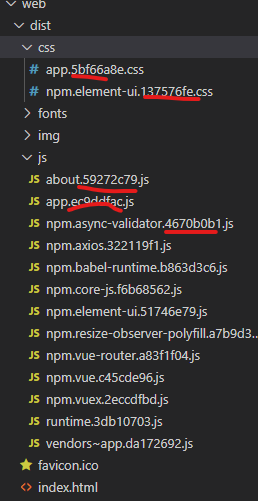

## filenameHashing

- Type: `boolean`
- Default: `true`

#### 用途

设置打包生成的的静态资源的文件名中是否加入`hash`以便控制浏览器缓存问题。

#### 用法

```json
module.exports = {
  publicPath: './', // 基本路径
  outputDir: 'dist', // 输出文件目录
  assetsDir: './assets',
  indexPath: 'index.html',
  filenameHashing: true, // 生成的静态资源在它们的文件名中包含了 hash 以便更好的控制缓存
}
```

效果如下：


#### 拓展

**什么是浏览器缓存问题？**

浏览器加载静态文件机制：当浏览器去加载一个页面的静态文件时，浏览器会先去缓存查找当前域名是否已存在这个文件。如果存在，则直接读取缓存里的文件，而不再向服务器请求该资源。浏览器这样的设定减少了请求资源的占用，同时也加快页面的加载速度。这样看来时非常不错的设定。但是，因为这个缓存问题，开发人员就会遇到这样一个问题：当我们开发人员对某个静态文件（如：css、js）修改后，再到浏览器一跑，发现修改并没有起效。

满脸疑惑有没有？

**出现这个问题就是浏览器缓存导致的了。**

要解决这个问题，我们就要保证每次改动后生成的文件不能与浏览器缓存中的文件名一致就可以了。因此，常用的方法就是给文件名添加一段随机数（`hsah`就是随机数的一种）。

当然啦！我们也可以手动去清除浏览器的缓存。但是，用户并不知道呀！

再拓展，

如果后台向前端返回静态资源的 URL，让前端通过 URL 去后端获取对应的静态资源，那么也会存在浏览器缓存问题。解决方法一样。详细可查阅：[前端使用后端回传的 url，显示图片的使用方法](https://blog.csdn.net/weixin_44869002/article/details/103949908)

#### 文章跳转

- 上一篇：[Vue CLI4.0 webpack 配置属性——outputDir、assetsDir、indexPath](https://blog.csdn.net/weixin_44869002/article/details/105819648)
- 下一篇：[Vue CLI4.0 webpack 配置属性——lintOnSave、configureWebpack、chainWebpack、parallel](https://blog.csdn.net/weixin_44869002/article/details/105831476)
