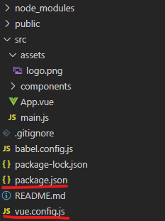

# Vue CLI 4.0 webpack 配置专栏

## 为什么要了解 Vue CLI 4.0 webpack 配置？

**使用 Vue.js 必然需要使用 Vue CLI；使用 Vue CLI，不可避免的会涉及到 webpack 的使用。而 webpack 最关键的地方就是配置了**。Vue CLI 是基于 webpack 构建起来的 Vue 手脚架。俗话说得好，磨刀不误砍柴工。想要提高在 Vue 上的编码速度，必然需要一个好的 Vue CLI；想要拥有一个好的 Vue CLI，肯定离不开好的 webpack 配置。所以说，了解 Vue CLi 的配置方法，对 Vue 开发人员来说是很重要的。

可能有人说，Vue CLI 默认配置就很好用呀！并不需要去配置自己的 webpack。

诚然，Vue CLI 官方的配置已经很好用的。但是 Vue CLI 默认配置是面向大众的。说白了就是一款满足大众开发需求的 webpack 方案。然而，总顶不住某些奇葩的需求。面对这些特殊的需求，可能默认配置就不适用了。例如，**项目部署上线的路径问题**、**跨域调试问题**、**项目打包优化问题**等等。

## Vue CLI webpack 的历史

Vue CLI 有一个重要的节点，那就是 Vue CLI 3.0。在 Vue CLI 3.0 之前，webpack 的配置文件叫做`webpack.config.js`，用 Vue CLI 创建项目时会自动生成。这时的 Vue CLI 的 webpack 配置方法跟 webpack 官方配置方法一样。但是到了 Vue CLI 3.0 之后（包括 Vue CLI 3.0），配置文件就变成了`vue.config.js`。Vue CLI 不再默认生成 webpack 的配置文件了。想要手动配置 webpack，就需要用户在**项目根目录**手动去添加`vue.config.js`。而且，Vue 还对 webpack 配置做了自己的定制，增加了一些定制属性，配置的方法跟 webpack 官方提供的方法有了一些不同。

为了帮助大家能够快速了解 Vue CLI webpack，以及巩固我自己关于 Vue CLI 的知识点。我将以一个系列来讲解 Vue CLI webpack。期待与大家共进，相互学习。

## 本系列讲的是什么？

本系列是一个 Vue CLI 4.0 webpack 的入门专栏，主要介绍的是 Vue CLI 4.0 webapck 基础内容，将会结合 Vue CLI 4.0 的官方文档，对 Vue CLI 4.0 的 webpack 的一些常用配置属性进行讲解，辅以配置属性使用代码案例。此外，还将提供一个完整的基础配置范例。

## 开始：创建`vue.config.js`

想要在 Vue CLI 4.0 配置自己的 webpack。第一步，要做的就是创建`vue.config.js`。

关于`vue.conmfig.js`，官方说明如下：

> `vue.config.js` 是一个可选的配置文件，如果项目的 (和 `package.json` 同级的) 根目录中存在这个文件，那么它会被 `@vue/cli-service` 自动加载。你也可以使用 `package.json` 中的 `vue` 字段，但是注意这种写法需要你严格遵照 JSON 的格式来写。

- 第一点：`vue.config.js`是可选配置文件；
- 第二点：`vue.config.js`必须存在与项目根目录，不然无法生效。这里要提及的一点，项目的根目录是更具`package,json`文件来定义的。
- 第三点：`Vue.config.js`会被自动加载（前提是位置正确）。所以我们只需要添加好`vue.config.js`，并做好配置就行了。

如下图，这是添加好`vue.config.js`的项目了。可以看到`vue.config.js`与`package.json`在同一层目录。



#### 小知识

实际上，VueCLI 3.0 及以上构建的项目是有`webpack.config.js`的，只是被 Vue 隐藏起来了。里面是 VueCLI 的默认`webpack`配置。而`vue.config.js`是 vue 对`webpack.config.js`的扩展文件。最终编译时，`vue.config.js`会被合并到`webpack.config.js`中。
如果我们想查看最终编译的`webpack`配置，可进行一下操作：

```powershell
vue inspect
```

在控制台的 Vue 项目根目录下运行上面代码，`webpack`配置将在控制台打印出来。

如果，想要`webpack`配置存储到一个文件中，可以这样：

```powershell
vue inspect > output.js
```

这样`webpack`配置将存在到`output.js`中。（`output.js`存储的文件路径为项目根目录）

更多相关知识，可参考 VueCLI 官方文档：[审查项目的-webpack-配置](https://cli.vuejs.org/zh/guide/webpack.html#%E5%AE%A1%E6%9F%A5%E9%A1%B9%E7%9B%AE%E7%9A%84-webpack-%E9%85%8D%E7%BD%AE)

## 系列目录

- 第一篇：Vue CLI 4.0 webpack 属性讲解以及创建`vue.config.js`
- 第二篇：[Vue CLI4.0 webpack 配置属性——publicPath](https://blog.csdn.net/weixin_44869002/article/details/105819462)
- 第三篇：[Vue CLI4.0 webpack 配置属性——outputDir、assetsDir、indexPath](https://blog.csdn.net/weixin_44869002/article/details/105819648)
- 第四篇：[Vue CLI4.0 webpack 配置属性——filenameHashing](https://blog.csdn.net/weixin_44869002/article/details/105820035)
- 第五篇：[Vue CLI4.0 webpack 配置属性——lintOnSave、configureWebpack、chainWebpack、parallel](https://blog.csdn.net/weixin_44869002/article/details/105831476)
- 第六篇：[Vue CLI4.0 webpack 配置属性——crossorigin](https://blog.csdn.net/weixin_44869002/article/details/105831572)
- 第七篇：[Vue CLI4.0 webpack 配置属性——productionSourceMap](https://blog.csdn.net/weixin_44869002/article/details/105832031)
- 第八篇：[Vue CLI4.0 webpack 配置属性——css.sourceMap](https://blog.csdn.net/weixin_44869002/article/details/105831784)
- 第九篇：[Vue CLI4.0 webpack 配置属性——css.extract](https://blog.csdn.net/weixin_44869002/article/details/105831757)
- 第十篇：[Vue CLI4.0 webpack 配置属性——css.requireModuleExtension、css.loaderOptions](https://blog.csdn.net/weixin_44869002/article/details/105831661)
- 范例篇：[Vue CLI 4.0 关于 webpack 基本配置范例](https://blog.csdn.net/weixin_44869002/article/details/105552911)
