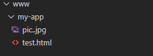

## publicPath

- Type: `string`
- Default: `'/'`

#### 官方文档说明：

> 部署应用包时的基本 URL。用法和 webpack 本身的 `output.publicPath` 一致，但是 Vue CLI 在一些其他地方也需要用到这个值，所以**请始终使用 `publicPath` 而不要直接修改 webpack 的 `output.publicPath`**。
>
> 默认情况下，Vue CLI 会假设你的应用是被部署在一个域名的根路径上，例如 `https://www.my-app.com/`。如果应用被部署在一个子路径上，你就需要用这个选项指定这个子路径。例如，如果你的应用被部署在 `https://www.my-app.com/my-app/`，则设置 `publicPath` 为 `/my-app/`。
>
> 这个值也可以被设置为空字符串 (`''`) 或是相对路径 (`'./'`)，这样所有的资源都会被链接为相对路径，这样打出来的包可以被部署在任意路径，

#### 官方文档解析

**看完官方文档是否一脸蒙蔽？**

什么是**部署应用包时的基本 URL**？

什么是**域名的根路径**？

别急，容我慢慢道来。

首先，我们来看两个字眼：**部署**、**域名**

从这两个字眼我们可以推断出， `publicPath`与服务器有关系了。

什么？你看不出。没关系，看不出，你就默认它有关吧！

##### 项目到部署服务器

当我们完成项目开发要对外开放时，就需要把打包好的项目文件上传到服务器进行部署操作。

流程大致如下:

1. 项目文件打包
2. 服务器安装配置 [Web Server 服务器（软件）](https://baike.baidu.com/item/WEB%E6%9C%8D%E5%8A%A1%E5%99%A8/8390210?fr=aladdin)。如：IIS、Apache(下面，我将默认以 Apache 进行讲解)
3. 将打包好的项目文件上传到 Web 服务器的域名根目录下，Apache 默认为 www 目录

##### 用户访问服务器流程说明：

访问网站我们都很熟悉，无非就是在浏览器输入对应网址就可以访问网址了。

那服务器是如何工作的呢？

简单来说，当 Apache 接收到用户发来的 http request 请求时，会自动到 www 目录下寻找对应的资源，然后将用户需要的资源再 Response 响应发送回去。拿官方例子来说，我们有一个对外的网址`https://www.my-app.com/` 。用户只要通过这个网址访问我们的服务器，Web 服务器就会自动到 www 目录里获取对应的资源。假设，www 目录有这个 test.html 文件。用户要访问这个文件，那么只需要`https://www.my-app.com/test.html` 就可以访问到了。实际上，就是`www/test.html`。也就是说，`https://www.my-app.com/`替代了`www/`

假设，www 目录结构现在变成下面这样，我们该这么访问呢?

访问 test.html 就变成了：`https://www.my-app.com/my-app/test.html`

如果 test.html 使用 pic.jpg 图片。写法就变成：``

看到这里，可能就有人满脸疑惑。

`src='/my-app/pic.jpg'` ？

`/my-app/pic.jpg` ？？

确定没错？？？

**没错！！！**

用户从浏览器访问 pic.jpg 路径跟访问 test.html 一样：`https://www.my-app.com/my-app/pic.jpg`

test.html 要使用 pic.jpg，那必然先得让用户浏览器访问到 pic.jpg。这一点，我们可以在任何一个网站可以看到。

一般的，在项目开发中写法应该将 src 写成：`./pic.jpg`。这是一种相对路径的写法。但要注意的是，相对路径还有另外两种写法：

- ../是父级目录
- /是根目录

关于相对路径的写法，请参考：[相对路径的三种写法](https://blog.csdn.net/weixin_42187676/article/details/81487861)

使用另外两种写法，应写成：

- `../my-app/pic.jpg`
- `/my-app/pic.jpg`

可能，对于最后一种的写法，大家会存在疑惑。

**根目录为什么是 www ?**

对于这一点，大家要注意的是这个根目录对应的 Apache 服务器的域名根目录。

这时，可能就会又有人问了。既然如此，是不是每次部署服务器都要去手动改 url？一个项目里有许许多多的 url，每次部署都要改，会死人的呀！

当然不能这么麻烦啦！`publicPath` 就是为此而生的。`publicPath`设置的就是项目文件根路径相对 www 的那一部分路径。也就是`/my-app/`了。设置`publicPath` 后，项目打包是就会自动在 src 前面补上`publicPath` 的值。

如下图：

打包出来的结果：

可以看到，在所有的 url 前都自动补上了`/my-app/`。

**讲了这么多，总之一句话：**

`publicPath`设置的就是`域名根目录`到`项目文件根目录`间的 url。

#### 一劳永逸的写法：使用当前相对路径写法

在官方文档最后一段话写到，我们可以将`publicPath` 设置为`''`或者`'./'`，这样打出来的包可以被部署在任意路径。

!!!∑(ﾟ Д ﾟノ)ノ

是不是学习到了！哈哈！！！

#### 总结：

- publicPath 接收 `string` 类型的 value；默认值为 `'/'`（`/`是根目录）

- publicPath 设置的是部署应用包的基本 URL，不是项目打包出来的文件存放的位置。

- publicPath 也可以设置为`''`或者`'./'`，设置成相对路径后可以任意部署。

#### 文章跳转

- 上一篇：[Vue CLI 4.0 webpack 属性讲解以及创建 vue.config.js](https://blog.csdn.net/weixin_44869002/article/details/105838825)

- 下一篇：[Vue CLI4.0 webpack 配置属性——outputDir、assetsDir、indexPath](https://blog.csdn.net/weixin_44869002/article/details/105819648)
